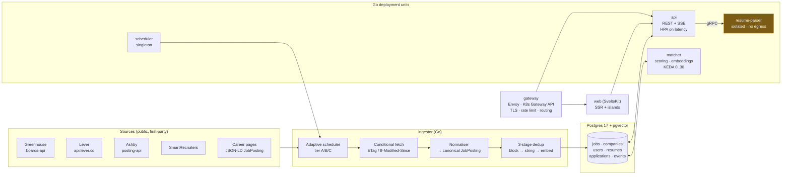

# JobTrack

**A job search instrument for software engineers.** Not another aggregator, not an auto-apply bot.

JobTrack does three things that existing tools do badly or not at all:

1. **Surfaces roles while they are still fresh**, pulled from the employer's own applicant tracking
   system (ATS) rather than a syndication layer — so the apply link lands you in the company's real
   hiring pipeline, not a board's inbox.
2. **Scores each role against your actual resume** with a transparent, explainable breakdown, and
   refuses to invent precision it does not have.
3. **Tracks what happens next** — per-channel, per-resume-version — so you can see which of your
   channels produce interviews and stop feeding the ones that don't.

---

## Why this exists

The 2020–2026 software hiring market did not just contract; it **rotated**. Indexed to a February
2020 baseline of 100, general software engineer postings sat at **51** while ML engineer postings sat
at **159**. Of the software posting recovery between May 2025 and May 2026, **71% came from senior
roles**. Applications per hire have **tripled since 2021**, now exceeding **300 per opening**.

For an engineer with 0–3 years of experience, this means the inbound channel is close to shut, and
the binding constraint is no longer resume quality — it is **channel selection, timing, and delivery
verification**. Most job-search tooling optimises the wrong variable: it makes it easier to send more
applications into channels that were already failing.

Every claim above is graded and sourced in **[docs/research/evidence-ledger.md](docs/research/evidence-ledger.md)**.
That ledger is a first-class artifact of this project, not a footnote — a third of what circulates as
job-search "fact" is vendor content marketing, and the product's credibility depends on us being able
to say which of our own claims are load-bearing and which are soft.

---

## The three mechanics that shape the whole design

These are not features. They are physical properties of how hiring works in 2026, and the
architecture falls out of them.

| Mechanic | Evidence | What JobTrack does about it |
|---|---|---|
| **Delivery is not guaranteed.** Whether your application reaches the employer depends on the domain you submit on. Indeed's Apply Sync is opt-in; LinkedIn Easy Apply forwarding depends on the poster's setup. | [A](docs/research/evidence-ledger.md#a-01) | Every listing records its **canonical ATS apply URL** and displays the ATS vendor. We never proxy an application. |
| **Freshness beats polish.** Postings collect hundreds of applications within hours; being in the first day matters more than tailoring. | [B](docs/research/evidence-ledger.md#b-04) | **Adaptive tiered polling** (2h / 6h / 24h) with a median source→visible latency target of **≤ 90 minutes** for watched companies. |
| **The ATS is a filing cabinet, not a robot judge.** The real auto-reject is the knockout questionnaire — location, work authorisation, minimum years. Ranking, where it exists, decides *order*, not rejection. | [A](docs/research/evidence-ledger.md#a-07) | We surface **knockout risk** explicitly and never sell "ATS optimisation" theatre. |

---

## What JobTrack deliberately will not do

Documented in full in [docs/product/principles.md](docs/product/principles.md#anti-features). In short:

- **No auto-apply.** Recruiters flag burst applications as spam. `JobFunnel` — once the leading
  open-source job scraper — was archived by its author precisely because boards moved to aggressive
  anti-automation. Automating discovery and scoring is durable; automating submission is not.
- **No keyword stuffing or "ATS score" gaming.** Hidden text and stuffing are actively detected and
  flag an application as manipulative.
- **No fake match precision.** A score of "87%" implies a calibration we do not have. We show bands,
  component breakdowns, and a parse-confidence indicator instead.
- **No scraping behind authentication or anti-bot defences.** See
  [ADR-0004](docs/architecture/adr/0004-source-acquisition-policy.md).

---

## Architecture at a glance

The `ingestor` box is one of six deployment units; the others are shown to its right. Workers
coordinate through Postgres rather than over RPC, which is why there are no arrows between them.

Full detail: **[system-architecture.md](docs/architecture/system-architecture.md)** (overview) and
**[service-topology.md](docs/architecture/service-topology.md)** (gateway, scaling, contracts).

**Stack:** Go 1.25 backend · PostgreSQL 17 with `pgvector` and `tsvector` as the *only* datastore ·
River (Postgres-backed queue) · SvelteKit frontend · Envoy Gateway on Kubernetes Gateway API ·
OpenTelemetry throughout. Dependency count is a design constraint, not an accident — see
[ADR-0003](docs/architecture/adr/0003-postgres-single-datastore.md).

### Microservices or monolith?

Neither, as usually posed — and the reasoning is written up with the numbers in
**[ADR-0008](docs/architecture/adr/0008-service-decomposition.md)**.

**One codebase with mechanically-enforced module boundaries; six independently-scaled deployment
units; one genuinely network-isolated service.**

At 4–400 RPS with a team of one to five, request throughput never justifies distribution — but two
things do: **CPU isolation** (scoring must not damage API p99) and **untrusted-input isolation**
(resume parsing runs PDF parsers over user uploads). So `api`, `web`, `ingestor`, `matcher`,
`scheduler` are separate deployments scaling on separate signals — HPA on latency, KEDA on queue
depth, scale-to-zero for workers — while sharing one database and coordinating through it rather than
over RPC.

That last part is what removes the entire distributed-systems tax: no saga, no transactional outbox,
no service mesh, no distributed transaction anywhere. `resume-parser` is the one true service, split
out for security rather than scale.

Extraction triggers for the rest are written down in advance, each as a measurable condition. The
evidence behind the call: Prime Video's 90% cost reduction from removing inter-component data
movement `[A-14]`, Uber's two-year DOMA effort to tame ~2,200 services `[B-13]`, Shopify running one
of the largest Rails codebases as a Packwerk-enforced modular monolith at Black Friday scale
`[B-14]`, and the finding that microservices benefits appear only above ~10–15 developers `[B-12]`.

**Vendor-agnostic throughout** — Kubernetes, Postgres, S3-compatible storage, OTLP, OpenTofu, KEDA.
No managed queue, no proprietary gateway, no cloud-specific service on the critical path. The claim
is tested, not asserted: CI runs the full suite with no cloud credentials present
([portability contract](docs/architecture/service-topology.md#8-vendor-neutrality--the-portability-contract)).

---

## Documentation

Start at **[docs/README.md](docs/README.md)** for the full map and suggested reading order.

| If you want to… | Read |
|---|---|
| Understand the problem and the evidence | [product/problem-statement.md](docs/product/problem-statement.md) |
| See what we're building in v1 | [product/feature-spec.md](docs/product/feature-spec.md) |
| Understand the system shape | [architecture/system-architecture.md](docs/architecture/system-architecture.md) |
| See the gateway, scaling policies and contracts | [architecture/service-topology.md](docs/architecture/service-topology.md) |
| Understand *why* each choice was made | [architecture/adr/](docs/architecture/adr/) |
| Start contributing code | [engineering/dev-environment.md](docs/engineering/dev-environment.md) |
| Run it in production | [operations/](docs/operations/) |
| Check a claim | [research/evidence-ledger.md](docs/research/evidence-ledger.md) |

---

## Status

**Phase: design complete, implementation not started.** This repository currently contains
documentation only. Every document is written to be executable — a scaffold generated from
[engineering/repository-structure.md](docs/engineering/repository-structure.md) plus
[architecture/data-model.md](docs/architecture/data-model.md) should compile and run.

All architectural decisions are settled — see the eight
[ADRs](docs/architecture/adr/). The last open one, the frontend framework, resolved to **SvelteKit 2**
on 2026-08-15 ([ADR-0002](docs/architecture/adr/0002-frontend-framework.md)).

Next step is the scaffold: repository skeleton, schema migrations, one working ATS adapter end to end,
and the `/jobs` feed against seeded data.

## Licence

TBD before first public commit.
