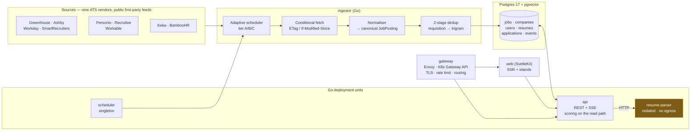

# JobTrack

**A job search instrument for software engineers.** Not another aggregator, not an auto-apply bot.

JobTrack does three things that existing tools do badly or not at all:

1. **Surfaces roles while they are still fresh**, pulled from the employer's own applicant tracking
   system (ATS) rather than a syndication layer — so the apply link lands you in the company's real
   hiring pipeline, not a board's inbox.
2. **Scores each role against your actual resume** with a transparent, explainable breakdown, and
   refuses to invent precision it does not have.
3. **Tracks what happens next** — per-channel, per-resume-version — so you can see which of your
   channels produce interviews and stop feeding the ones that don't.

---

## Run it

Docker, git and `python3` are the only host prerequisites. Everything else runs in containers.

```bash
make dev      # postgres, jaeger and every service, with live reload
make check    # every CI gate that needs no database and no network. The bar for "done"
docker compose run --rm tools "go run ./cmd/seed -ingest"   # ~350 postings, offline
```

Ingestion defaults to `fixture` mode, which replays the committed golden boards through the real
adapters, so **seeding reaches no network at all** and needs no credentials
([ADR-0021](docs/architecture/adr/0021-fixture-replay-at-the-http-boundary.md)). An unmapped host is
an error rather than a passthrough, and `internal/jobs` has a test asserting that only `live` mode
receives an HTTP client capable of dialling. Live ingestion additionally **refuses to start** without
an explicit per-source allowlist.

That sentence was false until 2026-09-30, and this README asserted it anyway. `INGEST_MODE` was
validated, logged, and read by no other code, so every mode fetched live. It is now implemented, and
the test above is what keeps it true.

## What is actually built

| | | |
|---|---|---|
| **Nine ATS adapters** | Greenhouse, Ashby, Workday, SmartRecruiters, Personio, Recruitee, Workable, Keka, BambooHR | each with golden-file tests against captured real responses |
| **13,484 postings** | 35.4% engineering-titled across the whole corpus | [`A-39`](docs/research/evidence-ledger.md#a-39) |
| **90.8% know their country** | up from 64.5%, from widening one lookup table | [`A-37`](docs/research/evidence-ledger.md#a-37) |
| **56–65 min** | median ingest → visible, tier A. Budget 90 | [`A-31`](docs/research/evidence-ledger.md#a-31) |
| **72 ms** | INP p75 at 4× CPU throttle, measured from the browser's own Event Timing. Budget 200 | [`A-32`](docs/research/evidence-ledger.md#a-32) |
| **93.5% / 44.4%** | field classifier precision / recall — precise and deliberately low-recall | [`A-38`](docs/research/evidence-ledger.md#a-38) |
| **14 invariants** | layering, SQL location, function length, dead code, citations, migrations, plans, config, workflow env | `make arch-check`, under a second, no toolchain |

Every number above is a link to how it was measured, including the ones that are worse than we
hoped. `A-38` is the clearest example: the classifier is right 93.5% of the time and finds under
half of what it should, and the page that shows it says so.

---

## Why this exists

The 2020–2026 software hiring market did not just contract; it **rotated**. Indexed to a February
2020 baseline of 100, general software engineer postings sat at **51** while ML engineer postings sat
at **159**. Of the software posting recovery between May 2025 and May 2026, **71% came from senior
roles**. Applications per hire have **tripled since 2021**, now exceeding **300 per opening**.

For an engineer with 0–3 years of experience, this means the inbound channel is close to shut, and
the binding constraint is no longer resume quality — it is **channel selection, timing, and delivery
verification**. Most job-search tooling optimises the wrong variable: it makes it easier to send more
applications into channels that were already failing.

Every claim above is graded and sourced in **[docs/research/evidence-ledger.md](docs/research/evidence-ledger.md)**.
That ledger is a first-class artifact of this project, not a footnote — a third of what circulates as
job-search "fact" is vendor content marketing, and the product's credibility depends on us being able
to say which of our own claims are load-bearing and which are soft.

---

## The three mechanics that shape the whole design

These are not features. They are physical properties of how hiring works in 2026, and the
architecture falls out of them.

| Mechanic | Evidence | What JobTrack does about it |
|---|---|---|
| **Delivery is not guaranteed.** Whether your application reaches the employer depends on the domain you submit on. Indeed's Apply Sync is opt-in; LinkedIn Easy Apply forwarding depends on the poster's setup. | [A](docs/research/evidence-ledger.md#a-01) | Every listing records its **canonical ATS apply URL** and displays the ATS vendor. We never proxy an application. |
| **Freshness beats polish.** Postings collect hundreds of applications within hours; being in the first day matters more than tailoring. | [B](docs/research/evidence-ledger.md#b-04) | **Adaptive tiered polling** (2h / 6h / 24h) with a median source→visible latency target of **≤ 90 minutes** for watched companies. |
| **The ATS is a filing cabinet, not a robot judge.** The real auto-reject is the knockout questionnaire — location, work authorisation, minimum years. Ranking, where it exists, decides *order*, not rejection. | [A](docs/research/evidence-ledger.md#a-07) | We surface **knockout risk** explicitly and never sell "ATS optimisation" theatre. |

---

## What JobTrack deliberately will not do

Documented in full in [docs/product/principles.md](docs/product/principles.md#anti-features). In short:

- **No auto-apply.** Recruiters flag burst applications as spam. `JobFunnel` — once the leading
  open-source job scraper — was archived by its author precisely because boards moved to aggressive
  anti-automation. Automating discovery and scoring is durable; automating submission is not.
- **No keyword stuffing or "ATS score" gaming.** Hidden text and stuffing are actively detected and
  flag an application as manipulative.
- **No fake match precision.** A score of "87%" implies a calibration we do not have. We show bands,
  component breakdowns, and a parse-confidence indicator instead.
- **No scraping behind authentication or anti-bot defences.** See
  [ADR-0004](docs/architecture/adr/0004-source-acquisition-policy.md).

---

## Architecture at a glance



The `ingestor` box is one of five deployment units; the others are shown to its right. Workers
coordinate through Postgres rather than over RPC, which is why there are no arrows between them.

Two things in this diagram were true of the design and are not true of the build, so they are drawn
as built rather than as planned. There is **no `matcher` service**: scoring became a pure function
run on the read path, which deleted a deployment unit and a staleness class at once
([ADR-0016](docs/architecture/adr/0016-scores-are-computed-not-materialised.md)). And dedup has
**two stages, not three** — the embedding stage is deliberately absent, because a stage that does
not exist must not silently pass everything through.

Full detail: **[system-architecture.md](docs/architecture/system-architecture.md)** (overview) and
**[service-topology.md](docs/architecture/service-topology.md)** (gateway, scaling, contracts).

**Stack:** Go 1.25 backend · PostgreSQL 17 with `pgvector` and `tsvector` as the *only* datastore ·
River (Postgres-backed queue) · SvelteKit frontend · Envoy Gateway on Kubernetes Gateway API ·
OpenTelemetry throughout. Dependency count is a design constraint, not an accident — see
[ADR-0003](docs/architecture/adr/0003-postgres-single-datastore.md).

### Microservices or monolith?

Neither, as usually posed — and the reasoning is written up with the numbers in
**[ADR-0008](docs/architecture/adr/0008-service-decomposition.md)**.

**One codebase with mechanically-enforced module boundaries; six independently-scaled deployment
units; one genuinely network-isolated service.**

At 4–400 RPS with a team of one to five, request throughput never justifies distribution — but two
things do: **CPU isolation** (scoring must not damage API p99) and **untrusted-input isolation**
(resume parsing runs PDF parsers over user uploads). So `api`, `web`, `ingestor`, `matcher`,
`scheduler` are separate deployments scaling on separate signals — HPA on latency, KEDA on queue
depth, scale-to-zero for workers — while sharing one database and coordinating through it rather than
over RPC.

That last part is what removes the entire distributed-systems tax: no saga, no transactional outbox,
no service mesh, no distributed transaction anywhere. `resume-parser` is the one true service, split
out for security rather than scale.

Extraction triggers for the rest are written down in advance, each as a measurable condition. The
evidence behind the call: Prime Video's 90% cost reduction from removing inter-component data
movement `[A-14]`, Uber's two-year DOMA effort to tame ~2,200 services `[B-13]`, Shopify running one
of the largest Rails codebases as a Packwerk-enforced modular monolith at Black Friday scale
`[B-14]`, and the finding that microservices benefits appear only above ~10–15 developers `[B-12]`.

**Vendor-agnostic throughout** — Kubernetes, Postgres, OTLP, OpenTofu, KEDA.
No managed queue, no proprietary gateway, no cloud-specific service on the critical path. The claim
is tested, not asserted: CI runs the full suite with no cloud credentials present
([portability contract](docs/architecture/service-topology.md#8-vendor-neutrality--the-portability-contract)).

---

## Documentation

Start at **[docs/README.md](docs/README.md)** for the full map and suggested reading order.

| If you want to… | Read |
|---|---|
| Understand the problem and the evidence | [product/problem-statement.md](docs/product/problem-statement.md) |
| See what we're building in v1 | [product/feature-spec.md](docs/product/feature-spec.md) |
| Understand the system shape | [architecture/system-architecture.md](docs/architecture/system-architecture.md) |
| See the gateway, scaling policies and contracts | [architecture/service-topology.md](docs/architecture/service-topology.md) |
| Understand *why* each choice was made | [architecture/adr/](docs/architecture/adr/) |
| Start contributing code | [engineering/dev-environment.md](docs/engineering/dev-environment.md) |
| Run it in production | [operations/](docs/operations/) |
| Check a claim | [research/evidence-ledger.md](docs/research/evidence-ledger.md) |

---

## Status

**Built and running against a live corpus.** Nine ATS adapters ingest on a tiered schedule, the
`/jobs` feed searches and filters 13k postings, resumes parse and score, applications track, and a
weekly digest mails saved searches over SMTP. Eighteen [ADRs](docs/architecture/adr/) record how it
got here, including the ones that overturned an earlier decision once a measurement disagreed with
it: [ADR-0015](docs/architecture/adr/0015-hand-written-sql-in-a-store-layer.md) superseded ADR-0001's
`sqlc` clause after it sat unadopted for months, and
[ADR-0016](docs/architecture/adr/0016-scores-are-computed-not-materialised.md) deleted a 1,952 MB
table — 78.4% of the database — once scoring measured three orders of magnitude cheaper than the
design assumed.

What is **not** finished, stated here rather than left for a reader to discover:

| | |
|---|---|
| `internal/app` has no tests | 1 package, down from 3. `internal/jobs` and `internal/httpx` gained tests on 2026-09-30 |
| The digest has never delivered a real email | The code path is verified end to end against a local relay; no SMTP host has been configured |
| One employer's board is 34.8% of the corpus | Mostly not software. Curation measured as the *weaker* lever ([`A-39`](docs/research/evidence-ledger.md#a-39)), so the answer is the Software filter rather than a blocklist — but it is a live product question |
| Two functions exceed the 80-line limit | Recorded in `scripts/arch/baseline/func-length.txt`, which is only allowed to shrink |

The same list lives in [CLAUDE.md](CLAUDE.md#known-gaps--real-recorded-being-paid-down) with live
counts, because a document that describes an aspiration as a fact is the failure this project spends
most of its tooling preventing.

## Licence

[MIT](LICENSE).

The adapters read **public, first-party feeds only** — no accounts, no authenticated endpoints, no
anti-bot circumvention, one host at a time with a polite delay. That is a binding constraint rather
than a default: [ADR-0004](docs/architecture/adr/0004-source-acquisition-policy.md) is the gate every
new source passes, and it has already rejected two vendors (Darwinbox, iCIMS) for sitting behind
bot challenges.
