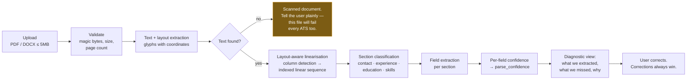

# ADR-0007 — Deterministic local resume parsing; LLM as opt-in enrichment

- **Status:** DECIDED
- **Date:** 2026-08-15
- **Decision drivers:** privacy, cost, determinism, testability, security of untrusted input

## Context

A resume is the most sensitive object we hold: name, contact details, full employment history,
education, sometimes address and date of birth. Under India's DPDP Act 2023 and the GDPR it is
personal data with real obligations.

It is also the hardest input we process. PDFs store **positioned glyphs on a canvas, not structured
text** — they were designed for print, not machines. Two-column layouts interleave, tables lose
structure, and scanned resumes have no text at all.

And parsing accuracy has direct product consequences beyond our own scoring: **parsing failures kill
more applications than keyword gaps do** `[B-02]`. Our parser doubles as a diagnostic that shows the
user what an ATS will see.

## Options

| | Deterministic local | LLM-only | **Local + optional LLM** |
|---|---|---|---|
| Resume text leaves our systems | **Never** | Always | Only if the user opts in |
| Cost per resume | **~0** | $0.01–0.10 | ~0 baseline |
| Latency | **< 2 s** | 5–30 s | < 2 s baseline |
| Deterministic / regression-testable | **✓** | ✗ | ✓ for the baseline |
| Handles messy layouts | Moderate | **Good** | Good when enabled |
| Works offline / self-hosted | **✓** | ✗ | ✓ |

**LLM-only is rejected primarily on privacy**, not cost. Sending every user's full resume to a third
party by default is not a decision we get to make on their behalf
([P8](../../product/principles.md#p8--the-users-data-is-theirs-and-it-is-the-most-sensitive-thing-we-hold)).
Non-determinism is the second objection: a parser whose output changes between runs cannot have a
regression suite, and a parser without a regression suite decays.

There is also a genuine security dimension. Resume text is **untrusted input**, and feeding untrusted
text into an LLM whose output drives system behaviour is a prompt-injection surface — a resume
containing instructions aimed at the extractor is a real, demonstrated attack class.

## Decision

**A deterministic local pipeline as the default. LLM enrichment strictly opt-in, per user,
per-purpose, disclosed at the point of use.**

**Layout-aware linearisation is the key step.** Converting the document into an indexed linear text
sequence *before* extraction is what makes structured key-value extraction robust — this is the
approach the resume-extraction literature converges on `[B-23]`. Naive top-to-bottom text extraction
interleaves two-column resumes into nonsense, which is the single most common cause of catastrophic
parse failure.

**Runs in the isolated `resume-parser` service** — no network egress, no database credentials,
read-only filesystem, seccomp, 512 Mi hard memory limit, 30 s timeout. PDF parsers are a known source
of crashes, unbounded memory growth and parser-level exploits, and this is the only component in the
system that executes over untrusted binary input. See
[service-topology §3](../service-topology.md#resume-parser--the-one-true-service).

### The diagnostic view is a product feature, not a debug tool

After parsing, the user sees **what a naive parser extracted from their file**. Not "parsing failed" —
specifically which fields we could not find and the likely cause: two-column layout, text inside a
table, a scanned image, a non-embedded font.

This is genuinely useful information they cannot get elsewhere, and it directly addresses the
mechanic that kills the most applications. If we mangle their job titles, an ATS will too.

### Where the LLM is allowed

| Purpose | Default | Notes |
|---|---|---|
| Baseline extraction | **Never** | Deterministic pipeline only |
| Rescue for low-confidence parses (< 0.5) | **Opt-in** | Offered explicitly: "we struggled with this file — try AI extraction?" |
| Skill normalisation for unrecognised terms | **Opt-in** | Sends the term, never the resume |
| Resume review (v4) | **Opt-in** | The feature *is* language analysis; disclosure at the point of use |

When enabled, the configuration **records exactly which fields leave the system**, and that record is
visible to the user in their privacy settings. Extracted text is never used for model training, and
that is a contractual requirement on any provider we use.

## Consequences

### Good

- Resume text never leaves our infrastructure by default. That is a statement we can make plainly.
- Zero marginal cost, so parsing is not rate-limited by budget.
- Deterministic, so a golden corpus works: ~50 real resumes across layouts, asserting ≥ 95%
  extraction accuracy on the contact block and ≥ 90% on employment dates.
- Self-hostable end to end, which matters for the privacy-conscious segment of this audience.
- Parser upgrades are safe: `resumes.parser_version` triggers reprocessing, and user edits still win.

### Bad, and accepted

- **Lower ceiling on messy layouts** than a good vision-language model. Mitigated by the diagnostic
  view (the user sees and corrects) and by opt-in rescue.
- **We must maintain extraction rules** as resume conventions drift. Real ongoing work.
- **Scanned resumes are not supported** in v1. Deliberate, and we say so usefully: a scanned resume
  fails most ATS parsers too, so "export a text-based PDF" is the correct advice rather than a
  limitation to paper over.
- **User corrections create a two-source-of-truth problem.** Resolved by an explicit rule —
  `user_edited` wins over any re-parse, always.

## Revisit

If parse confidence on real uploads sits materially below the golden-corpus figure, the layout
linearisation is the first thing to examine. If a small self-hostable vision model becomes practical
to run in the isolated service **with no network egress**, that satisfies the privacy constraint and
should be reconsidered on merit — the objection is to sending data out, not to using models.
