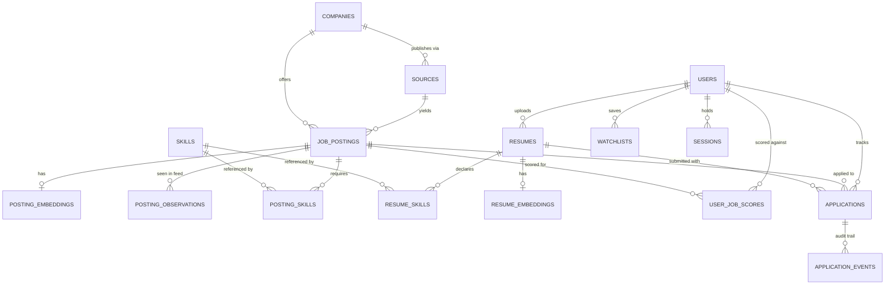

# Data model

> Status: **DECIDED**. Schema is the contract; changes go through
> [deployment-zdt.md](../operations/deployment-zdt.md).

PostgreSQL 17. Extensions: `pgvector`, `pg_trgm`, `citext`, `pgcrypto`.

## 1. Entity relationships



Two relationships carry unusual weight:

- **`APPLICATIONS → RESUMES`** is mandatory, not optional. The resume version is the field that lets
  channel analytics answer *which positioning converts*, and it is the field every competing tracker
  omits ([problem-statement §7](../product/problem-statement.md#7-what-tracking-is-actually-for)).
- **`POSTING_OBSERVATIONS`** exists so "is this posting still open?" is answered by **observed feed
  behaviour** rather than by guessing intent. It is also the substrate for company hiring posture
  ([feature-spec §F7](../product/feature-spec.md#f7--company-hiring-posture)).

---

## 2. Core tables

### `companies`

```sql
CREATE TABLE companies (
    id              bigint GENERATED ALWAYS AS IDENTITY PRIMARY KEY,
    slug            citext NOT NULL UNIQUE,
    name            text   NOT NULL,
    website         text,
    -- Registrable domain, used to link inbound recruiter email (v2) to a company
    -- without depending on display-name matching, which is hopeless across locales.
    primary_domain  citext,
    logo_url        text,
    hq_country      char(2),
    created_at      timestamptz NOT NULL DEFAULT now(),
    updated_at      timestamptz NOT NULL DEFAULT now()
);
CREATE INDEX ON companies USING gin (name gin_trgm_ops);
CREATE UNIQUE INDEX ON companies (primary_domain) WHERE primary_domain IS NOT NULL;
```

### `sources`

One row per company-vendor pairing. A company can publish through several (a Greenhouse board *and*
JSON-LD on its careers page); dedup collapses the resulting duplicate postings.

```sql
CREATE TYPE source_vendor AS ENUM (
    'greenhouse','lever','ashby','smartrecruiters','recruitee','workable','personio','jsonld'
);
CREATE TYPE source_tier AS ENUM ('a','b','c','paused');

CREATE TABLE sources (
    id                bigint GENERATED ALWAYS AS IDENTITY PRIMARY KEY,
    company_id        bigint NOT NULL REFERENCES companies(id),
    vendor            source_vendor NOT NULL,
    -- Vendor-specific board identifier: Greenhouse board token, Lever site slug,
    -- Ashby job-board name, or a full URL for jsonld.
    board_token       text   NOT NULL,
    tier              source_tier NOT NULL DEFAULT 'c',

    -- Conditional-request state. Carrying both is deliberate: vendors are
    -- inconsistent about which they honour, and a wrong 304 is worse than an
    -- unnecessary 200.
    etag              text,
    last_modified     text,
    content_hash      bytea,

    last_polled_at    timestamptz,
    last_changed_at   timestamptz,
    next_poll_at      timestamptz NOT NULL DEFAULT now(),
    consecutive_errors int NOT NULL DEFAULT 0,
    -- Circuit breaker: set when consecutive_errors crosses the threshold.
    -- Cleared by a successful poll or by an operator via the runbook.
    disabled_until    timestamptz,

    created_at        timestamptz NOT NULL DEFAULT now(),
    UNIQUE (vendor, board_token)
);
-- The scheduler's only hot query: "what is due?"
CREATE INDEX sources_due_idx ON sources (next_poll_at)
    WHERE tier <> 'paused' AND disabled_until IS NULL;
```

### `job_postings`

The central table.

```sql
CREATE TYPE work_mode      AS ENUM ('onsite','hybrid','remote','unknown');
CREATE TYPE employment_type AS ENUM ('full_time','part_time','contract','intern','temporary','other');
CREATE TYPE posting_status AS ENUM ('live','closed','superseded');

CREATE TABLE job_postings (
    id               bigint GENERATED ALWAYS AS IDENTITY PRIMARY KEY,
    source_id        bigint NOT NULL REFERENCES sources(id),
    company_id       bigint NOT NULL REFERENCES companies(id),

    -- Vendor's stable identifier where one exists; otherwise a derived hash.
    -- Derivation rule is documented per vendor in research/source-catalog.md.
    external_id      text NOT NULL,

    title            text NOT NULL,
    title_normalised text NOT NULL,          -- lowercased, seniority tokens stripped
    description_html text,
    description_text text,                   -- extracted plain text; scoring reads this

    apply_url        text NOT NULL,          -- canonical ATS URL; never proxied
    posting_url      text,

    -- Location. Kept both raw and structured: the structured form drives filters,
    -- the raw form is shown to the user because our parse is not always right.
    location_raw     text,
    country          char(2),
    region           text,
    city             text,
    mode             work_mode NOT NULL DEFAULT 'unknown',

    employment       employment_type NOT NULL DEFAULT 'full_time',

    -- Compensation. NULL means "not disclosed" and is distinct from zero.
    -- The filter must be able to tell those apart; collapsing them loses ~20% of
    -- the market, since only ~80% of postings carry baseSalary. [A-12]
    comp_min         numeric(14,2),
    comp_max         numeric(14,2),
    comp_currency    char(3),
    comp_period      text,                   -- 'year' | 'month' | 'hour'
    comp_source      text,                   -- 'structured' | 'parsed_text' | NULL

    yoe_min          smallint,
    yoe_max          smallint,
    -- Confidence in the YoE extraction, 0..1. Filters treat low-confidence
    -- values as unknown rather than excluding the posting.
    yoe_confidence   real,

    posted_at        timestamptz,            -- vendor's date; may be absent
    first_seen_at    timestamptz NOT NULL DEFAULT now(),
    last_seen_at     timestamptz NOT NULL DEFAULT now(),
    closed_at        timestamptz,
    status           posting_status NOT NULL DEFAULT 'live',

    -- Ghost-job integrity signals, per the Greenhouse 2025 study. [A-06]
    -- Stored as computed booleans so the feed can filter on them cheaply.
    has_disclosed_comp boolean GENERATED ALWAYS AS (comp_min IS NOT NULL) STORED,

    -- Deduplication: points at the surviving posting when status='superseded'.
    canonical_id     bigint REFERENCES job_postings(id),

    search_tsv       tsvector GENERATED ALWAYS AS (
                        setweight(to_tsvector('english', coalesce(title,'')), 'A') ||
                        setweight(to_tsvector('english', coalesce(description_text,'')), 'B')
                     ) STORED,

    parse_confidence real NOT NULL DEFAULT 1.0,
    raw              jsonb,                  -- vendor payload, for reprocessing

    created_at       timestamptz NOT NULL DEFAULT now(),
    updated_at       timestamptz NOT NULL DEFAULT now(),

    UNIQUE (source_id, external_id)
);
```

**Indexes**, chosen against the actual feed query rather than speculatively:

```sql
-- The feed's ranking key. Partial: we never list closed postings.
CREATE INDEX jp_live_recent_idx ON job_postings (posted_at DESC NULLS LAST, id DESC)
    WHERE status = 'live';

-- Filter combinations that appear together in practice.
CREATE INDEX jp_geo_idx  ON job_postings (country, region, mode) WHERE status = 'live';
CREATE INDEX jp_yoe_idx  ON job_postings (yoe_min, yoe_max)      WHERE status = 'live';
CREATE INDEX jp_comp_idx ON job_postings (comp_currency, comp_min) WHERE status = 'live' AND comp_min IS NOT NULL;
CREATE INDEX jp_company_idx ON job_postings (company_id, posted_at DESC) WHERE status = 'live';

CREATE INDEX jp_fts_idx ON job_postings USING gin (search_tsv);
CREATE INDEX jp_title_trgm_idx ON job_postings USING gin (title_normalised gin_trgm_ops);
```

> **On `WHERE status = 'live'` partial indexes.** At steady state roughly 70% of rows are closed. The
> partial indexes are therefore ~3× smaller and stay resident in shared buffers. The cost is that a
> query forgetting the `status` predicate silently loses the index — so every generated query in
> `internal/store` includes it, and there is a `sqlc vet` rule asserting so.

### `posting_observations`

Append-only. One row per source poll in which a posting was present.

```sql
CREATE TABLE posting_observations (
    posting_id  bigint      NOT NULL REFERENCES job_postings(id) ON DELETE CASCADE,
    observed_at timestamptz NOT NULL DEFAULT now(),
    -- Hash of the normalised posting, so we can distinguish "still there,
    -- unchanged" from "still there, edited" without storing full snapshots.
    content_hash bytea      NOT NULL,
    PRIMARY KEY (posting_id, observed_at)
) PARTITION BY RANGE (observed_at);
```

**Partitioned monthly.** This is the highest-volume table in the system — roughly 200k postings × 4–12
observations/day. Partitioning makes retention a `DROP TABLE` rather than a `DELETE` that would bloat
the heap and stall autovacuum. Retention: 13 months (enough for a year-over-year posture comparison).

Partition creation is a scheduled River job running one month ahead; see
[runbooks §R6](../operations/runbooks.md#r6--partition-maintenance-fell-behind).

### `posting_embeddings`

```sql
CREATE TABLE posting_embeddings (
    posting_id bigint PRIMARY KEY REFERENCES job_postings(id) ON DELETE CASCADE,
    -- 384 dimensions: a small sentence-transformer class model. Chosen over 768/1536
    -- because at 200k postings the index fits comfortably in RAM and recall for
    -- this task is indistinguishable. See ADR-0006.
    embedding  vector(384) NOT NULL,
    model      text NOT NULL,        -- model identity, so a swap can be rolled forward
    created_at timestamptz NOT NULL DEFAULT now()
);

CREATE INDEX ON posting_embeddings
    USING hnsw (embedding vector_cosine_ops)
    WITH (m = 16, ef_construction = 64);
```

> **`hnsw.iterative_scan` is what makes this usable at all.** Filtering happens *after* the index
> scan, so at the default `ef_search = 40` a predicate matching 10% of rows yields ~4 results `[A-13]`.
> It is an enum — `off` | `strict_order` | `relaxed_order` — and every filtered vector query in this
> system sets `relaxed_order` via `SET LOCAL`. Details and the planner caveat:
> [matching-and-scoring §7](matching-and-scoring.md#filtered-vector-search--the-setting-that-is-not-optional).

---

## 3. Skills

A shared, normalised vocabulary is what makes `Postgres` and `PostgreSQL` one thing on both sides of
the match.

```sql
CREATE TABLE skills (
    id           bigint GENERATED ALWAYS AS IDENTITY PRIMARY KEY,
    canonical    citext NOT NULL UNIQUE,      -- 'postgresql'
    display_name text   NOT NULL,             -- 'PostgreSQL'
    category     text   NOT NULL,             -- language|framework|datastore|cloud|practice
    -- Aliases resolved at ingest: {'postgres','pgsql','psql'}
    aliases      citext[] NOT NULL DEFAULT '{}'
);
CREATE INDEX ON skills USING gin (aliases);

CREATE TYPE skill_requirement AS ENUM ('must_have','nice_to_have','mentioned');

CREATE TABLE posting_skills (
    posting_id  bigint NOT NULL REFERENCES job_postings(id) ON DELETE CASCADE,
    skill_id    bigint NOT NULL REFERENCES skills(id),
    requirement skill_requirement NOT NULL,
    confidence  real NOT NULL,
    PRIMARY KEY (posting_id, skill_id)
);

CREATE TABLE resume_skills (
    resume_id   bigint NOT NULL REFERENCES resumes(id) ON DELETE CASCADE,
    skill_id    bigint NOT NULL REFERENCES skills(id),
    -- Years derived from the employment periods that mention the skill.
    -- NULL where we could not attribute it to a dated role.
    years       real,
    -- true when the user edited this entry; user values always win over re-parsing.
    user_edited boolean NOT NULL DEFAULT false,
    PRIMARY KEY (resume_id, skill_id)
);
```

The `must_have` / `nice_to_have` distinction is the single largest driver of score quality. Treating
every mentioned technology as required produces scores that are uniformly low and useless for
ranking. Extraction heuristics are in
[matching-and-scoring §2](matching-and-scoring.md#2-component-skills-coverage).

---

## 4. Users and resumes

```sql
CREATE TABLE users (
    id                bigint GENERATED ALWAYS AS IDENTITY PRIMARY KEY,
    email             citext NOT NULL UNIQUE,
    password_hash     text,                        -- NULL for OAuth-only accounts
    email_verified_at timestamptz,

    -- Search preferences. Denormalised onto the user because every feed query
    -- reads them and they are small.
    pref_countries    char(2)[] NOT NULL DEFAULT '{}',
    pref_modes        work_mode[] NOT NULL DEFAULT '{}',
    pref_comp_min     numeric(14,2),
    pref_currency     char(3),
    total_yoe         real,

    -- Per-user data key, wrapped by the application's KMS key. Resume PII is
    -- encrypted with this so a table dump is not a resume dump.
    dek_wrapped       bytea,

    created_at        timestamptz NOT NULL DEFAULT now(),
    deleted_at        timestamptz
);

CREATE TABLE resumes (
    id            bigint GENERATED ALWAYS AS IDENTITY PRIMARY KEY,
    user_id       bigint NOT NULL REFERENCES users(id) ON DELETE CASCADE,
    label         text   NOT NULL,              -- user-facing version name
    is_default    boolean NOT NULL DEFAULT false,

    blob_key      text   NOT NULL,              -- always '' since ADR-0020; kept for the day
                                                -- the original file is retained
    mime_type     text   NOT NULL,
    byte_size     int    NOT NULL,

    -- Encrypted with the user's DEK.
    parsed_text_enc  bytea,
    parsed_json_enc  bytea,                     -- structured profile

    -- Fraction of expected sections we successfully extracted. Surfaced to the
    -- user as the parse diagnostic, and used to gate scoring confidence.
    parse_confidence real,
    parser_version   text,                      -- reprocess trigger on upgrade

    created_at    timestamptz NOT NULL DEFAULT now()
);
CREATE UNIQUE INDEX ON resumes (user_id) WHERE is_default;
```

### `user_job_scores`

Precomputed. The feed reads this; it never scores at request time.

```sql
CREATE TABLE user_job_scores (
    user_id     bigint NOT NULL REFERENCES users(id) ON DELETE CASCADE,
    posting_id  bigint NOT NULL REFERENCES job_postings(id) ON DELETE CASCADE,
    resume_id   bigint NOT NULL REFERENCES resumes(id) ON DELETE CASCADE,

    score       real   NOT NULL,               -- 0..100
    band        text   NOT NULL,               -- strong|plausible|stretch|unlikely
    -- Per-component contributions, rendered directly in the UI as the explanation.
    -- jsonb rather than columns because the scoring profile is configurable and
    -- components can be added without a migration. Shape is versioned by profile_version.
    components  jsonb  NOT NULL,
    confidence  real   NOT NULL,               -- 0..1, from parse quality both sides

    profile_version text NOT NULL,             -- scoring profile that produced this
    computed_at timestamptz NOT NULL DEFAULT now(),
    PRIMARY KEY (user_id, posting_id)
);
CREATE INDEX ujs_feed_idx ON user_job_scores (user_id, score DESC, posting_id DESC);
```

**Retention:** rows are deleted when the posting closes, and recomputed when either the posting or the
user's default resume changes. Volume analysis in
[scaling-and-capacity §3](../operations/scaling-and-capacity.md#3-scoring-load) — this is the table
that grows fastest and it is where the first real scaling pressure appears.

---

## 5. Applications

```sql
CREATE TYPE application_status AS ENUM (
    'saved','applied','referred','recruiter_screen','hm_screen','onsite',
    'offer','rejected','ghosted','withdrawn'
);
CREATE TYPE application_channel AS ENUM (
    'careers_page','job_board','referral','cold_email','recruiter_inbound','other'
);

CREATE TABLE applications (
    id             bigint GENERATED ALWAYS AS IDENTITY PRIMARY KEY,
    user_id        bigint NOT NULL REFERENCES users(id) ON DELETE CASCADE,
    -- Nullable: users track roles we never ingested. The tracker must not be
    -- limited to our own inventory, or it loses to a spreadsheet on day one.
    posting_id     bigint REFERENCES job_postings(id),
    company_id     bigint REFERENCES companies(id),

    -- Free-text fallbacks for manually-added applications.
    company_name   text,
    role_title     text,

    status         application_status NOT NULL DEFAULT 'saved',
    channel        application_channel,
    resume_id      bigint REFERENCES resumes(id),

    applied_at     timestamptz,
    last_activity_at timestamptz NOT NULL DEFAULT now(),
    next_action    text,
    next_action_at date,

    ats_vendor     source_vendor,
    apply_url      text,
    contact_name   text,
    contact_note   text,
    why_applied    text,

    created_at     timestamptz NOT NULL DEFAULT now(),
    updated_at     timestamptz NOT NULL DEFAULT now()
);

-- Channel and resume are required once an application is real. Enforced in the
-- database rather than only in the handler, because these two fields are the
-- entire basis of channel analytics — if they can be NULL, they will be.
ALTER TABLE applications ADD CONSTRAINT applied_requires_attribution
    CHECK (status = 'saved' OR status = 'withdrawn'
           OR (channel IS NOT NULL AND resume_id IS NOT NULL AND applied_at IS NOT NULL));

-- Drives the 21-day ghosting sweep.
CREATE INDEX app_stale_idx ON applications (last_activity_at)
    WHERE status IN ('applied','recruiter_screen','hm_screen');
CREATE INDEX app_user_idx ON applications (user_id, status, last_activity_at DESC);

CREATE TABLE application_events (
    id             bigint GENERATED ALWAYS AS IDENTITY PRIMARY KEY,
    application_id bigint NOT NULL REFERENCES applications(id) ON DELETE CASCADE,
    from_status    application_status,
    to_status      application_status NOT NULL,
    -- 'user' | 'system:ghost_sweep' | 'system:email_classifier'
    actor          text NOT NULL,
    note           text,
    occurred_at    timestamptz NOT NULL DEFAULT now()
);
```

**`application_events` is append-only and never updated.** It is what makes the pipeline auditable and
what makes the automatic 21-day ghost transition reversible — the sweep writes an event, and a later
reply writes another. No state is lost.

---

## 6. Watchlists and sessions

```sql
CREATE TABLE watchlists (
    id           bigint GENERATED ALWAYS AS IDENTITY PRIMARY KEY,
    user_id      bigint NOT NULL REFERENCES users(id) ON DELETE CASCADE,
    label        text   NOT NULL,
    -- The saved filter set, in the same shape the API accepts. Storing the
    -- request rather than a parsed structure means a new filter needs no migration.
    filters      jsonb  NOT NULL,
    notify_mode  text   NOT NULL DEFAULT 'digest_daily',  -- instant|digest_daily|digest_weekly
    last_notified_at timestamptz,
    created_at   timestamptz NOT NULL DEFAULT now()
);

-- Companies a user watches. Promotes the company's sources to ingestion tier A,
-- so user attention directly drives crawl priority.
CREATE TABLE watched_companies (
    user_id    bigint NOT NULL REFERENCES users(id) ON DELETE CASCADE,
    company_id bigint NOT NULL REFERENCES companies(id) ON DELETE CASCADE,
    PRIMARY KEY (user_id, company_id)
);

CREATE TABLE sessions (
    id         bytea PRIMARY KEY,               -- 32 random bytes, hashed
    user_id    bigint NOT NULL REFERENCES users(id) ON DELETE CASCADE,
    expires_at timestamptz NOT NULL,
    created_at timestamptz NOT NULL DEFAULT now(),
    user_agent text,
    ip_hash    bytea                            -- hashed, for anomaly detection only
);
CREATE INDEX ON sessions (user_id);
```

Server-side sessions rather than stateless JWTs, because **revocation must be immediate** — a user
signing out on a shared machine cannot be told to wait for token expiry.

---

## 7. Conventions

| Convention | Rationale |
|---|---|
| `bigint GENERATED ALWAYS AS IDENTITY` | Standard SQL; avoids `serial`'s sequence-ownership quirks. Not UUID — these IDs are not user-facing and B-tree locality matters at this row count |
| `timestamptz` everywhere, UTC | Job postings span timezones; a naive timestamp is a bug waiting to happen |
| `citext` for emails, slugs, skill names | Case-insensitive uniqueness without `lower()` on every query |
| Enums for closed vocabularies | Type safety in generated Go; adding a value is an `ALTER TYPE ... ADD VALUE`, which is non-blocking in PG 12+ |
| `jsonb` only for genuinely open shapes | `components`, `filters`, `raw`. Anything queried with a filter gets a column |
| No `ON DELETE CASCADE` from `job_postings` to `applications` | A user's tracked history must survive a posting being purged |
| Soft delete only on `users` | Everything else hard-deletes. `users.deleted_at` exists to make the anonymisation sweep idempotent |

## 8. Migration policy

Forward-only, numbered, one concern per file. Every migration must be **safe to run while the previous
release is still serving traffic** — expand first, contract at least one release later.

```
migrations/
  0001_extensions.up.sql
  0002_companies_sources.up.sql
  ...
  0031_add_yoe_confidence.up.sql        -- expand:   ADD COLUMN, nullable, no default rewrite
  0032_backfill_yoe_confidence.up.sql   -- backfill: batched, resumable River job
  0034_yoe_confidence_not_null.up.sql   -- contract: one release later
```

Rules, with the reasoning in [deployment-zdt.md](../operations/deployment-zdt.md):

- `CREATE INDEX CONCURRENTLY`, always, on any populated table.
- No `ALTER TABLE ... ADD COLUMN ... NOT NULL DEFAULT <volatile>` — PG 11+ handles constant defaults
  without a rewrite, but a volatile default rewrites the whole table under an ACCESS EXCLUSIVE lock.
- Backfills are River jobs with a batch size and a resume cursor, never a single statement.
- Every migration runs in CI against a restored snapshot of the **previous release's** schema, not
  against an empty database. A migration that only works on an empty database is not a migration.
