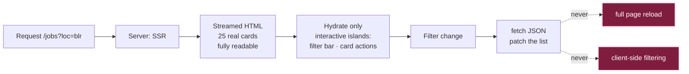

# Frontend architecture

> Status: **DECIDED**. Framework settled on SvelteKit 2 / Svelte 5 —
> [ADR-0002](adr/0002-frontend-framework.md). Everything below except the code samples is
> framework-independent and would survive a future change.

## 1. The governing constraint

> *"Modern yet snappy, running efficiently on lower-end laptops — like Pokémon on the Game Boy:
> almost no resources, but fun and fast, and it did a lot."*

That analogy is a real engineering brief, and it is worth unpacking because it prescribes a method,
not just an aspiration.

Pokémon Red fit on a handheld with a 4 MHz CPU and 8 KB of work RAM, and it felt instant. It managed
that by being **data-driven rather than code-driven**: creatures, moves, maps and encounters were
tables interpreted by one small fixed engine. The engine's cost was budgeted and constant; the content
grew without the engine growing.

Applied here:

| Game Boy discipline | JobTrack equivalent |
|---|---|
| Fixed ROM/RAM budget, decided up front | Fixed JS and INP budgets, enforced in CI |
| Small fixed engine, large data tables | Small client, server sends decided results |
| No dynamic allocation in the hot loop | No layout thrash or re-render on filter change |
| Tile reuse | One component vocabulary, aggressively reused |
| Deterministic frame budget | Interaction budget measured on a fixed low-end profile |

The version of this that people get wrong is treating "fast" as an optimisation phase. It is a
budget, decided before the first component, and enforced by a build that fails.

## 2. Performance budget — enforced in CI

Measured on a **reference low-end profile**, not a developer laptop: 4× CPU throttle, Fast 3G, 1366×768.

| Metric | Budget | Why this number |
|---|---:|---|
| First-load JS, `/jobs` (gzipped) | **≤ 100 KB** | Roughly 1 s to parse and execute on a low-end CPU. Above this the "snappy" claim fails |
| First-load CSS | ≤ 20 KB | |
| LCP | ≤ 1.8 s | |
| **INP p75** | **≤ 200 ms** | The metric that actually reflects "snappy". Filter changes are the dominant interaction |
| CLS | ≤ 0.05 | Card skeletons reserve exact dimensions |
| Total transfer, first load | ≤ 300 KB | |
| DOM nodes on `/jobs` | ≤ 1,500 | ~25 cards; enforces virtualisation discipline |

**A PR that regresses a budget fails CI.** Raising a budget requires a note in the PR explaining the
trade. Budgets that can be silently exceeded are not budgets.

## 3. Rendering strategy



**Server-side rendering for the first paint.** The user sees real job cards in the initial HTML
response. On a slow device this is the difference between content at 800 ms and content at 3 s.

**Islands, not whole-page hydration.** A job card is static markup; the "save" button is a small
interactive island. Hydrating 25 fully-interactive cards is what makes dashboards feel heavy on low-end
hardware.

**Filter changes fetch JSON and patch the list.** No shell re-download, no full navigation, no loss of
scroll position.

**Filtering, sorting and scoring are server-side, always.** Shipping the browser a query engine over
an in-memory job array is the single decision that would blow the INP budget, and it is forbidden by
[P1](../product/principles.md#p1--ship-data-not-javascript).

## 4. Design system

### Colour encodes direction, never decoration

Carried over deliberately from the market-research artifacts, because the discipline proved itself
there: a reader can tell the *state* of a number before reading the number.

| Token | Meaning | Used for |
|---|---|---|
| **teal** | growing / good / matched | Strong-fit band, matched skills, rising cadence |
| **rose** | shrinking / bad / missing | Missing must-haves, knockout warnings, dead channels |
| **ochre** | contested / uncertain / stale | Low confidence, undisclosed comp, ageing postings, C-grade evidence |
| neutral | structure | Text, borders, surfaces |

A colour never means "this is a heading" or "this is our brand". If a colour carries no state, it is
neutral.

### Theme

**Dark by default, with a toggle** — matching the established preference, and correct for a tool used
in long sessions.

Implementation must handle three states, which is where most implementations break: an explicit
choice sets `data-theme` on the root; the default "system" setting sets nothing and is resolved only
by `prefers-color-scheme`.

```css
:root { /* complete light palette — every token defined here */ }

@media (prefers-color-scheme: dark) {
  :root:not([data-theme="light"]) { /* dark overrides */ }
}

:root[data-theme="dark"] { /* dark overrides again, so the toggle wins */ }
```

No colour gets its only definition inside a media query. `body` gets an explicit background token —
a transparent body borrows the host's theme and produces the classic flash of wrong colours.

### Type and space

One family (system stack — **zero font bytes**, and a system font renders faster than any webfont on a
low-end machine). Modular scale at 1.25. 4 px spacing grid. Density is a deliberate choice: this is a
scanning tool, so cards are compact and information-dense rather than airy.

### Charts

**Hand-rolled SVG components**, no charting library. For the four chart types the dashboard needs —
funnel, channel table, sparkline, distribution bar — a library costs 40–90 KB gzipped, which is
40–90% of the entire JS budget, to save perhaps 200 lines.

Rules: every chart is readable in both themes, has a text alternative, degrades to a table when JS is
unavailable, and never uses colour as the *only* encoding.

## 5. Accessibility

WCAG **2.2** AA — not 2.1. The 2.2 additions are not paperwork; three of them change concrete
decisions in this specific interface `[B-35]`.

### The 2.2 criteria that actually bite here

**2.4.11 Focus Not Obscured (Minimum)** — a focused element must be at least partially visible.

> **Where this bites us:** the filter bar is sticky and the job feed is a long scrolling list.
> Keyboard-tabbing down the list will push focused cards *under* the sticky header — the exact
> failure this criterion describes. Fixed with `scroll-margin-top` equal to the header height on
> every focusable item in the feed, which costs one CSS line and is invisible until you test it.

**2.5.8 Target Size (Minimum)** — interactive targets at least 24×24 CSS pixels, or adequately spaced.

> **Where this bites us:** the compact, information-dense card design
> ([§4](#type-and-space)) pushes toward small controls. The save/dismiss icon buttons and the skill
> chips are the risk. Minimum 24×24 hit area with 8px spacing, enforced by a lint rule on the
> component library rather than by eye.

**3.3.8 Accessible Authentication (Minimum)** — no cognitive function test (memorising, transcribing,
puzzle-solving) without an alternative.

> **Where this bites us:** it rules out a CAPTCHA as the *only* path through sign-up, and requires
> that password fields permit **paste** — password managers are the alternative mechanism this
> criterion exists to protect. Blocking paste on a password field is a common "security" habit that
> is now an accessibility failure.

Also new at AA and relevant: **3.2.6 Consistent Help** (the help affordance stays in the same relative
place across pages) and **3.3.7 Redundant Entry** (do not ask for information already provided in the
same session — directly relevant to the multi-step resume-correction flow).

### Baseline, unchanged from 2.1

Visible focus indicators; no keyboard traps; form errors programmatically associated with inputs;
`aria-live` regions for async results; 4.5:1 text contrast in **both** themes; `prefers-reduced-motion`
honoured on every transition; a visible skip link to the results list.

### The job feed specifically

The cards are a list of links, and should behave like one — `<ul>`/`<li>` with a single primary link
per card, not a `div` with a click handler. Skill chips carry `aria-label` text ("matched: Python",
"missing: Kafka") because a coloured ✓/✗ is not an accessible encoding on its own. Filter changes
announce the new result count through a polite live region, so a screen-reader user learns that
filtering did something.

### Verification

`axe-core` in CI catches roughly a third of real issues. The rest need two manual passes per release,
both short:

1. **Keyboard-only**: complete the entire core loop — search, filter, open, apply, track — with no
   pointer. Catches focus traps and unreachable controls that no automated tool finds.
2. **Screen reader**: one pass through the feed and one application, with VoiceOver or NVDA.

Both are on the release checklist. Neither takes more than a few minutes, and the keyboard pass in
particular has a very high defect yield relative to its cost.

## 6. State

Deliberately minimal, and this is where dashboards usually accumulate weight:

| State | Lives in |
|---|---|
| Filters, sort, pagination | **The URL.** Shareable, back-button-correct, and free |
| Server data | Fetch-on-navigate + a small in-memory cache keyed by URL |
| Session/user | Server-rendered into the page shell |
| Ephemeral UI (open menu, toast) | Component-local |

**There is no global client store**, and no state-management dependency. If one becomes genuinely
necessary, that is an ADR — not a convenience import.

## 7. Loading and empty states

These are where a "snappy" product is actually won or lost, because they are what the user sees while
waiting.

- **Skeletons with exact final dimensions**, so nothing shifts (CLS ≤ 0.05).
- **Optimistic updates** for save/unsave and status changes, with rollback on failure.
- **Unscored postings appear immediately**, marked `scoring…`. Freshness beats completeness
  ([P2](../product/principles.md#p2--freshness-is-the-product)) — hiding a two-hour-old posting
  because a worker is behind defeats the product.
- **Zero-results is a designed state**: it names the filter most responsible and offers to relax it.
- **Stale-feed banner** if ingestion is behind. Visible degradation is recoverable; silent staleness
  destroys trust permanently.

## 8. What we do not ship

| Not shipping | Reason |
|---|---|
| Client-side filtering of a large job array | Blows INP; server does this ([P1](../product/principles.md#p1--ship-data-not-javascript)) |
| A charting library | 40–90 KB for four charts |
| A component library (MUI, Chakra) | Brings its own styling runtime and a look we do not want |
| Webfonts | System stack costs zero bytes and renders sooner |
| Animation library | CSS transitions cover it |
| Third-party analytics | [P8](../product/principles.md#p8--the-users-data-is-theirs-and-it-is-the-most-sensitive-thing-we-hold) — no user content to third parties. Telemetry is self-hosted, PII-free |
| Streaks, badges, engagement mechanics | [AF5](../product/principles.md#af5--engagement-mechanics-built-on-anxiety) |

## 9. How "awe" is achieved without weight

Worth stating explicitly, since the brief asked for a product that feels remarkable and the budget
above might read as austerity.

The impression comes from **information design and responsiveness**, not from motion or ornament:

1. **Speed itself is the effect.** A filter change that lands in under 100 ms feels engineered in a
   way no animation replicates. This is the entire Game Boy point.
2. **Honest, dense information.** A card showing *"7 of 9 must-haves — missing Kafka, Terraform"*
   alongside *"posted 4h ago"* and *"via Ashby"* tells the user more in one glance than any competitor
   does in a full page. Density that is legible reads as competence.
3. **Colour that means something.** When teal and rose consistently encode direction, the interface
   becomes readable at a glance rather than merely decorated.
4. **Refusals that demonstrate integrity.** `not enough data — 13 more for a reading` is a more
   impressive thing to encounter than a confident fake percentage, for exactly the audience we are
   building for.
5. **Restraint in motion.** One well-chosen 150 ms transition on state change. Nothing that moves for
   its own sake, and nothing that delays a result.
