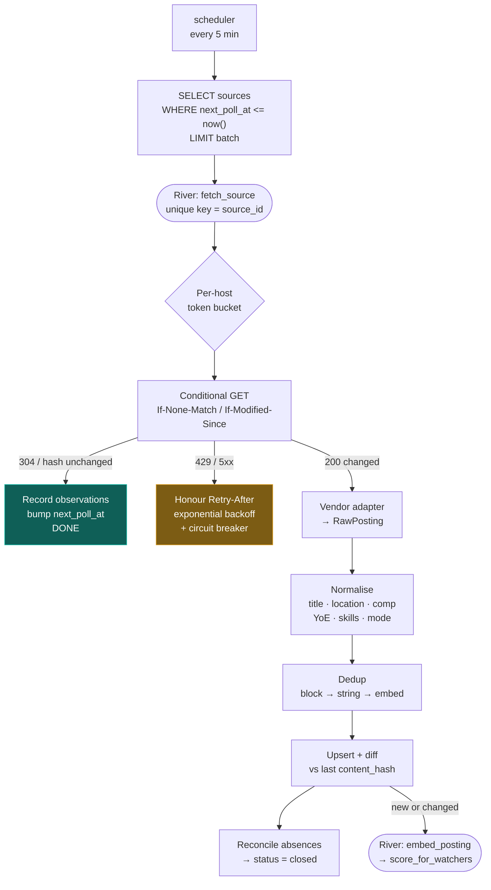
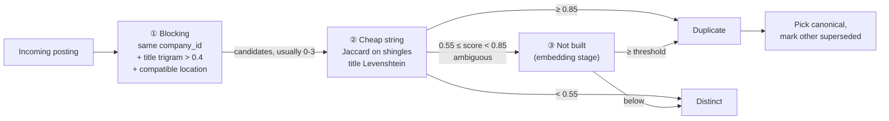

# Ingestion pipeline

> Status: **DECIDED**. Source inventory and per-vendor quirks:
> [source-catalog.md](../research/source-catalog.md). Legal and policy basis:
> [ADR-0004](adr/0004-source-acquisition-policy.md).

This is the component the whole product depends on. If ingestion is late, wrong, or duplicated,
nothing downstream can compensate.

## 0. What makes this hard

Fetching is easy. The difficulty is in four places, in ascending order of pain:

1. **Scheduling** — polling 5,000 boards often enough to be fresh without being abusive.
2. **Normalisation** — six ATS vendors with six schemas, date formats, and location conventions.
3. **Deduplication** — one requisition can appear on a Greenhouse board, the company's JSON-LD
   careers page, and a second board, with different text each time.
4. **Closure detection** — knowing a posting is dead, which nobody tells you.

Each gets a section.



---

## 1. Source policy in one paragraph

We fetch **only** public, unauthenticated, first-party endpoints that the publisher intends for
machine consumption: ATS job-board JSON APIs, and `schema.org/JobPosting` JSON-LD embedded in company
career pages. No accounts, no logins, no CAPTCHA solving, no proxy rotation, no board scraping.

The reasoning is both legal and engineering, and the engineering half is the more persuasive: ATS
public feeds exist so employers can embed listings on their own marketing sites, which means the
vendor's paying customer depends on them staying available. Board scraping, by contrast, is opposed
by the board's own interest — which is why `JobFunnel` was **archived by its author** when boards
moved to aggressive anti-automation `[B-11]`. Full argument: [ADR-0004](adr/0004-source-acquisition-policy.md).

---

## 2. Adaptive scheduling

### The freshness requirement

Postings collect hundreds of applications within hours, and being in the first day matters more than
tailoring `[B-04]`. A flat "poll everything 2–3 times a day" — the obvious design — gives a **worst
case of 8–12 hours** of staleness on exactly the roles the user cares most about.

So polling frequency is **driven by user attention and observed change rate**, not by a fixed cron.

### Tiers

| Tier | Membership | Interval | Freshness SLO (median) |
|---|---|---|---|
| **A** | Any company on any user's watchlist, **or** changed in the last 7 days | **2 h** | ≤ 90 min |
| **B** | Changed in the last 30 days | 6 h | ≤ 4 h |
| **C** | No change in 30+ days | 24 h | ≤ 8 h |
| paused | Circuit breaker open, or operator-disabled | — | — |

Tier is recomputed nightly, and **promotion to A is immediate** when a user watches a company. That
coupling is the elegant part: user attention directly drives crawl priority, so the sources that
matter are the fresh ones, and the long tail costs almost nothing.

### Why this is affordable — the arithmetic

The reason a flat schedule seems necessary is an assumption that polling is expensive. With
conditional requests it is not.

Assume 5,000 sources: 500 tier A, 1,500 tier B, 3,000 tier C.

```
Tier A:   500 sources × 12 polls/day  =  6,000
Tier B: 1,500 sources ×  4 polls/day  =  6,000
Tier C: 3,000 sources ×  1 poll/day   =  3,000
                                        ───────
                                         15,000 requests/day  ≈  0.17 req/s
```

Spread across ~5,000 distinct hosts, that is **roughly three requests per host per day** — far
gentler than a search engine crawler. And because ~90% return `304 Not Modified` or an unchanged
content hash, actual parsing work is around 1,500 payloads/day.

**Tier A at 2-hour intervals is therefore ~40× fresher than the naive design at a fraction of the
bandwidth.** This is the single highest-leverage decision in the pipeline.

### Politeness

Non-negotiable, and stricter than the law requires:

- **`robots.txt` is fetched, cached for 24 h, and honoured** for JSON-LD career-page sources,
  including `Crawl-delay`. ATS API endpoints are exempt only where the vendor documents the endpoint
  as a public integration surface.
- **Per-host token bucket**, default 1 request per 2 s, never concurrent to the same host.
- **Adaptive backoff on latency.** If a host's response time rises, the delay before the next request
  to that host rises with it — a common production heuristic is to wait a multiple of the observed
  response time, which backs off automatically under load without hard-coding per-domain rules
  `[B-18]`.
- **`Retry-After` is honoured exactly** on 429 and 503.
- **Identifying User-Agent** with a contact URL. If we are causing a problem, we want to be told
  rather than blocked.
- **Jitter** on `next_poll_at` so 500 tier-A sources do not fire simultaneously on the hour.

### Circuit breaker

Per source: 5 consecutive failures → `disabled_until = now() + 6h`, alert raised. Per vendor: if
> 30% of that vendor's sources fail within 15 minutes, pause the whole vendor — that pattern means
the vendor changed something, and hammering it will not help.
Runbook: [R1](../operations/runbooks.md#r1--a-source-adapter-is-failing).

---

## 3. Fetching

**Conditional requests are the mechanism that makes the whole schedule work.**

```go
// Send whichever validators we hold. Vendors are inconsistent about which they
// honour, and we would rather send both than guess wrong — a missed 304 costs
// bandwidth, but a wrongly-assumed 304 costs freshness, which is the product.
req.Header.Set("If-None-Match", src.ETag)
req.Header.Set("If-Modified-Since", src.LastModified)
```

Three layers of change detection, cheapest first:

1. **HTTP 304** — no body transferred. Ideal.
2. **Content hash** — some vendors always return 200. We hash the response body and compare; equal
   means no parse, no diff, no downstream work.
3. **Per-posting hash** — within a changed board, only postings whose normalised hash moved are
   re-processed. A board where one of 400 roles changed does one posting's worth of work.

Every fetch, including a 304, writes `posting_observations` rows. That table is what makes closure
detection and company hiring posture possible, so the cheap path still produces the data.

**Limits:** 30 s timeout, 10 MB response cap, no redirects across hosts without re-checking
`robots.txt`, TLS verification always on.

---

## 4. Normalisation

Where the real engineering cost lives. The vendors differ in ways that are individually trivial and
collectively a full-time adapter surface `[A-19]`:

| Vendor | Endpoint | Pagination | Quirk that bites |
|---|---|---|---|
| Greenhouse | `boards-api.greenhouse.io/v1/boards/{token}/jobs?content=true` | **None** — entire board in one response, even at 500+ roles | `content` is HTML **that is itself HTML-escaped**; needs a decode pass before parsing |
| Lever | `api.lever.co/v0/postings/{site}?mode=json` | `skip` / `limit` | `createdAt` is **epoch milliseconds**, not ISO-8601 |
| Ashby | `api.ashbyhq.com/posting-api/job-board/{board}?includeCompensation=true` | None | **Best compensation data of any vendor** — but it nests in `summaryComponents`, sometimes top-level, sometimes inside `compensationTiers` |
| SmartRecruiters | `api.smartrecruiters.com/v1/companies/{co}/postings` | `limit`/`offset`, max 100 | **Descriptions are absent** from the list; one extra request per posting, returned as sections needing reassembly |
| Recruitee | `{company}.recruitee.com/api/offers/` | None | Per-company subdomain, so an invalid slug fails as **DNS resolution, not HTTP 404** — a different error path entirely |
| Workable | `workable.com/api/accounts/{sub}?details=true` | None | Locations and departments come from **separate endpoints** |
| Personio | `{company}.jobs.personio.de/xml?language=en` | None | **XML**, not JSON; domain may be `.com` |
| JSON-LD | Company career page | n/a | Quality varies enormously; `title` and `datePosted` appear in ~99% of postings but `baseSalary` and `employmentType` in only ~80% `[A-12]` |

**Design consequence:** one adapter per vendor behind a single interface, each with **golden-file
tests against captured real responses**. Adapters never hit a live ATS in CI. When a vendor changes
their shape, exactly one file changes and one golden test fails — which is how we find out.

```go
// Adapter is the only vendor-aware surface in the system. Everything downstream
// consumes RawPosting and does not know which ATS produced it.
type Adapter interface {
    Fetch(ctx context.Context, src Source) (FetchResult, error)
    Parse(ctx context.Context, body []byte) ([]RawPosting, error)
}
```

### The canonical schema

We normalise to `schema.org/JobPosting` field semantics rather than inventing our own vocabulary.
This is deliberate: JSON-LD sources already speak it, ATS vendors broadly map to it, and it gives us
an unambiguous definition to point at when two adapters disagree about what `employmentType` means.

Normalisation steps, each independently tested:

| Step | What it does | Hard part |
|---|---|---|
| **Title** | Lowercase, strip seniority tokens into a separate field, expand abbreviations (`Sr.`→senior, `SDE`→software engineer) | Title conventions differ by market; `SDE-1` vs `Software Engineer I` vs `Engineer, Backend (L3)` |
| **Location** | Parse into country / region / city; resolve aliases (`Bengaluru`=`Bangalore`) | Free text like `"Remote (US or Canada)"` or `"Bangalore / Hyderabad / Remote"` — one posting, three locations |
| **Work mode** | Derive `onsite`/`hybrid`/`remote` | **Never trust the vendor's flag.** A posting tagged `remote` whose body says "3 days in office" is hybrid. We cross-check the flag against the description and prefer the description |
| **Compensation** | Structured range + currency + period | Ashby gives structure; others need text extraction (`"₹28-42 LPA"`, `"$180k–$220k"`). `comp_source` records which, so the UI can be honest about it. **NULL ≠ zero** |
| **YoE** | `yoe_min`/`yoe_max` + a confidence | `"3+ years"`, `"2-4 years"`, `"senior"` with no number. Low confidence is stored as low confidence, and filters treat it as unknown rather than excluding the posting |
| **Skills** | Map to the canonical skill vocabulary, classify `must_have` / `nice_to_have` | Section-aware: skills under "Requirements" are must-have, under "Nice to have"/"Bonus" are not. Getting this wrong makes every score uniformly low and useless |

**`parse_confidence` is computed per posting** and carried all the way to the UI. If we extracted a
title and nothing else, the card says so rather than scoring on fragments (P3).

---

## 5. Deduplication

One requisition can legitimately appear three times: the company's Greenhouse board, its JSON-LD
careers page, and a second ATS during a migration. Showing it three times destroys the feed.

We use the three-stage approach validated in the Fraunhofer job-posting duplicate-detection work,
whose central finding is that **no single technique performs acceptably alone** — combining string
comparison, text embeddings, and curated weighted skill lookups produces a significant boost, and
their tool runs in production `[A-20]`. Only the first two stages below are built; the embedding stage is not ([ADR-0022](adr/0022-retrieval-is-lexical.md)).



**Stage 1 — blocking.** Never compare all pairs. Candidates must share `company_id`, have title
trigram similarity > 0.4 (`pg_trgm`, indexed), and have compatible locations. This reduces an
O(n²) problem to a handful of comparisons per posting.

**Stage 2 — cheap string similarity.** Jaccard over description shingles plus title edit distance.
Resolves the large majority of cases at negligible cost.

**Stage 3 — embeddings, only for the ambiguous band. Not built.** The design was cosine similarity plus
weighted skill overlap. No embeddings are generated ([ADR-0022](adr/0022-retrieval-is-lexical.md)), and `internal/jobs/dedupe.go` says
so explicitly: dedup runs exact matching (same company and requisition id) and fuzzy matching (trigram
blocking on normalised title, plus location and work-mode agreement).

**Canonical selection**, in priority order — this ranking encodes the delivery mechanic from
[problem-statement §4](../product/problem-statement.md#4-delivery-is-not-guaranteed--and-this-is-the-most-under-documented-mechanic-in-job-search):

1. Direct ATS source over JSON-LD (the apply URL is more certainly the real one)
2. Richer compensation data
3. Longer description
4. Earlier `first_seen_at`

The loser gets `status = 'superseded'` and `canonical_id` pointing at the winner. **Nothing is
deleted** — the user can see both originals (P7), and a wrong merge is recoverable.

---

## 6. Closure detection

Nobody tells you a job is closed. Roughly 18–22% of online postings are estimated to be "ghost jobs"
`[A-06]`, and much of that is simply requisitions nobody took down.

**We do not attempt to divine intent. Absence from the source feed is the ground truth.**

```
For each source poll that returned a full payload (not 304):
  postings in DB for this source, status='live', NOT in this payload
    → missing_count += 1
    → if missing_count >= 2 consecutive full polls:
         status = 'closed', closed_at = now()
```

Two consecutive misses, not one, because a partial vendor response would otherwise close an entire
board. A poll returning **zero** postings for a board that had 200 is treated as a fetch failure, not
a mass closure — that asymmetry has saved every aggregator that implemented it and embarrassed every
one that did not.

**Staleness signals** shown to the user, distinct from closure:

| Signal | Meaning |
|---|---|
| `age_days` | From `posted_at`, or `first_seen_at` when the vendor gives no date |
| `last_seen_at` | Last confirmed present in its source feed |
| `repost_count` | Times a near-identical posting from this company appeared and vanished — a genuine ghost-job indicator |
| `has_disclosed_comp` | One of the four Greenhouse integrity correlates |

---

## 7. Idempotency and failure

Every stage is idempotent because retries are guaranteed.

- Identity is `(source_id, external_id)`; upserts use `ON CONFLICT`.
- Where a vendor gives no stable ID, we derive `sha256(canonical_url || normalised_title || company_id)`.
- River jobs carry a unique key, so a duplicate enqueue collapses.
- The whole per-source transaction — upsert, diff, close, enqueue downstream — commits atomically.
  There is no window where a posting exists without its scoring job, and therefore no outbox pattern
  and no saga ([service-topology §4](service-topology.md#why-there-is-no-outbox-pattern-no-saga-and-no-broker)).

| Failure | Handling |
|---|---|
| Timeout / 5xx | Retry with exponential backoff + jitter, max 5 attempts, then circuit breaker |
| 429 | Honour `Retry-After` exactly; do not retry sooner |
| 404 / DNS failure | Source likely gone. Mark `disabled_until` +24 h, alert after 3 days |
| Malformed payload | **Store the raw body**, fail the job, alert. Never silently drop — this is how we detect vendor schema changes |
| Partial payload | Detected by the zero/low-count guard; treated as failure |

---

## 8. What we measure

| Metric | Type | Alert |
|---|---|---|
| `ingest_latency_seconds` (source change → visible) | histogram by tier | p50 > SLO for 30 min |
| `source_poll_total` | counter by vendor, status | — |
| `source_poll_304_ratio` | gauge by vendor | **Sudden drop** — means our conditional requests stopped working, and cost is about to spike |
| `postings_upserted_total` | counter | — |
| `dedup_merges_total` | counter by stage | Sharp rise — a normalisation regression |
| `parse_confidence` | histogram by vendor | p50 drop — vendor changed their schema |
| `sources_disabled` | gauge | > 5% of a vendor's sources |

`source_poll_304_ratio` deserves the emphasis. It is the leading indicator for both cost and
politeness: if it falls, we are about to hammer every source we track, and we would rather learn that
from a metric than from a vendor blocking us.
