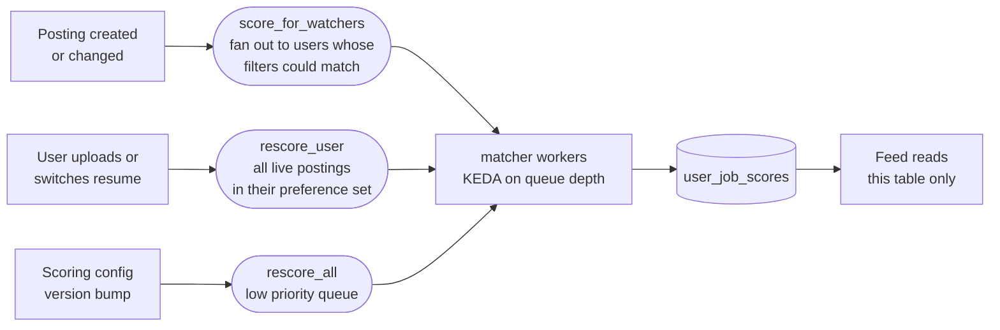

# Matching and scoring

> **Amended 2026-08-25.** The `matcher` service described below no longer
> exists. [ADR-0016](adr/0016-scores-are-computed-not-materialised.md)
> computes scores on the read path, which removed the scoring fan-out and the
> `score` / `score_bulk` queues — the matcher's only work. There are now **five**
> deployment units: api, ingestor, scheduler, resume-parser, migrate. Everything
> else on this page still holds.

> Status: **DECIDED**. Retrieval mechanics: [ADR-0006](adr/0006-hybrid-retrieval-and-scoring.md).
> Resume parsing: [ADR-0007](adr/0007-resume-parsing-local-first.md).

The user asked for scoring to be **configuration-controlled**. That requirement shapes the whole
design: the scoring model is data, not code, and can be tuned, versioned, A/B-tested and rolled back
without a deploy.

## 0. The governing constraint

From [principles.md §P3](../product/principles.md#p3--never-claim-precision-we-do-not-have):

> A match score of "87%" implies a calibrated probability. We do not have one, and neither does any
> competitor displaying such a number.

So the output of this system is not a number. It is:

```
Band          Strong fit
Score         78            (available on expand, not headline)
Components    skills 32/40 · yoe 15/15 · location 10/10 · comp 8/15 · semantic 13/20
Gaps          Missing must-haves: Kafka, Terraform
Confidence    0.82          (resume parsed 0.91 · posting parsed 0.74)
```

Every one of those lines is renderable in the UI, and the last two are the ones competitors omit.

---

## 1. The model

A weighted sum over independent components. Deliberately **not** a learned end-to-end ranker,
because [P7](../product/principles.md#p7--explainability-is-a-feature-not-a-debug-tool) requires that
we can explain any ranking as text.

```
score = Σ (weight_i × component_i) × confidence_penalty
```

Configuration, checked into the repo and hot-reloadable:

```yaml
# config/scoring/default.yaml
version: "2026.08.1"
bands:
  strong:    { min: 70 }
  plausible: { min: 50 }
  stretch:   { min: 30 }
  unlikely:  { min: 0 }

components:
  skills:
    weight: 40
    must_have_ratio: 0.75      # must-haves carry 75% of the skills component
    partial_credit_adjacent: 0.5  # 'MySQL' earns half credit toward 'PostgreSQL'
  experience:
    weight: 15
    # Asymmetric by design: being under the stated band is normal and survivable;
    # being far over it signals the role is a step backwards.
    under_penalty_per_year: 4
    over_penalty_per_year: 8
    stretch_tolerance_years: 2
  location:
    weight: 10
  compensation:
    weight: 15
    undisclosed_treatment: neutral   # never penalise a posting for not disclosing
  semantic:
    weight: 20
  freshness:
    # Not a match component — a ranking multiplier. See §5.
    half_life_days: 7

confidence:
  min_posting_parse: 0.4     # below this, do not score at all
  penalty_curve: linear
```

**Why configuration rather than code:** weights are the part most likely to be wrong at launch and
most likely to need adjusting per market. An Indian SDE-1 search and a US staff-engineer search want
different weights. Config makes that a data change with a version stamp on every score row
(`user_job_scores.profile_version`), which means we can tell exactly which model produced which score
and re-run a cohort after a change.

---

## 2. Component: skills coverage

The largest component and the one that determines whether scores are useful at all.

**The must-have / nice-to-have split is the whole ballgame.** Treating every technology mentioned in a
job description as required produces scores that are uniformly low — every posting mentions fifteen
technologies and nobody has all fifteen — and a uniformly low score cannot rank anything.

Classification is **section-aware**, applied during ingestion:

| Section heading matches | Classification |
|---|---|
| `requirements`, `qualifications`, `you have`, `must have`, `basic qualifications` | `must_have` |
| `nice to have`, `bonus`, `preferred`, `plus`, `desirable` | `nice_to_have` |
| Anywhere else (intro, benefits, "our stack") | `mentioned` — scored at low weight |

```
skills_score = 40 × ( 0.75 × must_have_coverage + 0.25 × nice_to_have_coverage )

where coverage counts a skill as matched if:
  - exact canonical match, or
  - alias match (postgres → postgresql), or
  - adjacent match at partial_credit_adjacent (mysql → postgresql, 0.5)
```

**Adjacency comes from a curated table, not from embeddings.** Embedding similarity puts "Java" and
"JavaScript" close together, which is exactly the failure a candidate would be furious about.
Adjacency is hand-maintained per skill pair, sourced from the skill taxonomy, and reviewed. The
Fraunhofer duplicate-detection work reached the same conclusion in a neighbouring problem —
**curated weighted lookup lists for specific skills outperformed embeddings alone** `[A-20]`.

**Years-weighted matching:** a resume claiming 6 months of Kubernetes against a posting wanting 3
years scores partial, not full. Years come from `resume_skills.years`, derived by attributing skills
to dated employment periods.

---

## 3. Component: experience fit

```
if yoe_confidence < 0.5:            # posting's YoE claim is unreliable
    return neutral (full marks)     # do not penalise on our own parse failure

gap_under = max(0, posting.yoe_min - user.total_yoe)
gap_over  = max(0, user.total_yoe - posting.yoe_max)

score = 15 - 4×gap_under - 8×gap_over    # floored at 0
```

Two deliberate asymmetries:

**Under-shooting is penalised half as much as over-shooting.** A large share of SDE-1 postings say
"2+ years", and that band is soft in practice — self-filtering there costs real opportunities
`[problem-statement §6](../product/problem-statement.md#6-the-india--bengaluru-layer)`. A 1-YOE
engineer applying to a "2+ years" role should see `plausible`, not `unlikely`. Meanwhile a
6-year engineer looking at an intern posting genuinely should be pushed down.

**Our own parse failure never costs the user.** If `yoe_confidence` is low, the component returns
full marks rather than a guess. This rule recurs across every component and is the practical form of
P3: **uncertainty on our side is never converted into a penalty on the user's side.**

---

## 4. Components: location, compensation, semantic

**Location** (weight 10). Exact metro match, then country match, then remote-compatible. A `remote`
posting with a region restriction the user fails scores zero — that is a knockout, and it also
surfaces in the knockout radar.

**Compensation** (weight 15). The rule that matters:

```
if posting.comp_min is NULL:
    return neutral (full marks)   # undisclosed_treatment: neutral
```

Only ~80% of postings carry salary data `[A-12]`, and Ashby is the only ATS returning it
consistently. Penalising non-disclosure would systematically down-rank every Greenhouse and Lever
posting — an artefact of the *source*, not of the job. The UI distinguishes *"below your floor"* from
*"not disclosed"* rather than collapsing them.

**Semantic** (weight 20). Cosine similarity between the resume embedding and the posting embedding,
384-dimensional, rescaled from the observed distribution rather than used raw.

Its weight is capped at 20 on purpose. Cosine similarity over whole documents rewards **shared
vocabulary and document register** more than actual fit — two backend job descriptions from the same
company are more similar to each other than either is to a matching resume. It is a good tie-breaker
and a poor primary signal. This is why the architecture is hybrid rather than embedding-first; see
[ADR-0006](adr/0006-hybrid-retrieval-and-scoring.md).

---

## 5. Ranking composite

The **score** answers "how well do I fit this?". The **rank** answers "what should I look at now?".
They are not the same question, and conflating them is a common product mistake.

```
rank_key = score × freshness_multiplier

freshness_multiplier = 0.5 ^ (age_days / half_life_days)   # half_life_days = 7
```

A perfect match posted 12 days ago is multiplied by ~0.31 and falls below a merely-strong match
posted this morning. **This is correct**, because the 12-day-old posting already has hundreds of
applicants and being in the first day matters more than fit at the margin `[B-04]`.

Users who disagree can switch the sort to `Best match`, which drops the freshness term. The default
encodes our view; the control lets them override it.

---

## 6. When scoring runs

Scores are **precomputed**. The feed reads `user_job_scores`; it never scores at request time.



**Fan-out is bounded, not universal.** Scoring every new posting against every user is O(users ×
postings) and would dominate all other work. Instead a new posting is scored only for users whose
stored preferences (`pref_countries`, `pref_modes`, YoE band) make it plausibly relevant — typically
a few percent of the user base. Volume analysis:
[scaling-and-capacity §3](../operations/scaling-and-capacity.md#3-scoring-load).

**`rescore_all` runs on a low-priority queue** so a config change cannot starve live scoring.

**Unscored postings still appear** in the feed, marked `scoring…`, ordered by recency. Freshness beats
completeness (P2) — hiding a two-hour-old posting because a worker is behind would defeat the point of
the product.

---

## 7. Retrieval

Scoring ranks a candidate set. Getting that candidate set — especially for free-text search — is
hybrid retrieval, fused with Reciprocal Rank Fusion.

```
lexical  : ts_rank over search_tsv        (GIN indexed)
semantic : pgvector cosine, HNSW, iterative_scan on
fusion   : RRF —  Σ 1 / (k + rank_i),  k = 60
```

RRF ignores raw scores and uses only rank positions, which sidesteps the fact that `ts_rank` and
cosine distance live on incomparable scales. A document ranking highly in both lists rises; no
normalisation is needed `[B-19]`.

`ts_rank` is a TF-IDF variant rather than true BM25, which is a real but acceptable limitation at our
corpus size — the fusion shape is identical to what you would write against Elasticsearch, without
adding Elasticsearch. If lexical quality becomes the binding constraint, the upgrade path is a BM25
extension (ParadeDB's `pg_search`) inside the same Postgres, not a separate search cluster.

### Filtered vector search — the setting that is not optional

With approximate indexes, **filtering is applied after the index is scanned**. At the default
`hnsw.ef_search = 40`, a predicate matching 10% of rows leaves roughly **4 results** `[A-13]`. Our
queries are always filtered (location, YoE, freshness), so the default silently returns short result
sets — the worst kind of bug, because nothing errors.

`hnsw.iterative_scan` is an **enum, not a boolean** — `off` (default) | `strict_order` |
`relaxed_order`:

```sql
SET LOCAL hnsw.iterative_scan = relaxed_order;  -- keeps scanning until LIMIT is satisfied
SET LOCAL hnsw.ef_search = 100;                 -- wider candidate list; 40 is too narrow for us
SET LOCAL hnsw.max_scan_tuples = 20000;         -- bound the worst case
```

We use **`relaxed_order`**: it returns better recall for the same work, and exact distance ordering
does not matter because the weighted scorer re-ranks everything afterwards anyway. `strict_order`
would buy ordering we immediately discard.

⚠️ **Known caveat:** with `relaxed_order` the planner may still assume the index returns strictly
ordered rows ([pgvector#862](https://github.com/pgvector/pgvector/issues/862)). Retrieval therefore
never relies on index order for correctness — the scorer sorts. An integration test asserts result
*count* under a 5%-selectivity filter, which is what catches a regression here.

`SET LOCAL` scopes these to the transaction rather than leaking across a pooled connection — a real
hazard once PgBouncer is in front ([caching-and-storage](caching-and-storage.md#5-connection-pooling)).

---

## 8. Confidence

Confidence is a first-class output, computed from both sides:

```
confidence = min(resume.parse_confidence, posting.parse_confidence)

if posting.parse_confidence < 0.4:
    do not score at all — show the posting with "insufficient detail to score"
```

Confidence is displayed, and it damps the score toward the band midpoint rather than being applied as
a silent multiplier — a low-confidence score should read as *uncertain*, not as *bad*.

In Go this is enforced by the type system rather than by convention:

```go
// Scored values never travel without their confidence. A function that returns
// a bare float64 score cannot exist in this package — the constructor is
// unexported and requires both.
type Scored struct {
    Value      float64
    Confidence float64
    Components []Component
}
```

---

## 9. Calibration and evaluation

A scoring model nobody evaluates drifts silently. Three mechanisms:

**Golden corpus.** ~200 hand-labelled resume/posting pairs with an expected *band*, never an exact
value. CI fails if band accuracy drops below 85%. Bands rather than values because exact scores are
not meaningful and testing against them produces brittle tests that get deleted.

**Distribution monitoring.** Score distribution per band, tracked over time. If `strong` grows from
5% to 30% of results, something regressed — most likely must-have classification. This catches more
real problems than the golden corpus does.

**Outcome feedback (v2+, and honestly labelled).** We know which scored postings the user applied to
and what happened. That is the only real ground truth, and it is heavily confounded — users apply to
what we rank highly, so outcomes partly measure our own ranking. It is used to detect gross
miscalibration, **not** to train an end-to-end ranker, because that would break explainability (P7).

If a learned re-ranker is ever added, it sits **on top of** the explainable base score and is capped
in how far it may move a result, so the explanation stays true.

---

## 10. What we deliberately do not do

| Not doing | Why |
|---|---|
| Show a headline percentage | [P3](../product/principles.md#p3--never-claim-precision-we-do-not-have) |
| Embedding-only matching | Cosine over documents rewards shared register over fit; caps out as a tie-breaker |
| Learned end-to-end ranking as the primary order | Unexplainable; violates [P7](../product/principles.md#p7--explainability-is-a-feature-not-a-debug-tool) |
| LLM scoring on the hot path | Cost, latency, non-determinism, and it cannot be tested against a golden corpus. Optional enrichment only, opt-in, [ADR-0007](adr/0007-resume-parsing-local-first.md) |
| Penalise postings with no salary | Punishes an artefact of the source vendor, not the job |
| Penalise the user for our parse failures | Uncertainty on our side never becomes a penalty on theirs |
| Hide postings that score badly | The user decides; we inform. Same rule as the knockout radar |
