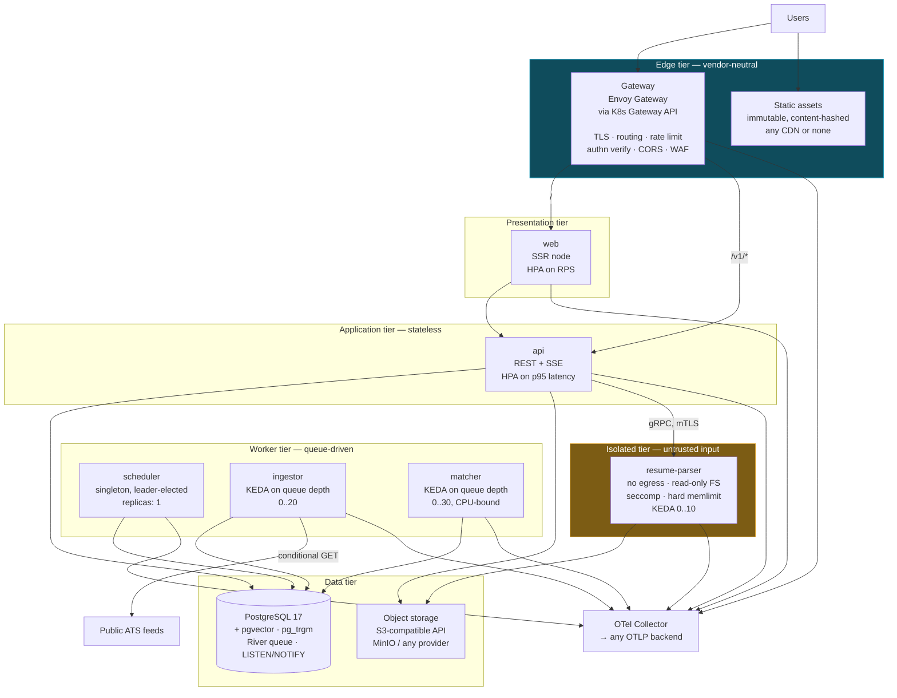
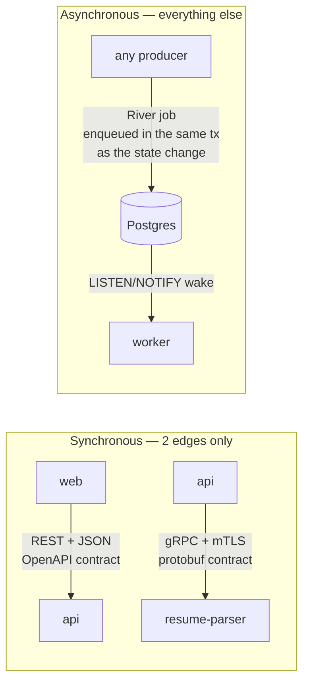
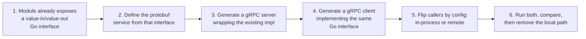

# Service topology, gateway and scaling

> **Amended 2026-08-25.** The `matcher` service described below no longer
> exists. [ADR-0016](adr/0016-scores-are-computed-not-materialised.md)
> computes scores on the read path, which removed the scoring fan-out and the
> `score` / `score_bulk` queues — the matcher's only work. There are now **five**
> deployment units: api, ingestor, scheduler, resume-parser, migrate. Everything
> else on this page still holds.

> Status: **DECIDED**. Decision rationale in [ADR-0008](adr/0008-service-decomposition.md).
> Read that first if you are wondering why this is not eight microservices.

This document specifies the runtime topology: the gateway tier, every deployment unit, how each
scales, how they communicate, and how a module gets extracted into a network service when a trigger
fires.

**Vendor neutrality is a hard requirement here.** Every component named below is either an open
standard, a CNCF project, or a protocol with multiple interchangeable implementations. There is no
managed-service dependency anywhere on the critical path. §8 states the portability contract and how
it is tested.

---

## 1. Runtime topology



**Note what is absent:** no service mesh, no message broker, no cache tier, no service registry, no
distributed transaction coordinator. Those exist to solve problems created by network boundaries
between components that share data. We have exactly one such boundary (`api` → `resume-parser`), and
it is request/response with no shared state, so it needs none of them.

---

## 2. The gateway tier

**Choice: Envoy Gateway, configured through the Kubernetes Gateway API.**

### Why Gateway API rather than Ingress

This is not a preference — Ingress is being retired.

The Kubernetes Steering and Security Response Committees announced the retirement of the
**ingress-nginx** project in November 2025; it reached **end of life in March 2026**, with no further
releases, bug fixes, or security patches `[A-15]`. Ingress-nginx was critical infrastructure in
roughly half of cloud-native environments, so this is a large, industry-wide migration and starting a
new project on Ingress in 2026 would be building on a dead component.

Gateway API core resources — `GatewayClass`, `Gateway`, `HTTPRoute`, `GRPCRoute`, `ReferenceGrant` —
reached **GA and are production-ready**, and Gateway API has replaced Ingress as the de facto
Kubernetes traffic standard `[A-16]`.

### Why Envoy Gateway specifically

| Option | Assessment |
|---|---|
| **Envoy Gateway** ✅ | CNCF-graduated Envoy data plane, **vendor-neutral controller**, first-class Gateway API implementation, strong native observability, WASM extensibility. C++ data plane gives consistently lower latency than Go-based gateways |
| Apache APISIX | Fully Apache-2.0 with no enterprise tier — genuinely attractive. Config propagates via etcd in milliseconds. Rejected only because it adds **etcd** as a second stateful dependency, violating [P6](../product/principles.md#p6--every-dependency-is-a-liability) |
| Kong | Most widely deployed, large plugin ecosystem. Rejected: plugin config propagates via its **database**, adding a stateful dependency, and the open-core split creates a pull toward the paid tier |
| Traefik | Best auto-discovery and built-in ACME. Reasonable alternative; keep as fallback. Rejected as primary on data-path latency consistency |
| Cloud provider gateway (ALB, Cloud LB, App Gateway) | **Rejected outright** — violates the vendor-neutrality requirement |

**Escape hatch:** because configuration is expressed in Gateway API resources rather than in
Envoy-specific config, swapping the implementation to Istio, Cilium, Kong or Traefik's Gateway API
controller is a `GatewayClass` change. This is the practical value of the standard, and it is why the
gateway choice is low-risk.

### What the gateway does — and does not do

| Gateway responsibility | Notes |
|---|---|
| TLS termination + automatic certificate renewal | ACME; no provider-specific cert manager |
| Path routing | `/v1/*` → `api`, `/` → `web`, `/healthz` → per-service |
| **Global rate limiting** | Per-IP and per-session. First line of defence; the API keeps its own per-user quota as the second |
| JWT/session **signature** verification | Cheap rejection of malformed credentials at the edge |
| CORS, request size limits, header normalisation | |
| Request ID injection + W3C `traceparent` propagation | Every request is traceable end-to-end from the edge |
| Circuit breaking + outlier ejection to upstreams | |

**Explicitly not at the gateway:** authorisation decisions, business logic, response transformation,
or anything requiring a database read. Authentication *verification* is at the edge; **authorisation
is in the application**, because an authorisation rule that lives in gateway config is a rule that
cannot be unit-tested and will drift from the code it protects.

---

## 3. Deployment units

All Go binaries are compiled from **one module**. Same code, different `main`.

### `api`

| | |
|---|---|
| **Responsibility** | Serve the REST API and SSE streams. All authorisation. No long-running work |
| **Scaling** | HPA on p95 latency (primary) and CPU (secondary). 2 → 20 replicas |
| **Min replicas** | 2, always — never scale a user-facing tier to zero |
| **Probes** | `/healthz` liveness (process alive); `/readyz` readiness (DB reachable, migrations at expected version) |
| **Graceful shutdown** | On SIGTERM: fail readiness immediately, drain for `terminationGracePeriodSeconds: 45`, then exit. The readiness flip must precede the drain, or the load balancer keeps sending traffic to a draining pod |
| **PDB** | `minAvailable: 50%` |
| **DB pool** | 10 per replica |

Long work is never done in a request. A request that needs work enqueues a River job in the same
transaction as its write and returns `202` with a poll or SSE handle.

### `ingestor`

| | |
|---|---|
| **Responsibility** | Fetch source feeds, normalise, deduplicate, upsert, reconcile closures |
| **Scaling** | **KEDA on River queue depth.** 0 → 20. `lagThreshold` = 50 jobs/replica |
| **Min replicas** | **0.** Scale to zero between poll cycles is correct and saves real money |
| **Shutdown** | River's own graceful stop: finish in-flight jobs, stop fetching new ones. `terminationGracePeriodSeconds: 120` — a slow ATS response must not be killed mid-flight |
| **DB pool** | 5 per replica |

Queue depth, not CPU, is the scaling signal. For asynchronous queue-driven work **backlog is the true
signal and infrastructure utilisation is a lagging proxy** `[B-15]` — an ingestor blocked on network
I/O shows near-zero CPU while the backlog grows, so a CPU-based HPA would scale exactly backwards.

### `matcher`

| | |
|---|---|
| **Responsibility** | Generate embeddings, compute scores, maintain `user_job_scores` |
| **Scaling** | KEDA on queue depth. 0 → 30. **CPU-bound**, so replica count tracks node CPU |
| **Isolation** | Separate node pool where available. This is the workload that would otherwise damage `api` p99 |
| **Shutdown** | Graceful; jobs are idempotent so a killed job simply re-runs |
| **DB pool** | 4 per replica |

### `scheduler`

| | |
|---|---|
| **Responsibility** | Enqueue periodic work: source polling sweeps, the 21-day ghost transition, partition maintenance, digest sends, retention |
| **Scaling** | **`replicas: 1`, never autoscaled.** Leader election via a Postgres advisory lock so a rolling deploy briefly overlapping two pods cannot double-enqueue |
| **Why separate** | A cron loop inside `api` would fire once per replica. Making the singleton explicit is what prevents that entire class of bug |
| **DB pool** | 2 |

`replicas: 1` means a brief scheduling gap during a rollout. That is acceptable: every scheduled job
is idempotent and catch-up-safe, computing what is *due* rather than assuming it ran on time.

### `resume-parser` — the one true service

| | |
|---|---|
| **Responsibility** | Turn an uploaded PDF/DOCX into structured JSON. Nothing else |
| **Interface** | gRPC, mTLS, `Parse(bytes) → ParsedResume`. Stateless, no database access |
| **Scaling** | KEDA on queue depth. 0 → 10 |
| **Hardening** | `automountServiceAccountToken: false`; **NetworkPolicy denying all egress**; read-only root filesystem; `runAsNonRoot`; dropped capabilities; seccomp `RuntimeDefault`; `memory.limit` 512 Mi; 30 s hard timeout per parse |
| **DB pool** | **none — no database credentials exist in this pod** |

**Why this one is extracted while the others are not:** it is the only component that executes
parsing logic over **untrusted binary input**. PDF parsers are a well-documented source of crashes,
unbounded memory growth and parser-level exploits. The isolation is a **security boundary**, not a
scaling decision — and it is why the argument for it survives even though the workload is small.

A crash here returns a clean error to the user. A crash of the same code inside `api` takes down
request handling for every user on that pod, and a memory exploit there would sit next to database
credentials and other users' session data.

### `web`

SvelteKit SSR node ([ADR-0002](adr/0002-frontend-framework.md)). HPA on RPS, min 2. Holds no
secrets beyond a server-side API token and never talks to Postgres.

### `migrate`

Kubernetes `Job`, not a Deployment. Runs to completion before a rollout begins. Exits non-zero to
abort the deploy. See [deployment-zdt.md](../operations/deployment-zdt.md).

---

## 4. Communication



### Why there is no outbox pattern, no saga, and no broker

The transactional outbox exists to solve the **dual-write problem**: when a service must update its
database *and* publish an event to a separate broker, either can fail independently, and the
standard remedy is to write the event into an outbox table inside the same transaction and relay it
`[B-16]`. It is genuinely mandatory infrastructure if you have a broker.

**We do not have that problem, because the queue is in the same database as the data.**

```go
// The state change and the work it triggers commit atomically. There is no
// window in which the posting exists but its scoring job does not.
tx, _ := pool.Begin(ctx)
defer tx.Rollback(ctx)

posting, err := q.UpsertPosting(ctx, tx, args)
_, err = riverClient.InsertTx(ctx, tx, ScorePostingArgs{PostingID: posting.ID}, nil)

return tx.Commit(ctx)
```

River is built on Postgres and pgx and supports enqueueing inside an existing transaction, which
collapses the dual-write problem rather than mitigating it `[A-17]`. No outbox table, no relay
process, no CDC pipeline, no Debezium, no Kafka, no saga compensation logic — because there is no
distributed transaction anywhere in the system.

This is the single largest simplification the topology buys, and it is a direct consequence of
[ADR-0003](adr/0003-postgres-single-datastore.md). If we ever add a second datastore, all of the
above comes back.

### Contracts

Both synchronous edges are **schema-first with automated breaking-change detection** — the discipline
that makes independent deployment safe:

| Edge | Contract | Enforcement |
|---|---|---|
| `web` ↔ `api` | OpenAPI 3.1, hand-written, checked in | Server types and TS client generated from it; contract tests generated from it; `oasdiff` fails CI on a breaking change |
| `api` ↔ `resume-parser` | Protobuf, `buf` module | `buf lint` + **`buf breaking`** against the previous release in CI |

`buf breaking` compares the current schema against a past version and reports changes that would break
clients or servers, with explicit rule categories for wire and JSON compatibility `[A-18]`. Protobuf
is forward- and backward-compatible **as long as field numbers are preserved and tags are never
reused**, so the tool enforces exactly the property that makes rolling deploys safe.

Rules: every RPC gets its own request and response message (never share them across RPCs, or you
cannot evolve one without the other); fields are added, never renumbered; removed fields are
`reserved`.

---

## 5. Resource and connection budgets

The shared database is the one real risk of this topology, so connection limits are a **hard
contract**, not a tuning parameter. A `matcher` scale-out event must never starve `api` of connections.

| Unit | Max replicas | Pool/replica | Max conns | CPU req/limit | Mem req/limit |
|---|---:|---:|---:|---|---|
| `api` | 20 | 10 | 200 | 250m / 1000m | 256Mi / 512Mi |
| `ingestor` | 20 | 5 | 100 | 200m / 1000m | 256Mi / 512Mi |
| `matcher` | 30 | 4 | 120 | 500m / 2000m | 512Mi / 1Gi |
| `scheduler` | 1 | 2 | 2 | 50m / 200m | 64Mi / 128Mi |
| `resume-parser` | 10 | **0** | **0** | 250m / 1000m | 256Mi / **512Mi** |
| **Total** | | | **422** | | |

Postgres `max_connections` is **600**, leaving headroom for migrations, operator sessions and
backups. Above ~400 total, introduce PgBouncer in transaction mode — this is the documented first
scaling step, not an emergency measure. Trigger and procedure:
[scaling-and-capacity.md](../operations/scaling-and-capacity.md#5-bottleneck-order).

---

## 6. Zero-downtime properties of the topology

Deployment mechanics are in [deployment-zdt.md](../operations/deployment-zdt.md). What the *topology*
contributes:

- **Readiness gates traffic, liveness restarts.** Conflating them causes rolling restarts under load.
- **`preStop` sleep of 5 s before drain.** Endpoint propagation is eventually consistent across
  kube-proxy and the gateway; without this pause a pod stops accepting connections before every proxy
  has learned it is gone, and users see resets. This is the most commonly missed detail in
  "zero-downtime" Kubernetes setups.
- **PodDisruptionBudgets on every workload.** A PDB limits how many pods may be unavailable during
  *voluntary* disruptions — node drains, cluster upgrades, autoscaler actions `[B-17]`. Without one,
  a routine node upgrade can evict every replica at once. `minAvailable: 50%` on `api` and `web`;
  `maxUnavailable: 1` on workers.
- **Topology spread constraints** across zones, so a zone loss degrades rather than outages.
- **Workers are killed safely by construction** because every job is idempotent and re-runnable.

Zero downtime needs all of these cooperating: replicas, spread, readiness probes, rollout settings,
capacity headroom, graceful termination, and a PDB `[B-17]`. Any one missing turns a routine
maintenance event into an incident.

---

## 7. Extraction path

When a trigger from [ADR-0008](adr/0008-service-decomposition.md#extraction-triggers) fires, this is
the procedure. It is short because the seams already exist.



Step 5 is the payoff: because the module is consumed through an interface, the choice between an
in-process call and a network call is a **wiring decision in `main`**, not a code change in any
caller. Both implementations satisfy the same interface, so the shadow-compare in step 6 is possible
at all.

**The preconditions that make this work** — and which the import linter enforces from day one:

- The module's interface takes and returns **values**, never database handles or transactions.
- The module **owns its tables**; nothing else writes them.
- No caller depends on the module sharing a transaction with it.

If any of those is violated the extraction becomes a rewrite. That is precisely why they are lint
rules rather than guidelines. `resume-parser` was extracted this way in v1, which proves the seam
holds rather than merely asserting it.

---

## 8. Vendor neutrality — the portability contract

Every dependency is an open standard or has ≥ 2 interchangeable implementations.

| Concern | Choice | Standard / portability | Swap cost |
|---|---|---|---|
| Compute | OCI containers on Kubernetes | Open standard; runs on any managed K8s, k3s, or bare metal | None |
| Ingress | **Gateway API** | Kubernetes GA standard | `GatewayClass` change |
| Gateway impl | Envoy Gateway | CNCF; Istio/Cilium/Kong/Traefik implement the same API | Hours |
| Database | PostgreSQL 17 | Portable across every managed provider and self-hosted | Dump/restore |
| Queue | River (Postgres tables) | **Travels with the database** | None |
| Object storage | **S3-compatible API** | MinIO, Ceph, and every cloud provider implement it | Endpoint config |
| Secrets | Kubernetes Secrets + External Secrets Operator | Provider-agnostic interface over any backend | Provider config |
| Telemetry | **OpenTelemetry / OTLP** | Vendor-neutral by design; any OTLP backend | Collector exporter config |
| CI | Container-based, no proprietary steps | Runs on GitHub Actions, GitLab CI, Woodpecker, Jenkins | Pipeline rewrite only |
| IaC | **OpenTofu** | MPL-2.0 fork under open governance; provider-based | — |
| Autoscaling | HPA + **KEDA** | CNCF; KEDA scalers exist for every queue backend | Scaler config |

**Explicitly forbidden on the critical path:** any managed queue (SQS, Pub/Sub, Service Bus), any
managed function runtime, any proprietary API gateway, any provider-specific database extension, and
any observability SDK that is not OTLP.

**How this is tested rather than asserted:** CI runs the full integration suite against
`docker compose` — Postgres, MinIO, and the app — with no cloud credentials present. A dependency
that cannot run in that environment cannot merge. Portability that is not exercised is portability
that has already been lost.

**The deliberate exception:** managed Postgres in production. We depend on the *Postgres protocol and
version*, not on a provider's extensions, so this is portable by dump/restore. Operating our own
primary with sync replication and PITR is a worse use of a small team than accepting this one soft
dependency — and it is reversible.

---

## 9. Summary

| Question the user asked | Answer |
|---|---|
| API gateway? | **Yes** — Envoy Gateway on Kubernetes Gateway API. Vendor-neutral, swappable via `GatewayClass`, and not built on the retired ingress-nginx |
| Separate backend / frontend / scheduler? | **Yes** — `api`, `web`, `scheduler` are independent deployments with independent scaling policies |
| Can it handle scale? | **Yes** — every tier scales independently; workers scale on queue depth to zero and back; the documented ceiling is ~400 RPS on 4 vCPU of app tier, with the next bottleneck (PgBouncer, then a read replica) identified in advance |
| Microservices or monolith? | **Neither as usually posed.** One codebase with mechanically-enforced module boundaries; six independently-scaled deployment units; one genuinely network-isolated service for untrusted input; documented triggers for extracting more. Full reasoning: [ADR-0008](adr/0008-service-decomposition.md) |
| Vendor agnostic? | **Yes** — §8, tested in CI with no cloud credentials |
