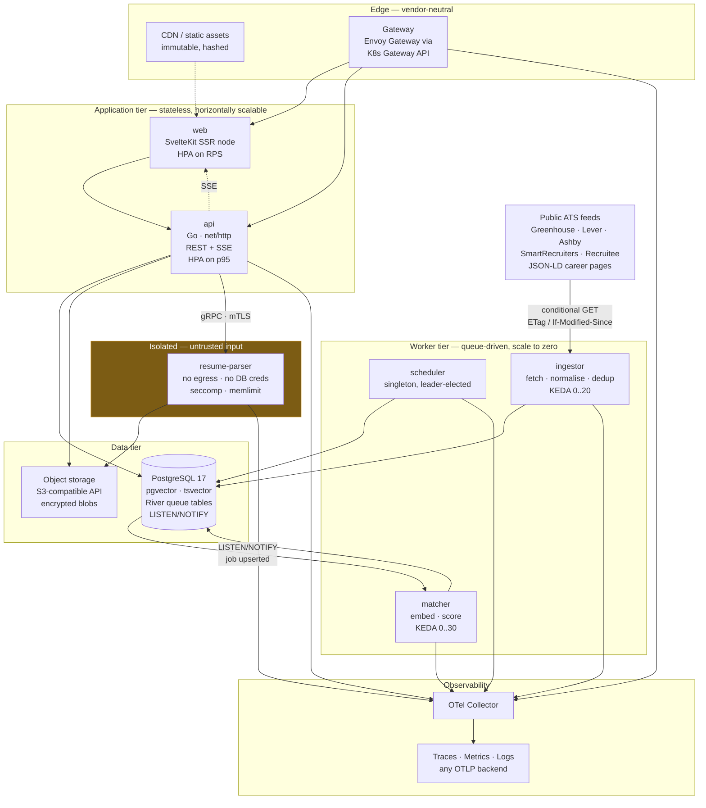
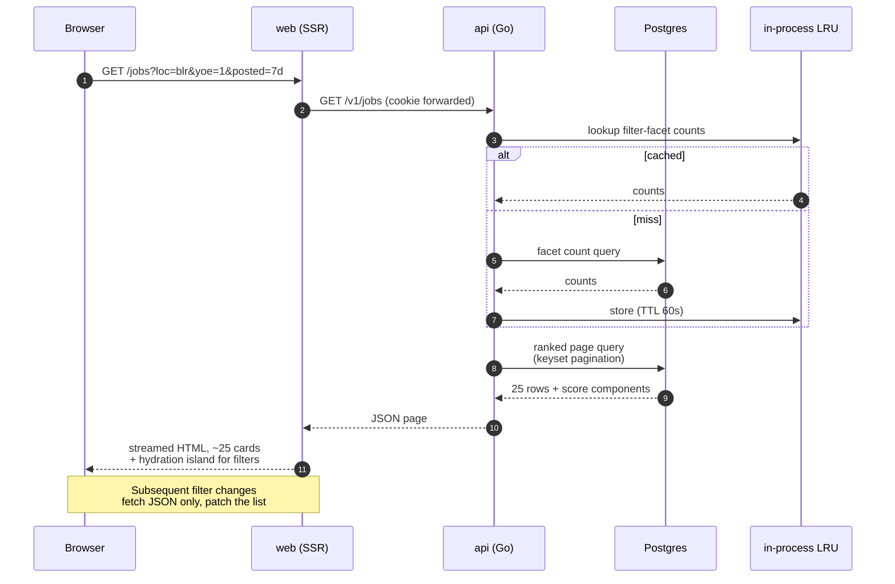
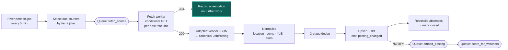
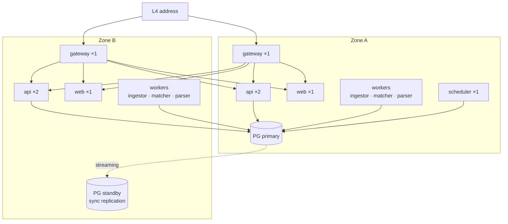

# System architecture

> **Amended 2026-08-25.** The `matcher` service described below no longer
> exists. [ADR-0016](adr/0016-scores-are-computed-not-materialised.md)
> computes scores on the read path, which removed the scoring fan-out and the
> `score` / `score_bulk` queues — the matcher's only work. There are now **five**
> deployment units: api, ingestor, scheduler, resume-parser, migrate. Everything
> else on this page still holds.

> Status: **DECIDED**.
>
> This document is the **overview**. The runtime topology — gateway tier, per-unit scaling policies,
> contracts, connection budgets and the vendor-neutrality contract — is specified in
> [service-topology.md](service-topology.md). The monolith-vs-microservices evaluation and its
> extraction triggers are [ADR-0008](adr/0008-service-decomposition.md).

## 1. Shape

**One Go module. Six binaries compiled from it. One Postgres. One gateway. One web app.**

The codebase is a modular monolith with mechanically-enforced boundaries; the *runtime* is a set of
independently-deployable, independently-scaled units split along **workload isolation** lines rather
than domain lines. This is a deliberate position between the two usual options and the reasoning is
in [ADR-0008](adr/0008-service-decomposition.md) — in short: at 4–400 RPS with a team of one to five,
request throughput never justifies distribution, but CPU isolation and untrusted-input isolation do.



**`migrate` is the sixth binary** and runs only as a pre-deploy job, never as a long-lived process.

### Why these units and not fewer

A single binary would be simpler, and for the first month it would work. We separate them because the
workloads have genuinely different failure, scaling and **trust** characteristics:

| Unit | Scaling signal | Failure tolerance | Why separate |
|---|---|---|---|
| `api` | p95 latency (HPA) | **None** — user-facing | Must be shielded from everything else |
| `ingestor` | Queue depth (KEDA) | Hours | I/O-bound; CPU-based scaling would scale it backwards |
| `matcher` | Queue depth (KEDA) | Hours | **CPU-saturating** — would damage `api` p99 in-process |
| `scheduler` | None — `replicas: 1` | Minutes | A cron loop inside `api` fires once *per replica* |
| `resume-parser` | Queue depth (KEDA) | Seconds | **Untrusted binary input** — a security boundary, not a scaling one |

The last row is the only one that is a true network service. Everything else coordinates through
Postgres, which is what keeps distributed-transaction machinery out of the system entirely.

### Why these units and not more

They share one database, one module, one release version and one deploy pipeline. That is deliberate:
splitting the feed query's four-way join across services would replace one indexed query with
distributed joins or continuous denormalisation. Prime Video's 90% cost reduction came from removing
exactly that kind of inter-component data movement `[A-14]`. Full evaluation, scoring matrix and
extraction triggers: [ADR-0008](adr/0008-service-decomposition.md).

### Why this few

No Redis, no Elasticsearch, no separate vector database, no message broker. Postgres provides
full-text search (`tsvector` + GIN), vector similarity (`pgvector` + HNSW), durable queueing (River),
pub/sub (`LISTEN/NOTIFY`) and scheduled jobs. One thing to back up, monitor, secure and upgrade.
Reasoning and the explicit exit conditions: [ADR-0003](adr/0003-postgres-single-datastore.md).

---

## 2. Request path — the jobs feed

The hot path, and the one the performance budget is written against.



**Design notes:**

- **Keyset pagination**, never `OFFSET`. At page 40 with `OFFSET 1000` Postgres still sorts a
  thousand rows it will discard. Keyset is `WHERE (rank_key, id) < ($1, $2) ORDER BY rank_key DESC, id DESC LIMIT 25`
  and stays flat. Contract in [api-design.md](api-design.md#3-pagination).
- **The score is precomputed**, not calculated per request. `matcher` writes `user_job_scores` when
  either the posting or the user's resume changes. A request reads it. See
  [matching-and-scoring.md §6](matching-and-scoring.md#6-when-scoring-runs).
- **SSR for the first paint, JSON for everything after.** The user gets HTML with real content on the
  first request; filter interactions never re-download the shell.
- **Facet counts are cached in-process, not in Redis.** They change slowly, are tiny, and are
  identical across users for a given filter prefix. An LRU with a 60-second TTL removes the entire
  argument for a cache tier (P6).

---

## 3. Ingestion path

Summarised here; the full design is [ingestion-pipeline.md](ingestion-pipeline.md).



The **304 path is the common case** and it costs almost nothing — roughly 90% of polls at steady
state. This is what makes 2-hour polling of watched companies affordable; see
[scaling-and-capacity.md §ingestion](../operations/scaling-and-capacity.md#2-ingestion-load).

---

## 4. Failure domains

The question that matters in review is *what still works when this breaks*.

| Component fails | Blast radius | Degradation | Recovery |
|---|---|---|---|
| `api` instance | None | Gateway ejects it via outlier detection | Rolling; readiness probe gates traffic |
| All `api` | Total outage | — | Multi-AZ from day one; 99.5% SLO absorbs this |
| Gateway instance | None | Multiple replicas behind an L4 address | Gateway runs ≥ 2 replicas with a PDB |
| `ingestor` | **No user impact for hours** | Feed goes stale; card age display makes this visible to the user rather than silent | Queue is durable in Postgres; work resumes exactly where it stopped |
| `matcher` | New postings appear **unscored** | Feed falls back to recency ordering with a banner: "scoring catching up" | Backlog drains; scores fill in |
| `scheduler` | Nothing new is enqueued | Existing queued work still drains. Visible within one poll interval as a rising ingest-latency metric | Restart; jobs compute what is *due*, so a gap self-heals without double-running |
| `resume-parser` | **Resume upload only** | Everything else works, including scoring against already-parsed resumes | Restart; the pod holds no state and no credentials |
| One source adapter | That vendor's postings go stale | Per-source circuit breaker opens; other vendors unaffected; source health surfaced in the UI | [runbooks §source-adapter-failing](../operations/runbooks.md#r1--a-source-adapter-is-failing) |
| Postgres primary | Total outage | — | Managed failover to standby; RPO ≤ 1 min, RTO ≤ 5 min |
| Object storage | Resume upload/download fails | Everything else works; existing parsed profiles are in Postgres | Retry with backoff |

**The deliberate property:** `ingestor` and `matcher` can be down for hours without breaking the
product, and their failures degrade visibly rather than silently. A stale feed that *says* it is stale
is recoverable; one that pretends to be fresh destroys trust permanently.

---

## 5. Consistency and idempotency

**Everything in ingestion is idempotent**, because retries are guaranteed.

- A posting's identity is `(source_id, external_id)` — a natural key from the vendor. Upserts use
  `ON CONFLICT` on that key.
- Where a vendor gives no stable ID (some JSON-LD pages), we derive one:
  `sha256(canonical_url || normalised_title || company_id)`. Documented per source in
  [source-catalog.md](../research/source-catalog.md).
- River jobs carry a **unique key** so a duplicate enqueue collapses rather than doing the work twice.
- **Job args are versioned.** A `fetch_source` arg struct gets a new field only additively, and
  workers must handle args enqueued by the previous release — this is expand/contract applied to the
  queue, and it is what makes rolling deploys safe.
  See [deployment-zdt.md §queue](../operations/deployment-zdt.md#4-queue-compatibility).

**Where we accept eventual consistency:** a posting can be visible in the feed for up to a few minutes
before it has a score. The UI handles this explicitly (`scoring` state on the card) rather than hiding
the posting, because freshness beats completeness (P2).

**Where we do not:** application state transitions are transactional, and an application's audit trail
is append-only. A user must never see their tracked pipeline in an inconsistent state.

---

## 6. Deployment topology



**Topology rules:** `topologySpreadConstraints` on every workload so a zone loss degrades rather than
outages. `scheduler` is a singleton and therefore zone-pinned — acceptable because its failure delays
enqueueing rather than breaking anything, and it recovers by computing what is due.

**v1 target:** any conformant Kubernetes (managed, k3s, or bare metal) plus managed Postgres with PITR.
Nothing in the design depends on a specific provider — the portability contract and how it is tested
are in [service-topology.md §8](service-topology.md#8-vendor-neutrality--the-portability-contract).
Total production footprint at 10k MAU is roughly 4 vCPU of application tier and a 4 vCPU / 16 GB
Postgres — costed in [scaling-and-capacity.md](../operations/scaling-and-capacity.md#6-cost-model).

**Read replicas are deliberately absent in v1.** They introduce replication-lag bugs (a user applies,
then reads a stale replica and sees no application) for a capacity problem we do not have. The exit
condition for adding one is in [scaling-and-capacity.md §bottleneck order](../operations/scaling-and-capacity.md#5-bottleneck-order).

---

## 7. What runs where — module boundaries

The Go module has one import rule, **enforced by a CI import-graph linter with no exemption
mechanism**. Boundaries maintained by discipline decay; boundaries enforced by a tool are real. This
is the mechanism Shopify uses (Packwerk) to run one of the largest Rails codebases in existence as a
modular monolith `[B-14]`, and it is what makes the extraction path in
[service-topology §7](service-topology.md#7-extraction-path) a transport change rather than a rewrite.

```
internal/domain      →  imports nothing from internal/
internal/source      →  imports domain
internal/matching    →  imports domain
internal/resume      →  imports domain
internal/store       →  imports domain
internal/http        →  imports domain, store, matching
cmd/*                →  imports anything internal/
```

`internal/domain` holds entities and business rules and **does not import a database driver, an HTTP
package, or any vendor SDK**. This is the boundary that makes the roadmap's later phases cheap: a
referral graph or a resume reviewer adds to `domain` and `store` without touching ingestion.

It is also the boundary that makes testing fast — scoring logic is tested with no database at all.

Layout and rationale: [repository-structure.md](../engineering/repository-structure.md).

---

## 8. Technology summary

| Concern | Choice | ADR |
|---|---|---|
| Service decomposition | Modular monolith, 6 deployment units, 1 extracted service | [0008](adr/0008-service-decomposition.md) |
| Edge / API gateway | Envoy Gateway via **Kubernetes Gateway API** (Ingress is retired) | [service-topology §2](service-topology.md#2-the-gateway-tier) |
| Autoscaling | HPA on latency (`api`, `web`), **KEDA on queue depth** (workers) | [service-topology §3](service-topology.md#3-deployment-units) |
| Internal contracts | OpenAPI 3.1 (`web`↔`api`), protobuf + `buf breaking` (`api`↔`resume-parser`) | [service-topology §4](service-topology.md#4-communication) |
| Backend language | Go 1.25 | [0001](adr/0001-go-for-backend.md) |
| HTTP routing | `net/http.ServeMux` (stdlib, Go 1.22+) | [0001](adr/0001-go-for-backend.md) |
| Frontend | SvelteKit 2 / Svelte 5 | [0002](adr/0002-frontend-framework.md) |
| Datastore | PostgreSQL 17 + `pgvector` + `tsvector` | [0003](adr/0003-postgres-single-datastore.md) |
| DB access | `pgx/v5` + `sqlc` (generated, type-safe, no ORM) | [0001](adr/0001-go-for-backend.md) |
| Source policy | Public first-party ATS feeds + JSON-LD only | [0004](adr/0004-source-acquisition-policy.md) |
| Background jobs | River (Postgres-backed, transactional enqueue) | [0005](adr/0005-river-background-jobs.md) |
| Retrieval + ranking | Hybrid BM25-ish `ts_rank` + `pgvector`, fused with RRF | [0006](adr/0006-hybrid-retrieval-and-scoring.md) |
| Resume parsing | Local-first deterministic pipeline; LLM opt-in | [0007](adr/0007-resume-parsing-local-first.md) |
| Observability | OpenTelemetry; `log/slog` + `otelslog` bridge | [observability.md](../engineering/observability.md) |
| Migrations | Numbered SQL, forward-only, expand/contract | [deployment-zdt.md](../operations/deployment-zdt.md) |
| Caching | In-process LRU; Redis has a numeric trigger, not yet met | [caching-and-storage.md](caching-and-storage.md) |
| Blob storage | S3-compatible object storage from day one | [caching-and-storage §4](caching-and-storage.md#4-object-storage--needed-from-day-one-and-this-one-is-not-close) |
| Backend concurrency | Precompute → coalesce/batch → fan out → optimise | [backend-performance.md](backend-performance.md) |
| Consistency gates | Lefthook prechecks, Atlas drift detection, generated-code freshness | [consistency-and-drift.md](../engineering/consistency-and-drift.md) |
| Container images | distroless static, non-root, read-only rootfs | [dev-environment §3](../engineering/dev-environment.md#3-what-make-dev-starts) |
