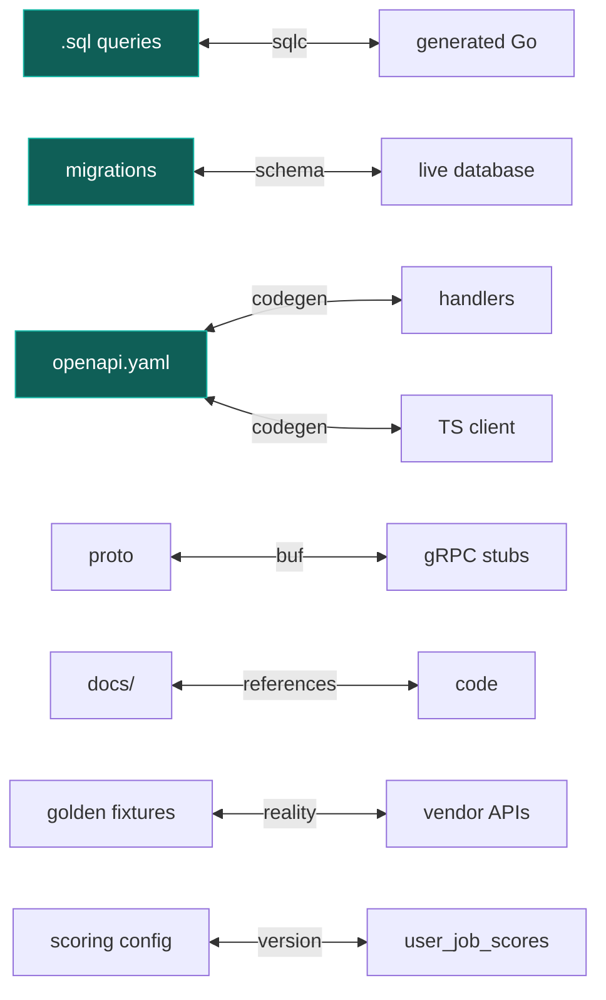

# Consistency, prechecks and drift

> Status: **DECIDED**. Everything here is automated. A rule that depends on someone remembering is
> not a rule.

## The problem

A codebase has many pairs of things that **must agree**, and every one of them drifts silently:



Green nodes are **sources of truth**. Everything else is derived, and derived things must be
**regenerated, never edited**.

Drift is insidious because nothing breaks at the moment it happens. The OpenAPI spec says one thing,
the handler does another, and you find out from a user. So each pair below has a **mechanical check**
and a **stage** at which it runs.

---

## 1. The precheck gate

`make check` is the contract: **if it passes locally, CI passes.** A divergence between them is a bug
in the Makefile, fixed rather than worked around.

It runs at three stages, ordered by speed so feedback arrives as early as possible:

| Stage | Runs | Budget | Blocking |
|---|---|---|---|
| **pre-commit** | format, lint changed files, secret scan, generated-code freshness | **< 5 s** | Yes |
| **pre-push** | unit tests, import-graph lint, `sqlc vet`, contract diffs | < 60 s | Yes |
| **CI** | everything, including integration, E2E, budgets, migration verification | < 10 min | Yes |

The 5-second pre-commit budget is a hard design constraint. **A slow hook gets bypassed with
`--no-verify`, and a bypassed hook protects nothing.** Anything slower moves to pre-push.

### Tooling: Lefthook

Chosen over `pre-commit` and Husky because it is a **single Go binary** with **parallel execution**,
which is what makes the 5-second budget achievable — it is roughly 10× faster than Husky on large
projects, which run hooks sequentially through bash `[B-31]`. It also adds no runtime dependency,
which matters for a repo whose backend has no Node requirement.

```yaml
# lefthook.yml
pre-commit:
  parallel: true
  commands:
    fmt:
      glob: "*.go"
      run: gofumpt -l -w {staged_files}
      stage_fixed: true
    lint-changed:
      glob: "*.go"
      run: golangci-lint run --fast {staged_files}
    secrets:
      run: gitleaks protect --staged --redact
    generated-fresh:
      # Cheap staleness check: are generated files older than their sources?
      # The authoritative check is `make generate && git diff --exit-code`,
      # which is too slow for pre-commit and runs at pre-push.
      run: scripts/check-generated-mtime.sh
    docs-links:
      glob: "*.md"
      run: scripts/check-links.py {staged_files}

pre-push:
  parallel: true
  commands:
    unit:      { run: go test ./... -short -race }
    arch:      { run: go-arch-lint check }
    sqlc:      { run: sqlc vet }
    generated: { run: make generate && git diff --exit-code }
    oas:       { run: oasdiff breaking --fail-on ERR origin/main api/openapi.yaml }
    proto:     { run: buf breaking --against '.git#branch=origin/main' }
```

---

## 2. Generated code

**Rule: generated code is never edited.** `internal/store/gen/` and `internal/http/gen/` are build
output.

**Check:** CI runs `make generate` and fails if the working tree is dirty.

```bash
make generate && git diff --exit-code || {
  echo "Generated code is stale. Run 'make generate' and commit the result."; exit 1; }
```

This single check makes an entire class of drift impossible. A developer who edits generated code
gets a clear failure rather than a change that silently vanishes on the next regeneration.

Generated files carry a header and are marked `linguist-generated=true` in `.gitattributes`, so they
collapse in review diffs.

---

## 3. Database schema

Three distinct drift risks, and they need different checks.

### 3.1 Migrations vs. the live database

The dangerous one: someone applied a change by hand, or a migration partially failed. Now the schema
does not match what the migration history claims — and the **next** migration fails in a confusing
way, in production.

> **Implemented differently — `make drift-check`, 2026-08-17.**
> Not Atlas. Atlas would add a tool to the image *and* a second declaration of
> the schema to keep in step — one more pair of things that can drift, in order
> to detect drift. Instead the check rebuilds the schema from `migrations/` in a
> throwaway database and diffs **catalogue introspection** of both: 333 facts
> covering columns, constraints, indexes and enums.
>
> A `pg_dump` text diff was tried first and abandoned for two concrete reasons:
> pg_dump emits multi-line statements, so filtering unwanted objects line by
> line leaves orphaned fragments; and pg_dump 17 stamps every run with a random
> `\restrict` token, so two dumps of the *same* database differ.
>
> River's tables are excluded throughout — River creates and migrates its own
> schema at startup by design ([ADR-0005](../architecture/adr/0005-river-background-jobs.md)),
> so their absence from `migrations/` is intentional. A check that cries wolf
> every run is a check that gets deleted.
>
> Verified by planting an out-of-band `ALTER TABLE companies ADD COLUMN`: the
> check failed and named the exact column.

**Atlas drift detection** compares the target database against the expected state at the latest
applied revision, and **blocks `migrate apply` when they differ** `[B-32]`. This runs as a
*pre-apply* gate in the deploy pipeline, making drift a synchronous, preventive control rather than
something discovered afterwards.

```bash
atlas migrate apply --dir file://migrations --url "$DATABASE_URL"   # refuses on drift
```

Nightly, it also runs read-only against production and alerts on drift, so an out-of-band change is
caught within a day rather than at the next deploy.

### 3.2 Migrations vs. the queries

`sqlc` generates from `.sql` files against the schema. If a migration drops a column a query still
references, `sqlc vet` catches it at generation, not at runtime.

Custom `sqlc vet` rules, enforced:

| Rule | Rejects |
|---|---|
| `no-select-star` | `SELECT *` — breaks every time expand/contract adds a column |
| `feed-requires-status` | A `job_postings` query without `status = 'live'`, which silently loses the partial index |
| `no-offset-pagination` | `OFFSET` on a user-facing list |
| `no-bare-set` | A bare `SET` (must be `SET LOCAL`) — correctness under transaction pooling |

The last two are unusual as lint rules and both encode a specific decision documented elsewhere
([backend-performance](../architecture/backend-performance.md),
[caching-and-storage §5](../architecture/caching-and-storage.md#5-connection-pooling)). Encoding a
decision as a lint rule is how it survives the person who made it.

### 3.3 New schema vs. the previous release

Covered in [testing-strategy §4](testing-strategy.md#4-migrations--against-the-previous-release-not-an-empty-database):
`make migrate-verify` restores the previous release's schema, runs the new migrations, and asserts
the previous release's queries still work. This is what makes expand/contract real rather than
aspirational.

---

## 4. API contracts

| Pair | Tool | Stage |
|---|---|---|
| `openapi.yaml` ↔ handlers | Generated server types + contract tests | pre-push, CI |
| `openapi.yaml` ↔ TS client | Generated client | pre-push, CI |
| `openapi.yaml` ↔ previous release | `oasdiff breaking` | pre-push, CI |
| `.proto` ↔ previous release | `buf breaking` | pre-push, CI |
| `.proto` ↔ stubs | `buf generate` + dirty-tree check | pre-push, CI |

`buf breaking` compares against a past snapshot with explicit rule categories for wire and JSON
compatibility `[A-18]`. Protobuf stays compatible as long as **field numbers are preserved and tags
never reused**, which is exactly what the tool enforces — and exactly what makes a rolling deploy safe
when two versions serve simultaneously.

---

## 5. Documentation

Docs drift faster than anything else because nothing breaks when they do.

| Check | Catches | Stage |
|---|---|---|
| **Link checker** | Broken relative links and `#anchors` across all markdown | pre-commit |
| **Evidence-ledger check** | An `[A-01]`-style citation with no ledger entry | CI |
| **ADR reference check** | A link to a non-existent ADR number | CI |
| **Fixture-coverage check** | A quirk in `source-catalog.md` with no matching `testdata/` file | CI |
| **Config-example check** | An env var read in code but absent from `.env.example` | CI |
| **Make-target check** | A `make X` referenced in docs that the Makefile does not define | CI |

The **fixture-coverage check** is the highest-value one. `source-catalog.md` documents per-vendor
quirks; each must have a golden fixture proving we handle it. Without the check, the catalogue becomes
folklore — accurate when written, decorative a year later.

The **make-target check** exists because onboarding docs that reference commands that no longer exist
are worse than no docs: they destroy trust in everything else on the page.

---

## 6. Fixtures vs. reality — the one that cannot be fully automated

Golden fixtures are **captured snapshots of vendor APIs**. If Ashby changes their schema, our fixtures
still pass while production breaks. This is the hardest drift problem here, because the source of
truth is outside our control.

Three defences, in order of how early they catch it:

1. **Weekly `fixture-refresh` job** (staging only, small allowlist): re-fetches each vendor's live
   response, diffs against the committed fixture, and **opens an issue on difference**. Never
   auto-updates — a silent fixture update would defeat the purpose entirely.
2. **`parse_confidence` per vendor**, monitored. A p50 drop is the production symptom of a schema
   change and alerts before users notice
   ([observability §6](observability.md#6-dashboards)).
3. **Malformed payloads store the raw body and fail loudly.** We never silently drop a posting we
   could not parse — that is how a schema change hides for a month.

---

## 7. Scoring configuration

Scoring weights are configuration, which creates its own consistency problem: **which model produced
this score?**

- Every row in `user_job_scores` carries `profile_version`.
- A config change bumps the version and enqueues `rescore_all` on the **low-priority** queue.
- Until a row is rescored, the UI shows the score computed by the version stamped on it — never a mix
  presented as current.
- The golden corpus runs against every config change; band accuracy below 85% fails CI.

Without the version stamp, a weight change would silently produce a feed where some scores come from
the old model and some from the new, with no way to tell which.

---

## 8. Dependencies

| Check | Tool |
|---|---|
| Known vulnerabilities | `govulncheck`, `npm audit` — CI, and daily on `main` |
| Updates | Dependabot, grouped, weekly |
| Licence compatibility | `go-licenses` |
| Budget enforcement | Script asserting direct deps ≤ 12 (Go) and ≤ 6 (frontend runtime) |
| Supply chain | `go.sum` verification; frontend lockfile committed and CI-verified |

The **budget enforcement** check makes [P6](../product/principles.md#p6--every-dependency-is-a-liability)
mechanical. Adding a thirteenth Go dependency fails the build, which forces the conversation the
principle asks for rather than leaving it to a reviewer's discretion.

---

## 9. What a contributor actually experiences

```
$ git commit -m "add ashby compensation tiers"
  ✓ gofumpt          0.3s
  ✓ golangci-lint    1.2s   (changed files only)
  ✓ gitleaks         0.4s
  ✓ generated-fresh  0.1s
  ✓ docs-links       0.2s
  → committed                                            2.2s total

$ git push
  ✓ unit tests       18s
  ✓ arch lint         2s
  ✓ sqlc vet          1s
  ✓ generated        11s
  ✓ oasdiff           3s
  ✓ buf breaking      2s
  → pushed                                                37s total
```

Two and a bit seconds to commit, well inside the budget that keeps hooks from being bypassed. The
expensive checks run at push, where a 37-second wait is acceptable because it happens far less often.

**Escape hatch:** `LEFTHOOK=0 git commit` exists and is legitimate for work-in-progress on a branch.
CI is the real gate and has no escape hatch. The hooks exist to give fast feedback, not to be the
enforcement boundary — conflating those two is what produces hooks people resent.

---

## 10. For AI agents working in this repo

Stated explicitly because agents fail differently from humans — they are more likely to produce
plausible-looking code that violates an invariant, and less likely to notice a convention nobody wrote
down.

| Before you… | Run | Because |
|---|---|---|
| Change a `.sql` file | `make generate` | Handwritten Go against a changed query will not compile, but stale generated code will |
| Add an endpoint | Edit `api/openapi.yaml` **first** | Handlers are generated from it; writing the handler first means writing it twice |
| Change job args | Check [deployment-zdt §4](../operations/deployment-zdt.md#4-queue-compatibility) | Args must remain readable by the previous release |
| Add a dependency | State what it replaces and what breaks if abandoned | The budget check will fail otherwise |
| Add a user-visible statistic | Add an entry to [evidence-ledger](../research/evidence-ledger.md) | CI fails on an uncited citation |
| Touch a source adapter | `make test-golden`, then **read the diff** | A blind `UPDATE=1` is the one way golden tests fail as a technique |
| Claim you are finished | `make check` | It is the same thing CI runs |

**The single most useful instruction:** `make check` is the definition of done. Not "the code
compiles", not "the test I wrote passes". If `make check` is green, the change is consistent with
everything else in the repository — which is the entire purpose of this document.
