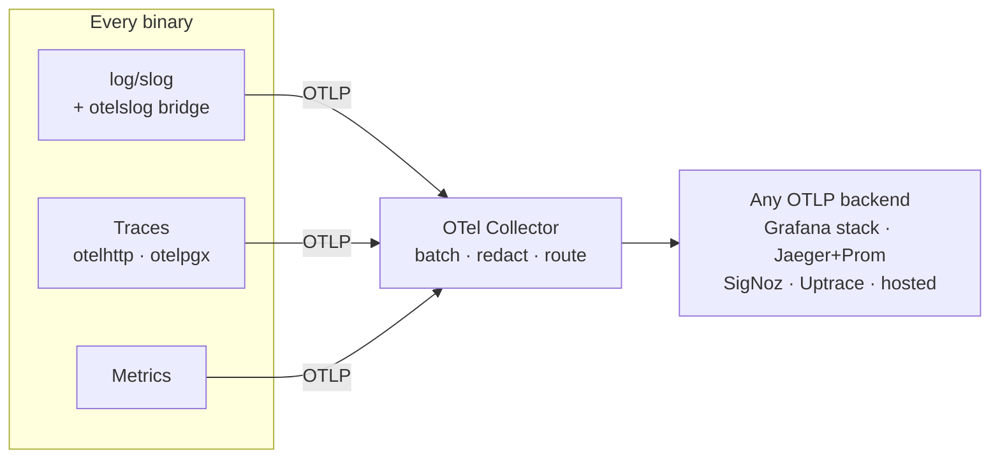

# Observability

> Status: **DECIDED**. Vendor-neutral by requirement — OTLP only, no proprietary SDKs.

## 1. Stack

**OpenTelemetry for all three signals**, exported via OTLP to whatever backend is configured. As of
2026 traces and metrics are covered by the project's stability guarantees; the logs signal is usable
in production but its API surface is not yet frozen `[B-25]`, which is why our logging goes through
`log/slog` with a bridge rather than through the OTel logging API directly.



**The Collector is deliberately in the path** even though services could export directly. It gives us
one place to batch, sample, **redact**, and re-route — and swapping backends becomes a Collector
config change rather than a redeploy of every service. That is the vendor-neutrality guarantee made
concrete.

## 2. Logging

`log/slog` — standard library, structured, zero-allocation, no dependency — bridged to OTel via
`otelslog`, which adds under 1% overhead because it only extracts trace context and appends it to
the record `[B-21]`.

```go
slog.InfoContext(ctx, "source polled",
    "source_id", src.ID,
    "vendor", src.Vendor,
    "status", resp.StatusCode,
    "postings", len(postings),
    "changed", changed,
)
// trace_id and span_id are added automatically from ctx
```

**Rules:**

- **`InfoContext`, never `Info`.** Without `ctx` the log line loses its trace correlation, which is
  the entire point.
- **Structured fields, never formatted strings.** `slog.Int("source_id", id)`, not
  `fmt.Sprintf("source %d", id)`. One is queryable; the other is a grep.
- **No PII, ever.** No emails, no resume text, no names. IDs only. The Collector runs a redaction
  processor as a second line of defence, but the first line is not putting it there.
- **Log at the boundary**, not at every frame. One line per decision.

| Level | Use |
|---|---|
| `Error` | Needs a human. Every Error should be actionable — if it is not, it is a Warn |
| `Warn` | Degraded but handled: circuit breaker opened, retry exhausted |
| `Info` | State changes worth a record: source polled, deploy started, user registered |
| `Debug` | Off in production; `LOG_SQL=true` territory |

## 3. Tracing

Instrumented: HTTP server and client (`otelhttp`), Postgres (`otelpgx`), River job execution, gRPC to
`resume-parser`. A trace covers a request or a job from end to end.

**Sampling:** parent-based, 10% head sampling in production, **100% for errors and for anything slower
than 1 s**. Traces are useful for the unusual request, and the unusual request is the one you cannot
afford to have sampled away.

**Span attributes worth having**, because they are what makes a trace answer a question rather than
just show a shape:

```go
span.SetAttributes(
    attribute.String("source.vendor", "ashby"),
    attribute.Int64("source.id", src.ID),
    attribute.Int("postings.parsed", n),
    attribute.Int("postings.changed", changed),
    attribute.Bool("response.not_modified", resp.StatusCode == 304),
)
```

Never put PII in a span attribute. Span data is frequently the least-protected telemetry.

## 4. Metrics and SLOs

### Service level indicators

| SLI | Target | Why it is the right measure |
|---|---|---|
| **Feed availability** | 99.5% monthly | `GET /v1/jobs` returning 2xx |
| **Feed latency** | p95 ≤ 120 ms | The budget the whole architecture is written against |
| **Ingest freshness, tier A** | p50 ≤ 90 min | **The product SLO.** Freshness is the product ([P2](../product/principles.md#p2--freshness-is-the-product)) |
| **Ingest freshness, tier C** | p50 ≤ 8 h | |
| **Scoring backlog** | p95 ≤ 10 min | How long a new posting stays unscored |
| **Resume parse success** | ≥ 95% of text-based PDFs | Excludes scans, which we tell the user about |

`ingest_latency_seconds` is unusual as an SLO and it is the most important one here. It is a **product
metric that happens to be measurable in infrastructure** — if it degrades, the product is failing even
though every service is healthy and every dashboard is green.

### Key metrics

```
# RED, per endpoint
http_requests_total{route,method,status}
http_request_duration_seconds{route}

# Ingestion
ingest_latency_seconds{tier}                   histogram
source_poll_total{vendor,result}               counter
source_poll_304_ratio{vendor}                  gauge
sources_disabled{vendor}                       gauge
postings_upserted_total{vendor,change_type}    counter
dedup_merges_total{stage}                      counter
parse_confidence{vendor}                       histogram

# Scoring
score_queue_depth                              gauge
score_duration_seconds                         histogram
score_band_distribution{band}                  gauge
score_fanout_ratio                             histogram   # users scored ÷ active users, per posting
posting_remote_share                           gauge       # by vendor — settles C-09 from our own corpus

# Queue (River)
river_jobs_by_state{queue,state}               gauge
river_job_duration_seconds{kind}               histogram

# Database
db_connections_in_use{service}                 gauge
db_query_duration_seconds{query_name}          histogram
```

## 5. Alerts

**Alert on symptoms users feel, not on causes.** High CPU is not an alert; a slow feed is.

| Alert | Condition | Severity |
|---|---|---|
| Feed unavailable | 5xx rate > 1% for 5 min | **page** |
| Feed slow | p95 > 250 ms for 10 min | **page** |
| Ingest stalled | No successful poll in 30 min | **page** |
| Ingest freshness breached | Tier A p50 > 90 min for 30 min | ticket |
| Vendor down | > 30% of a vendor's sources failing in 15 min | ticket |
| **304 ratio collapsed** | Drop > 30 points in 1 h | ticket |
| Scoring backlog | p95 > 30 min for 20 min | ticket |
| DB connections | > 80% of pool for 10 min | ticket |
| Score distribution shifted | Any band moves > 15 points week-over-week | ticket |
| **Fan-out above model** | `score_fanout_ratio` p50 > 20% | ticket |
| Disk | > 80% | ticket |
| Cert expiry | < 14 days | ticket |

Two of these deserve a note because they are not standard:

**304 ratio collapsed** is the leading indicator for both cost and politeness. If conditional requests
stop working, we are about to hammer every source we track. Far better to learn that from a metric
than from a vendor blocking us
([ingestion-pipeline §8](../architecture/ingestion-pipeline.md#8-what-we-measure)).

**Score distribution shifted** catches silent product regressions that no infrastructure alert would.
A must-have classification bug does not throw errors — it just makes every score wrong.

**Fan-out above model** exists because the scoring capacity model rests on a *derived* ratio (~13%),
not a measured one, and the derivation was already wrong once — it was 3% until
[Round 2 of verification](../research/verification-log.md#v11--fan-out-the-assumption-was-wrong-and-the-tail-is-worse-than-the-mean)
corrected it. The alert converts a modelling assumption into something the system tells us about
before it becomes a capacity incident. `posting_remote_share` is instrumented alongside it because
remote share is the dominant input to fan-out, and the published figures for it conflict by an order
of magnitude ([C-09](../research/evidence-ledger.md#c-09)) — after a week of ingestion, our own corpus
is a better source than either.

**Only four alerts page.** An on-call rotation that gets woken for tickets stops reading pages.

## 6. Dashboards

Four, each answering one question:

1. **Is the product working?** — the six SLIs and their error budgets. The only one to open first.
2. **Is ingestion healthy?** — poll rate, 304 ratio, freshness by tier, disabled sources by vendor,
   parse confidence by vendor.
3. **Is scoring healthy?** — queue depth, duration, band distribution over time, config version in
   effect.
4. **Is the database healthy?** — connections by service, slow queries, index hit rate, table and
   index bloat, replication lag.

Dashboard 2's *parse confidence by vendor* panel is the one that catches a vendor changing their
schema before users notice, which is worth more than any alert on it.

## 7. Correlation

Every request and job has a trace ID, and it appears in three places:

1. Every log line, via `otelslog`.
2. Every error response, as `trace_id` ([api-design §5](../architecture/api-design.md#5-errors)).
3. Every span.

So a user pasting a trace ID into a support message gives us the exact request, its logs, its
database queries and their timings. This costs almost nothing to build and is repeatedly the
difference between a five-minute investigation and an afternoon.

## 8. Cost control

Telemetry cost scales with traffic and can quietly exceed compute cost.

- Head sampling at 10%, with errors and slow requests always kept.
- Logs at `Info` in production; `Debug` requires an explicit, expiring override.
- Metric cardinality is reviewed: **never** a user ID, posting ID, or URL as a label. A `posting_id`
  label would create a time series per posting — 200,000 of them.
- Traces retained 7 days, metrics 90 days, logs 30 days.
- Collector batches and compresses.

## 9. Vendor neutrality

Everything above is OTLP. **No proprietary agents, no vendor SDKs, no code-level lock-in.** Switching
backends is a Collector exporter configuration change.

Locally, `make dev` runs Jaeger for traces. In production the choice is open: a self-hosted Grafana
stack, SigNoz, Uptrace, or a hosted OTLP endpoint. The application does not know or care, which is the
property we are protecting
([service-topology §8](../architecture/service-topology.md#8-vendor-neutrality--the-portability-contract)).
