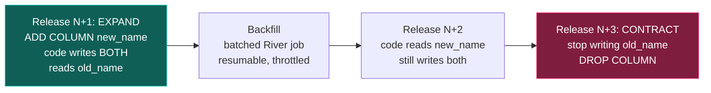
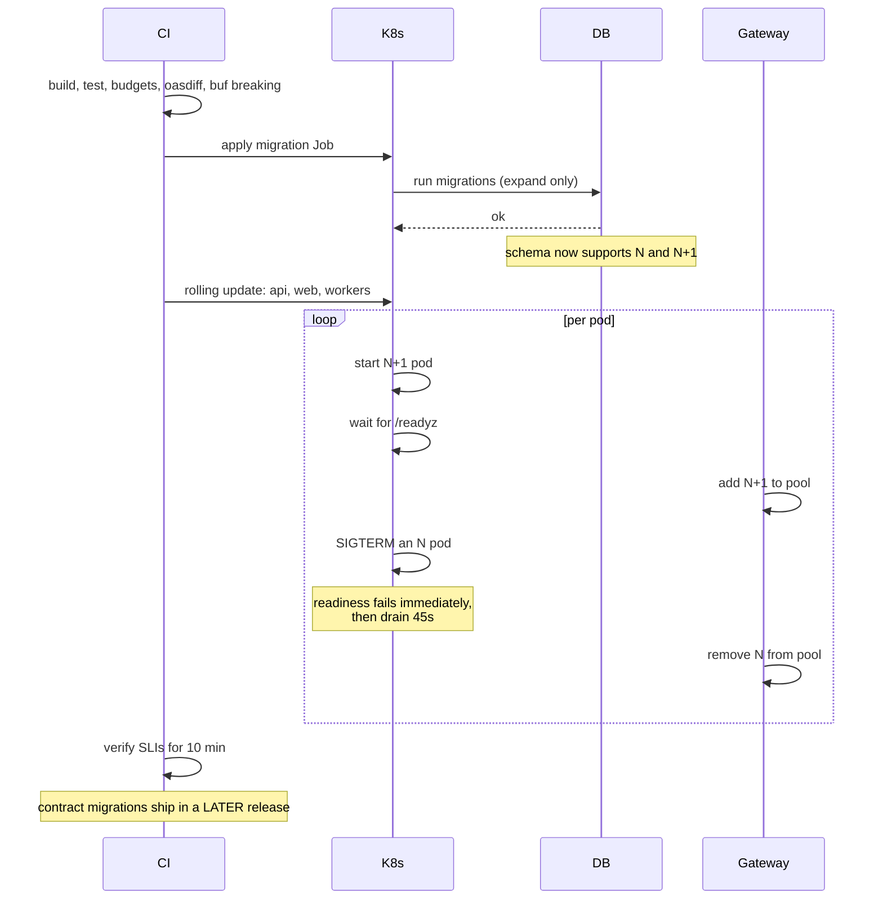

# Deployment and zero-downtime upgrades

> Status: **DECIDED**. Every rule here exists because violating it causes a user-visible outage.

## 1. The core problem

**During a rolling deploy, version N and version N+1 run simultaneously against the same database.**

That single sentence generates every rule in this document. If N+1 needs a column N does not
understand — or if N writes a shape N+1 cannot read — someone gets an error, and it will be a user.

```mermaid
gantt
    title Rolling deploy — the overlap window is where bugs live
    dateFormat X
    axisFormat %s
    section Pods
    v1 serving            :done, 0, 4
    v1 + v2 both serving  :crit, 4, 3
    v2 serving            :active, 7, 4
    section Database
    schema supports v1 AND v2 :5, 0, 11
```



The database schema must satisfy **both versions for the entire overlap**. That is not a
best-effort goal; it is the definition of a safe deploy.

## 2. Expand / contract — always

Never a breaking change. Always three non-breaking ones across at least two releases.

### Renaming a column



Four releases to rename a column. That is the price, it is paid rarely, and it is much cheaper than
the alternative.

**Do not drop the old column early.** If any running pod still references it you get runtime errors —
wait for a full rollout cycle, and preferably one more.

### The rules

| Operation | Safe? | Do this instead |
|---|---|---|
| `ADD COLUMN` nullable | ✅ | |
| `ADD COLUMN NOT NULL DEFAULT <constant>` | ✅ PG 11+ | Constant defaults do not rewrite the table |
| `ADD COLUMN NOT NULL DEFAULT <volatile>` | ❌ | Rewrites the whole table under `ACCESS EXCLUSIVE`. Add nullable → backfill → set NOT NULL |
| `DROP COLUMN` | ⚠️ | Only after ≥ 1 full release with no reader |
| `RENAME COLUMN` | ❌ | Expand/contract as above |
| `ALTER TYPE` | ❌ | New column, backfill, swap |
| `CREATE INDEX` | ❌ | **`CREATE INDEX CONCURRENTLY`**, always, on a populated table |
| `ADD CONSTRAINT ... CHECK` | ❌ | `ADD CONSTRAINT ... NOT VALID`, then `VALIDATE CONSTRAINT` separately |
| `ADD FOREIGN KEY` | ❌ | Same: `NOT VALID`, then `VALIDATE` |
| `ALTER TYPE ... ADD VALUE` (enum) | ✅ PG 12+ | Non-blocking; **cannot be removed**, so choose names carefully |

`CREATE INDEX` without `CONCURRENTLY` takes an `ACCESS EXCLUSIVE` lock for the duration of the build.
On `job_postings` that is a multi-minute total outage. There is no situation in this codebase where
the non-concurrent form is correct.

### Backfills are jobs, not statements

```sql
-- ❌ Locks the table, blocks autovacuum, blows up the WAL, cannot be resumed.
UPDATE job_postings SET yoe_confidence = 0.5 WHERE yoe_confidence IS NULL;
```

Backfills run as River jobs: batched (1,000–10,000 rows), with a resume cursor, throttled on
replication lag, and safely re-runnable after a crash.

## 3. Deployment sequence



**Migrations run before the rollout and contain expand steps only.** A migration that would break
version N must not be in the same release as the code that needs it.

**The migration Job fails the deploy on non-zero exit.** Never `|| true`.

## 4. Queue compatibility

The overlap window applies to River jobs too, and this is the part most teams miss until it bites.

**A job enqueued by version N may be executed by version N+1, and vice versa.**

```go
// Job args evolve additively. Version N+1 must handle args written by N —
// which means every new field needs a sensible zero value, and no field is
// ever removed or renamed in the same release that stops writing it.
type ScorePostingArgs struct {
    PostingID int64  `json:"posting_id"`
    Reason    string `json:"reason,omitempty"`     // added in v1.4; "" is valid
}
```

Rules:

- Add fields, never remove or rename in one step.
- New fields must have a meaningful zero value.
- A **new job kind** is safe to enqueue only once every worker can execute it — so deploy the worker
  first, then enable the enqueue behind a flag.
- Removing a job kind: stop enqueueing, wait for the queue to drain, then remove the worker in a
  later release.

## 5. Kubernetes configuration

The five settings that actually determine whether a deploy is zero-downtime:

```yaml
spec:
  strategy:
    rollingUpdate:
      maxSurge: 1
      maxUnavailable: 0        # never reduce capacity during a rollout
  template:
    spec:
      terminationGracePeriodSeconds: 45
      containers:
      - name: api
        readinessProbe:        # gates traffic
          httpGet: { path: /readyz, port: 8080 }
          periodSeconds: 5
          failureThreshold: 2
        livenessProbe:         # restarts a wedged process — NOT the same thing
          httpGet: { path: /healthz, port: 8080 }
          periodSeconds: 10
          failureThreshold: 3
        lifecycle:
          preStop:
            exec:
              # Endpoint removal propagates asynchronously across kube-proxy and
              # the gateway. Without this pause the pod stops accepting
              # connections before every proxy has learned it is gone, and users
              # see resets. This is the most commonly missed detail in
              # "zero-downtime" setups.
              command: ["sleep", "5"]
---
apiVersion: policy/v1
kind: PodDisruptionBudget
spec:
  minAvailable: 50%            # protects against voluntary disruption
  selector: { matchLabels: { app: api } }
```

**Readiness vs. liveness.** Readiness gates traffic; liveness restarts the process. Conflating them
causes rolling restarts under load — a slow pod fails liveness, gets killed, load shifts to its peers,
which then also slow down. Liveness must check only that the process is not wedged, never that a
dependency is healthy.

**PodDisruptionBudgets.** A PDB limits how many pods may be unavailable during **voluntary**
disruptions — node drains, cluster upgrades, autoscaler actions `[B-17]`. Without one, a routine node
upgrade can evict every replica simultaneously. Zero downtime requires replicas, topology spread,
readiness probes, rollout settings, capacity headroom, graceful termination **and** a PDB, all
cooperating; any one missing turns maintenance into an incident.

**Graceful shutdown** on SIGTERM, in this order:

1. Fail readiness immediately.
2. `preStop` 5 s pause for endpoint propagation.
3. Stop accepting new connections; finish in-flight requests.
4. Workers: stop fetching jobs, finish in-flight ones (grace period 120 s — a slow ATS response must
   not be killed mid-flight).
5. Close the database pool. Exit 0.

## 6. Rollback

| Situation | Action |
|---|---|
| Code bug, schema unchanged | `kubectl rollout undo`. Seconds |
| Code bug after an expand migration | `rollout undo`. **Safe by construction** — the expanded schema still supports N |
| Bad data written by N+1 | Roll back code, then repair with a migration. Never restore over live data |
| Bad contract migration | **The dangerous one.** Requires a restore. This is why contract steps ship alone, in their own release, with nothing else |

**Contract migrations are the only genuinely irreversible step**, so they are deployed in isolation,
never bundled with a feature, and only after at least one release has proven no reader remains.

**Feature flags decouple deploy from release.** Risky changes ship dark, get enabled for internal
users, then a percentage, then everyone. A flag that fails is turned off in seconds — no rollout, no
rollback.

## 7. Environments

| Environment | Data | Purpose |
|---|---|---|
| Local | Seeded fixtures | Development |
| CI | Ephemeral testcontainers | Tests, **no cloud credentials** |
| Staging | Anonymised subset + live ingestion for ~50 sources | Migration rehearsal, real vendor data |
| Production | Real | |

**Every migration runs in staging first**, against a restored production schema snapshot. Staging runs
real ingestion against a small allowlist, which is how vendor schema changes are caught before they
reach production.

## 8. Release checklist

- [ ] `make check` green
- [ ] Migrations are **expand-only**; contract steps deferred to a later release
- [ ] `make migrate-verify` — previous release's queries still work against the new schema
- [ ] Job args evolved additively; new job kinds have their workers deployed first
- [ ] `oasdiff` and `buf breaking` clean
- [ ] Performance budgets green
- [ ] Migration rehearsed in staging with production-shaped data
- [ ] Feature flags default to **off**
- [ ] Rollback path confirmed — and if it needs a restore, say so out loud before deploying
- [ ] SLIs watched for 10 minutes post-rollout
