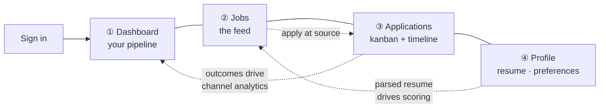
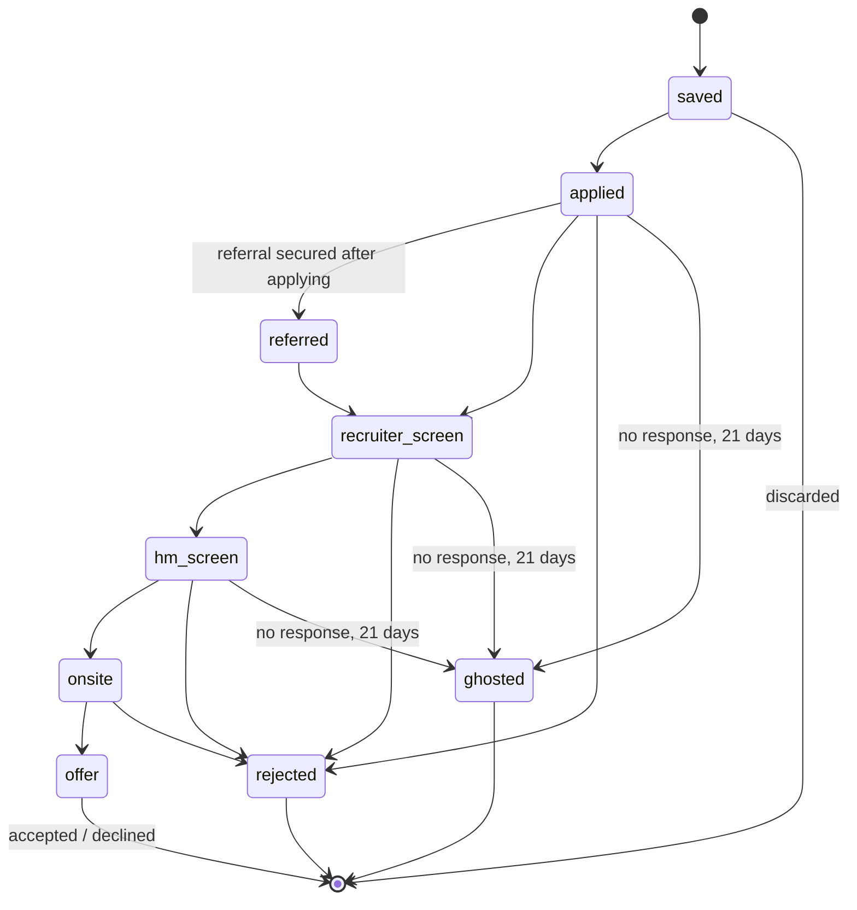

# v1 feature specification

> Status: **DECIDED** for scope; individual acceptance criteria marked `PROPOSED` where they depend on
> data we will only have after first ingestion.

v1 is deliberately narrow. It ships the loop that makes the product worth opening daily:
**find fresh, eligible roles → decide fast whether to invest → apply at the source → know what
happened.** Everything else is [roadmap](roadmap.md).

## Information architecture

Four top-level tabs. Not five, not a nav drawer.



The dotted lines are the point. The four tabs are one loop, and each feeds the next. A design where
the resume upload does not visibly change the jobs feed has failed.

---

## F1 — Authentication and account

**Scope:** email + password with Argon2id, plus Google OAuth. Session cookies (`HttpOnly`, `Secure`,
`SameSite=Lax`), server-side session records so revocation is real. Email verification required
before resume upload.

**Why not magic links only:** the primary persona checks from multiple devices including a work
laptop where personal email may not be available.

**Out of scope for v1:** teams, SSO, 2FA (v2 — 2FA lands before we hold enough tracked applications to
be worth stealing).

**Acceptance:**
- Sign-up → verified → first search in under 90 seconds on a cold cache.
- Session revocation takes effect within one request, not at token expiry.
- Password reset does not disclose whether an email is registered.

---

## F2 — Jobs feed

The core screen. A filtered, ranked, server-paginated list of live postings.

### Card anatomy

Every card carries the four signals Greenhouse's ghost-job study found to correlate with a posting
being real `[A-06]`, because "is this real" is the user's first question:

```
┌──────────────────────────────────────────────────────────────┐
│  Senior Backend Engineer                    ⬤ Strong fit     │
│  Razorpay · Bengaluru (Hybrid)                               │
│                                                              │
│  ₹28–42 LPA    3–6 yrs    Posted 4h ago    via Ashby         │
│   └ disclosed   └ you: 1   └ freshness      └ ATS vendor      │
│                                                              │
│  ✓ Python  ✓ PostgreSQL  ✓ Docker  ✓ AWS  ✗ Kafka  ✗ Go      │
│                                                              │
│  ⚠ Knockout: requires 3+ years                               │
│                                              [ Apply at Ashby ]│
└──────────────────────────────────────────────────────────────┘
```

Design notes that are requirements, not suggestions:

- **`Posted 4h ago` is never hidden.** Freshness is the product (P2).
- **`via Ashby` is shown** so the user knows the apply link lands in a real ATS. This is the delivery
  mechanic from [problem-statement §4](problem-statement.md#4-delivery-is-not-guaranteed--and-this-is-the-most-under-documented-mechanic-in-job-search),
  made visible.
- **Skill chips show misses, not just hits.** A card showing only matches is a sales pitch.
- **The band, not a percentage** (P3). The numeric score is available on expand.
- **`Apply at <vendor>`** is an outbound link to the canonical ATS URL. We never proxy it, never
  intercept it, and never claim to have applied on the user's behalf (AF1).

### Filters

`PROPOSED` for exact bucket boundaries — these get tuned once we have a real distribution.

| Filter | Type | Notes |
|---|---|---|
| **Location** | Hierarchical: country → metro → mode | Mode is `onsite` / `hybrid` / `remote` and is derived, not trusted — many feeds mislabel it. See [ingestion §normalisation](../architecture/ingestion-pipeline.md#4-normalisation) |
| **Years of experience** | Range with a **stretch band** | Default *includes* postings up to 2 years above the user's YoE. A large share of SDE-1 postings say "2+ years" and that band is soft in practice; self-filtering there costs real opportunities. The stretch portion is visually distinguished, not hidden |
| **Compensation** | Range + `disclosed only` toggle | Only ~80% of JSON-LD postings carry `baseSalary` `[A-12]`, and Ashby is the only ATS that returns structured compensation consistently. So the filter must distinguish *"below your floor"* from *"not disclosed"* — collapsing those loses most of the market |
| **Match with my resume** | Band selector | Disabled with an explanatory tooltip until a resume is parsed. Never silently empty |
| **Posted within** | 24h / 3d / 7d / 14d / any | Defaults to **7 days**. A default of "any" would bury the fresh postings the product exists to surface |
| **Company hiring posture** | `hires externally at my level` toggle | See F7 |
| **Tech stack** | Multi-select over normalised skills | Normalised via the skill taxonomy, so `Postgres` and `PostgreSQL` are one thing |
| **ATS vendor** | Multi-select | Power-user filter; some users have strong preferences (Workday forms are notoriously long) |

**Filter behaviour requirements:**

- Filter state lives in the **URL query string**. A filtered view is shareable and back-button-correct.
- Filters apply **server-side**. The client never holds the full result set (P1).
- Every filter shows a **result count before application** where cheap to compute, so users do not
  filter themselves into zero results blindly.
- **Zero-results state is a feature**, not an error: it names which filter is most responsible and
  offers to relax it.

### Ranking

Default order is **not** pure match score, and not pure recency. It is a blend, and the blend is
visible to the user as a sort selector with `Best match`, `Newest`, `Highest paid`, `Closing soon`.

The default `Best match` composite is defined in
[matching-and-scoring.md](../architecture/matching-and-scoring.md#5-ranking-composite). It includes a
freshness decay term specifically so that a perfect match posted 12 days ago does not outrank a
strong match posted this morning — because the 12-day-old one already has 300 applicants.

**Acceptance:**
- `GET /v1/jobs` p95 ≤ 120 ms server time at 200k live postings with three filters applied.
- First contentful paint of the feed ≤ 1.2 s on a 4× throttled CPU, 3G Fast profile.
- Changing a filter updates results without a full page navigation and without losing scroll intent.

---

## F3 — Resume upload and parsing

**Scope:** PDF and DOCX upload, ≤ 5 MB. Parsed into a structured profile: contact block, work
experience (company, title, dates, description), education, skills, total and per-technology years.

**The diagnostic view is the differentiating feature.** After parsing, the user sees *what we
extracted*, presented as "here is what a naive parser sees in your file". If we mangled the job
titles, an ATS will too — and parsing failures kill more applications than keyword gaps `[B-02]`.
Fields we could not extract are shown as gaps, with the specific likely cause (two-column layout,
text in a table, scanned image, non-embedded font).

**Editing is mandatory, not optional.** Every extracted field is user-correctable, and corrections
persist and take precedence over re-parsing. The parse is a starting point, never an authority.

**Versioning.** Multiple resume versions per user, each named. This is not a convenience feature — the
resume version is the field that lets channel analytics answer *which positioning converts* (F6), and
it is the field every competing tracker omits.

**Out of scope:** resume generation, rewriting, or scoring the resume itself in the abstract (P5, AF2).

**Acceptance:**
- p95 parse time ≤ 4 s for a 2-page PDF.
- On the golden corpus, ≥ 95% correct extraction for contact block, ≥ 90% for employment dates.
- A file we cannot parse produces a specific, actionable message — never "parsing failed".

---

## F4 — Knockout radar

The genuine auto-reject in modern ATS pipelines is the questionnaire, not the resume `[A-07]`.

For each posting we extract candidate knockout criteria — minimum years, work authorisation, location
requirement, degree requirement, on-site mandate — and compare them against the user's profile. Where
a hard mismatch exists, the card shows `⚠ Knockout: <criterion>` before the user invests time.

**Deliberate design constraint:** a knockout warning **never hides the posting**. It informs. The
"2+ years" band is soft in practice and users must be free to apply anyway — the warning exists to let
them make that choice knowingly, not to make it for them.

**Confidence handling:** knockout extraction from free-text job descriptions is error-prone. Warnings
are shown only above a confidence threshold, and low-confidence extractions are silently dropped
rather than shown as maybes. A false knockout warning costs the user an opportunity; a missed one
costs them 40 minutes. The asymmetry favours precision over recall.

---

## F5 — Application tracking

### State machine



**`ghosted` is distinct from `rejected` and this is load-bearing.** Where AI ranking is used it
decides *order*, not rejection — a low rank ends the application with no formal rejection ever sent
`[A-07]`. Collapsing these two states would destroy the channel analytics: a channel producing
rejections is reaching humans; a channel producing only ghosting may not be delivering at all.

The 21-day transition is **automatic** (a scheduled River job) but **reversible** — a reply after 30
days moves it back, which happens more often than you would think.

### Fields captured

Mandatory on transition to `applied`:

| Field | Why |
|---|---|
| `channel` | `careers_page` / `job_board` / `referral` / `cold_email` / `recruiter_inbound` — the analytics axis |
| `resume_version_id` | The column that answers which positioning converts |
| `applied_at` | Distinct from posting date; the gap is itself a signal |
| `ats_vendor` + `apply_url` | Delivery verification |

Optional but prompted: contact name and how you found them, next action + date, one-line note on why
you applied.

### Follow-up cadence

JobTrack suggests, never sends: **recruiter nudge at day 7–10; hiring-manager nudge at day 14 if you
have a real reason** (something you shipped, a specific question about the team); then let it go.
Suggestions appear as next actions on the dashboard, and are dismissible without guilt (AF5).

---

## F6 — Channel analytics

The dashboard's only non-obvious feature, and the one most likely to be got wrong.

**What it shows:** interview rate per channel — where `interview` means reaching `recruiter_screen`
or beyond — cross-cut by resume version.

**What it refuses to show:** any rate below **n = 25** attempts in that channel. Below the threshold
the cell reads `not enough data — 15 more for a reading`.

This is P4 applied literally. At realistic individual volume, three interviews from ten referrals is
not a 30% rate; it is noise, and a user who re-plans their week around it has been actively harmed by
the product. The signal that *is* legitimate at low volume — **a channel producing zero over 25+
attempts** — is surfaced prominently as a callout, because that is real information.

```
Channel              Attempts   Interviews   Rate
─────────────────────────────────────────────────────────
Referral                   12            3   not enough data — 13 more
Careers page               41            5   12%
Cold email                  8            2   not enough data — 17 more
Job board                  31            0   0%  ⚠ zero over 31 attempts
```

The `⚠` row is the product working. That is the moment a user stops feeding a dead channel.

---

## F7 — Company hiring posture

`PROPOSED` — depends on accumulating ~90 days of ingestion history before it produces useful output.

Because we observe every requisition each tracked company posts over time, we can answer a question
no competitor answers:

> **Does this company hire externally at entry level at all?**

Many Indian product companies fill entry level through campus and hire laterally at SDE-2. A target
list of 40 companies where only four have ever posted an external 0–2 YoE requisition is worse than
useless — it manufactures the feeling of effort without the possibility of outcome.

Per company we compute and display:

- **Entry-level openness** — share of the company's postings in the last 180 days at 0–2 YoE, with the
  absolute count (a percentage on a base of 3 postings is meaningless — P4 again).
- **Posting cadence** — postings per month, and whether it is rising or falling.
- **Median time-to-close** — how long their requisitions stay in the feed. A company whose reqs close
  in 9 days rewards speed; one at 90 days does not.
- **Compensation disclosure rate** — a soft proxy for how candidate-friendly their process is.

**Acceptance:** the metric is suppressed with an explanation for any company with fewer than 10
observed postings in the window.

---

## F8 — Watchlists and digests

Save a filter set. Get notified when it matches something new.

Two modes, and the second is the one that retains persona P2:

- **Instant** — for tier-A watched companies, where the 24–48 hour window matters. Fires within one
  poll cycle.
- **Digest** — daily or weekly rollup. No urgency framing, no counts designed to provoke.

Delivery: email in v1; in-app notification centre; SSE for live updates while a session is open.

**Watching a company also promotes it to ingestion tier A** (2-hour polling). The user's attention
directly drives crawl priority, which is both efficient and the correct incentive — see
[ingestion-pipeline §tiering](../architecture/ingestion-pipeline.md#2-adaptive-scheduling).

---

## F9 — Dashboard

The landing screen after sign-in. Answers three questions in one viewport:

1. **Where does my pipeline stand?** Funnel across the state machine — saved → applied → screens →
   onsites → offers. Counts, not percentages, at low volume.
2. **What needs me today?** Next actions due: follow-ups at day 7–10 and 14, applications stale
   without a status change, saved jobs about to age past their useful window.
3. **What is working?** The channel table from F6, including its refusals.

Explicitly **not** on the dashboard: streaks, daily goals, comparison to other users, or any tile
whose purpose is to make the user feel behind (AF5).

---

## F10 — AI screening disclosure

Added 2026-08-15 after verifying the Greenhouse schema — this field existed and we had missed it.

Greenhouse exposes three fields per posting: `include_ai_disclaimer`, `ai_disclaimer` (the employer's
own wording), and **`ai_opt_out_request_url`**.

That last one is unusually valuable. The research established that where AI ranking is used it decides
*order*, not rejection — a low rank ends an application with no rejection ever sent `[A-07]`. A
candidate who can see that a specific employer uses AI matching, read that employer's own disclosure,
and follow a real opt-out link, has information that is otherwise invisible to them.

**Scope:** a badge on the card (`⚙ AI-assisted screening`), the employer's disclaimer text on the
detail view, and the opt-out URL as a plain outbound link.

**Deliberate constraints:**
- **We report; we do not editorialise.** No "avoid this company" framing. Fewer than half of
  organisations use AI in HR at all `[A-08]`, and its presence is not evidence of a bad process.
- **We never follow the opt-out link on the user's behalf** — that is an action with consequences
  they must take knowingly. Same rule as [AF1](principles.md#af1--automated-application-submission).
- Absence of the field means **unknown**, not "no AI". Other ATS vendors do not expose this, and the
  UI says `not disclosed` rather than implying a negative.

---

## Non-functional requirements

| Requirement | Target | Verified by |
|---|---|---|
| First-load JS on `/jobs` | ≤ 100 KB gzipped | CI bundle budget |
| INP p75, 4× CPU throttle | ≤ 200 ms | Lighthouse CI on a fixed profile |
| `GET /v1/jobs` p95 | ≤ 120 ms server time | Load test in CI, 200k postings |
| Ingest → visible, tier A | ≤ 90 min median | Ingest latency histogram |
| Availability | 99.5% monthly | Synthetic probe |
| Accessibility | WCAG 2.2 AA | axe-core in CI; keyboard path through the full loop |
| Data export | Complete, ≤ 60 s, JSON + CSV | Integration test |
| Account deletion | Hard delete ≤ 24 h, including backups policy | Documented in [security-and-privacy.md](../operations/security-and-privacy.md) |

---

## Explicitly out of scope for v1

Listed so they stop being re-litigated: browser extension, mobile apps, LinkedIn/Indeed/Naukri
integration, referral graph, interview preparation, compensation benchmarking beyond what postings
disclose, cover-letter tooling, team/recruiter-side features, and any form of automated submission.

Each is addressed with its gate in [roadmap.md](roadmap.md).
