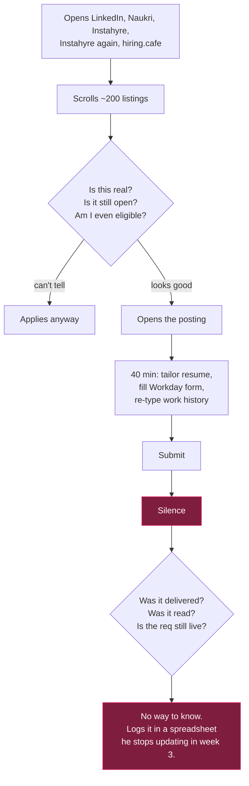
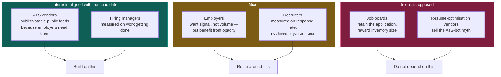

# Personas and perspectives

> Status: **DECIDED**. Read [problem-statement.md](problem-statement.md) first.

Most product docs list user personas and stop. That is insufficient here, because a job-search product
sits inside a market with **four parties whose incentives conflict**, and several of the failure modes
users experience are not bugs — they are another party's system working correctly. Knowing which is
which determines whether a problem is one we can fix, route around, or only explain.

---

## Part 1 — The candidate

### P1. Arjun — the primary persona

**~1 year experience, SDE-1, Bengaluru. Backend: Django/DRF, PostgreSQL, Docker/Kubernetes, AWS,
observability. Wants a product company with a meaningful compensation step.**

This persona is deliberately specific — it is the founding user — but it generalises to the largest
under-served segment in software hiring right now: engineers with 1–3 years who are past campus
pipelines and below the lateral hiring bar.

**A day in his current process, as it actually is:**

**What he actually needs, in priority order:**

| # | Need | Why existing tools fail him | JobTrack's answer |
|---|---|---|---|
| 1 | *"Show me roles I can actually get, that are actually open."* | Boards optimise for inventory size, not eligibility or liveness | Eligibility-aware ranking + staleness signals + knockout radar |
| 2 | *"Tell me quickly whether it's worth 40 minutes."* | No tool scores against **his** resume with reasons | Component-level match breakdown with the gaps named |
| 3 | *"Get me there before 300 other people."* | Aggregators lag the source by hours-to-days | Adaptive polling; ≤ 90 min median on watched companies |
| 4 | *"Tell me if this company even hires at my level."* | Nobody offers this | Entry-level openness score from ingestion history |
| 5 | *"Tell me what's working so I stop wasting weeks."* | Trackers count applications, which is the wrong metric | Channel analytics with sample-size gating |
| 6 | *"Stop making me re-type my work history."* | Only browser-extension autofill does this, at the cost of broad page access | v2 structured-profile export; explicit non-goal to auto-submit |

**What he does not need, despite asking for it:** more listings. He has more listings than he can
evaluate. Adding sources without adding *selection* makes his experience worse. This is worth stating
because "more sources" is the easiest roadmap item to justify and the least valuable.

**His trust posture.** He has been marketed to by resume-optimisation vendors his entire job search
and he is correctly cynical. A product that says "94% ATS match!" reads to him as the same category
of thing. Our credibility comes from showing our work — which is why the evidence ledger is
user-visible, not internal.

### P2. Priya — the switcher

**4–7 years, senior engineer, employed, not urgently looking.** Checks in weekly, not daily. Cares
about compensation benchmarking, company trajectory, and whether a role is a genuine level-up.

She matters because she is the **retention** persona. Arjun churns when he lands a job — Priya stays
for years if the passive-watch experience is good. Her needs diverge:

- Saved searches with digest notifications, not a feed to scroll
- Compensation as a first-class axis, not a filter afterthought
- Company-level tracking ("tell me when Company X posts anything at L5+")
- Zero urgency in the UI — no streaks, no gamification, no "you haven't applied today"

**Design consequence:** the notification system must support *digest* as a first-class mode, not
just real-time alerts. See [feature-spec.md](feature-spec.md#f8--watchlists-and-digests).

### P3. Sameer — the returner

**Career break, or laid off, 3+ months out.** Highest emotional cost, lowest tolerance for a product
that makes him feel behind. He is the reason we do not build streaks, leaderboards, or
"you're in the bottom 20% of applicants this week" mechanics.

Concretely, this persona vetoes an entire category of engagement design. Any feature whose mechanism
is "make the user feel bad enough to return tomorrow" is out.

### Anti-persona: the volume applicant

Someone who wants to send 500 applications this week. We are not for them, and building for them
would degrade the product for everyone else — both directly (the UI would optimise for throughput)
and indirectly (mass-applied listings become worse for other users as employer response rates fall).
This is the clearest case where a user's stated want and their interest diverge, and we side with the
interest. See [principles.md](principles.md#anti-features).

---

## Part 2 — The employer

Understanding the other side of the table is not empathy exercise; it is how you predict which
behaviours get punished.

**What the employer optimises:** time-to-fill and quality-of-hire, under a fixed recruiter headcount
that has usually been cut. With **applications per hire above 300** `[A-05]`, the recruiter's problem
is not finding candidates — it is triage.

**What follows from that:**

- **Volume is the enemy, not the goal.** A candidate who submits eight applications in two minutes is
  noise, and gets flagged as such `[C-05]`. Our refusal to auto-apply is aligned with the employer's
  interest, which is a good sign it is durable.
- **Referrals are valuable because they are pre-filtered social proof**, which is exactly why the
  "true referral vs. lead" split exists `[B-08]`. Employers built that split to defend the signal.
  A tool that helps candidates flood the referral channel would trigger the same defence.
- **Ghost jobs are mostly not malice.** Requisitions get frozen, filled internally, or left up for
  pipeline building, and nobody has an incentive to take them down. This is why *staleness detection
  from observed feed behaviour* works better than trying to divine intent — a posting that vanished
  from the ATS feed is closed, full stop, regardless of why.

**The one place our interests genuinely diverge:** employers benefit from applicant volume and from
opacity about requisition status. We reduce both. That is a real tension, and it is why we build on
public feeds the employer publishes deliberately, rather than on anything requiring their cooperation.

---

## Part 3 — The ATS vendor

Greenhouse, Lever, Ashby, Workday, SmartRecruiters, Workable, Recruitee, Personio.

**Their business is selling software to employers.** Candidates are not their customer. This has one
enormously useful consequence for us:

> The public job board APIs exist so employers can embed listings on their own marketing sites.
> They are published, unauthenticated, documented, and intended for machine consumption.

That makes them **stable, legitimate, and unlikely to be withdrawn** — the vendor's customer depends
on them. Compare this to board scraping, where the board's interest is directly opposed to yours.
This asymmetry is the entire basis of [ADR-0004](../architecture/adr/0004-source-acquisition-policy.md).

The evidence that this asymmetry is real and not theoretical: **JobFunnel**, once a leading
open-source job scraper, was **archived by its own author** with the explanation that it was built
when boards served static HTML and boards have since moved to aggressive anti-automation, making the
approach too fragile to maintain `[B-11]`. Meanwhile the Greenhouse board API has been serving the
same shape for years.

**Where they hurt us:** every one of these APIs has a different schema, pagination model, date format
and compensation representation. Lever returns `createdAt` as epoch milliseconds; Greenhouse returns
HTML-escaped HTML in the content field; SmartRecruiters omits descriptions and requires a request per
posting; Recruitee's per-company subdomains mean an invalid slug fails as DNS resolution rather than
HTTP 404. **The engineering cost is normalisation, not fetching** — which is why the ingestion design
puts almost all its complexity there. See [source-catalog.md](../research/source-catalog.md).

---

## Part 4 — The aggregator / board

LinkedIn, Indeed, Naukri, Glassdoor, ZipRecruiter.

**Their business is attention and employer spend.** Both create incentives that work against the
candidate:

- **Inventory size is a marketing number**, so stale postings have negative value to the candidate but
  positive value to the board.
- **Keeping the application on their domain** is strategically necessary for them (it is how they
  prove value to employers and retain the user) and is exactly what breaks delivery for the candidate
  `[A-10]`.
- **Anti-automation defences are aimed at competitors**, and catch candidates' tools as collateral.

**Our posture:** we treat boards as a *discovery hint layer at most*, never as a system of record, and
v1 does not integrate with any of them. Where a user finds a role on LinkedIn, JobTrack's job is to
resolve it to the underlying ATS requisition — the reverse of what the board wants.

---

## Perspective map

**The single most useful conclusion on this page:** the two parties whose interests align with the
candidate are the ones we build on — ATS vendors' public feeds for data, and hiring managers for
outreach. Recruiters and boards are routed around, not integrated with. Every architectural decision
that looks conservative (no board scraping, no auto-apply, no LinkedIn integration) traces back to
this map.
