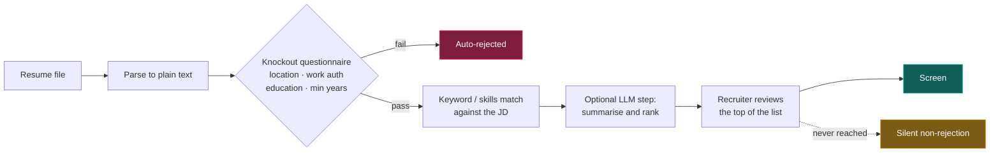

# Problem statement

> Status: **DECIDED**. This document is the factual basis for every product decision that follows.
> Claims are graded; see [evidence-ledger.md](../research/evidence-ledger.md).

## 1. The market rotated; it did not simply shrink

The common framing — "tech hiring is down" — is imprecise enough to produce bad product decisions.
The precise version:

Indexed to a February 2020 baseline of 100, US job postings by role sat at radically different levels
in 2026:

```
                     Feb 2020 = 100
ML engineer          ████████████████████████████████  159   [A-02]
Software engineer    ██████████                         51   [A-01]
                                                       ▲
                                          a 108-point gap inside one profession
```

And the recovery that did happen was not distributed evenly across levels. **71% of the software
posting recovery from May 2025 to May 2026 came from senior roles** `[A-03]`.

The independent corroboration is stronger than the postings data, because it observes hiring
decisions rather than advertisements. Stanford's Digital Economy Lab, working from ADP payroll
records covering 3.5–5 million workers monthly, found software developers aged **22–25 down roughly
20% from their late-2022 peak across 33 consecutive months of decline**, while **older developers at
the same firms continued to grow** `[A-04]`.

**The causation is contested and we do not take a position.** The Stanford authors attribute the
divergence to AI exposure; economists at Google and Apollo's Torsten Slok attribute it to interest
rates and the post-ZIRP correction `[C-02]`. For product purposes the cause does not matter — the
*shape* does, and the shape is not disputed: **the market moved away from exactly the people who need
this product most.**

### Why this matters for what we build

A tool that helps you send more applications is optimising a variable that is not binding. If
postings for your level are down and applications per hire have tripled, throughput is not the
constraint. **Selection, timing, and delivery verification** are.

## 2. The volume problem is now structural

| Metric | Value | Grade |
|---|---|---|
| Applications per hire, 2026 | **> 300**, roughly **3× the 2021 figure** | `[A-05]` |
| Share of online postings estimated to be "ghost jobs" | **18–22%** (Greenhouse, 2025) | `[A-06]` |
| Popular claim that "1 in 3 postings are fake" | Combines incompatible methodologies; the US Congressional Research Service acknowledged in April 2025 that **no official statistics exist** | `[C-01]` |

We use the 18–22% figure and label it. We do not repeat the 1-in-3 number, and one of the reasons
this project keeps an evidence ledger is that a product which quotes an unsourced ghost-job
percentage in its marketing is indistinguishable from the vendors that manufactured the number.

Greenhouse's own study also gives us the **filters that correlate with a posting being real**, and
these are directly implementable:

- posted within the last two weeks
- present on the company's own careers site (not only on a board)
- salary range disclosed
- a named team or hiring manager

All four become first-class signals in the JobTrack data model. See
[data-model.md](../architecture/data-model.md#job_postings) and the `staleness` and `integrity_signals`
columns.

## 3. Screening works differently than almost all advice claims

The widely repeated story — "an AI robot scans your resume and rejects 75% of applicants" — is
**false**, and the sites repeating it are generally selling resume-optimisation services `[C-03]`.

What recruiters who actually operate iCIMS, Lever, Taleo and Greenhouse describe is closer to a
filing cabinet: applications go in, they are not automatically filtered or weighted, and a human
decides who advances `[B-01]`.

The realistic 2026 pipeline at a large employer:



Three consequences, each of which becomes a feature:

1. **The genuine auto-reject is the questionnaire**, not the resume text `[A-07]`. Location, work
   authorisation, education, and minimum years of experience boot you before a human looks.
   → *JobTrack extracts and surfaces knockout criteria per posting, and warns you before you spend
   40 minutes on an application you cannot pass.*

2. **Where AI is used, it decides order, not rejection.** A low rank ends your application without
   anyone formally rejecting you — which is why "ghosted" is a distinct outcome and not a synonym for
   "rejected". It is also not universal: by SHRM's research, **fewer than half of organisations will
   use AI in HR at all in 2026**, skewed heavily toward large employers and high-volume roles `[A-08]`.
   → *JobTrack models `ghosted` as a first-class terminal state with an automatic 21-day transition.*

3. **Parsing failures kill more applications than keyword gaps do** `[B-02]`.
   → *JobTrack's resume parser doubles as a diagnostic: we show you what a naive parser extracts from
   your file, because if we mangle your job titles, so will an ATS.*

### On AI-written resumes

The evidence pulls in two directions and both sides are real:

- A randomised controlled trial across ~481,000 jobseekers found AI **editing of human-written prose**
  raised hires by **7.8%** `[A-09]`.
- **49% of US hiring managers report auto-dismissing resumes they suspect are AI-generated**, and
  **62% reject AI resumes that lack personalisation** `[B-03]`.

The reconciliation is that editing and generating are different operations. This is why JobTrack's
resume features are framed as **gap analysis and compression**, never generation. See
[principles.md](principles.md#p5--assist-editing-never-authorship).

## 4. Delivery is not guaranteed — and this is the most under-documented mechanic in job search

**The rule:** look at the domain of the final page where you press submit.

| Where submit happens | What it means |
|---|---|
| `boards.greenhouse.io`, `jobs.lever.co`, `jobs.ashbyhq.com`, `*.myworkdayjobs.com`, `*.icims.com`, `smartrecruiters.com`, `careers.<company>.com` | You are in the employer's real requisition queue. A recruiter working that req sees you. |
| The job board's own domain | You are in the **board's** inbox. Whether it reaches the employer depends on an integration the employer had to opt into. |

Concretely `[A-10]`:

- **Indeed** has two distinct paths. "Easily apply" keeps the application on Indeed. For jobs Indeed
  indexed from an ATS, the employer must enable **Apply Sync** to have applications flow through —
  it is opt-in, so an Indeed application may simply sit in a dashboard the employer rarely checks.
- **LinkedIn Easy Apply** delivers into LinkedIn's recruiter interface; whether your resume is
  forwarded depends on how the poster configured it. Recruiters see a profile snapshot — photo,
  headline, current and past titles, education, listed skills.
- **Naukri** is not an application system at all; it is a **resume database**. Recruiters search
  profiles and reach out. Your "apply" lands in the recruiter's Naukri RMS, not the company's ATS. On
  Naukri the inbound channel is the real one, which inverts the advice: **profile freshness matters
  more than application count.**

This single mechanic justifies a large fraction of JobTrack's architecture. It is why we ingest from
**first-party ATS feeds** rather than from boards: the feed *is* the requisition, so the apply URL we
store is the one that lands you in the pipeline. See
[ADR-0004](../architecture/adr/0004-source-acquisition-policy.md).

## 5. Channels are not equal, and the ranking is counter-intuitive

Ordered by realistic return per hour invested:

| Rank | Channel | Evidence | Caveat that matters |
|---|---|---|---|
| 1 | **Warm referral** (someone who knows your work) | Referrals are ~7% of applicants but **30–50% of hires** `[B-05]` | Only ~6% of employees refer for the bonus `[B-06]`; a referral is a reputation stake, so a generic "please refer me" fails |
| 2 | **Cold email to the hiring manager**, not the HR inbox | interviewing.io reports **one to two orders of magnitude** more responses than applying online alone `[B-07]`; 5–15% reply for highly targeted outreach vs. <1% for mass sends `[B-08]` | Recipients receive 30–50 such emails daily and delete recognisably templated ones on sight `[C-04]` |
| 3 | **Company careers page, within the first 24–48 hours** | Postings collect hundreds of applications within hours; being in the first day matters more than polish `[B-04]` | This is the channel JobTrack most directly serves, and the reason ingestion is designed for freshness |
| 4 | **Aggregators and boards** | Good for discovery, weak for conversion | See §4 on delivery |
| 5 | **Mass autofill / auto-apply** | Actively counterproductive | Recruiters report receiving eight applications from one candidate within two minutes and flagging it as spam `[C-05]` |

### The cold-referral trap

This is the finding that most contradicts popular advice, and it directly shapes the roadmap.

interviewing.io surveyed roughly 500 respondents and found **cold referrals ranked net negative —
worse than applying online** `[B-09]`. That appears to contradict the many engineers who say they
happily refer strangers `[C-06]`. Both are true, and the mechanism explains why: companies now split
**"true referrals"** from **"leads"**. A stranger's referral drops into the lead pile, which is
functionally identical to inbound. The willingness is genuine; the outcome is nil.

**Product consequence:** the referral network on our roadmap (v3) is designed around *converting a
cold contact into a warm one before the ask* — shared context, a specific question about their team,
demonstrable work — not around volume of referral requests. A feature that made it easy to blast
referral asks would make outcomes worse while appearing to work. See
[roadmap.md](roadmap.md#v3--referral-graph).

### Why the inbound channel closed for juniors, independent of AI

One mechanism is worth isolating because it is **not contested** and is **not about AI at all**:
recruiters are measured on response rates rather than on hires `[B-10]`. Sourcing rules that exclude
junior candidates are therefore rational for the recruiter and closed by design for the candidate.
This channel would be shut even if AI did not exist — and it is the one you can route around, by
reaching hiring managers, who are measured on whether the work gets done.

## 6. The India / Bengaluru layer

The founding user profile is a ~1 YOE SDE-1 in Bengaluru with a backend stack (Django/DRF, Postgres,
Docker/K8s, AWS, observability). India is therefore v1's primary market, and it has properties the US
data does not capture.

**The data genuinely conflicts, and we flag rather than resolve it:**

- Naukri JobSpeak reports **0–3 year hiring up 11–17%** `[B-26]`
- A separate July 2026 analysis reports **entry-level openings down 44%** `[C-07]`

The likely reconciliation is that "0–3 years" and "entry level" are different populations — which
puts a 1-YOE engineer precisely on the seam. We show both, labelled, and do not average them.

**The structural issue is supply, not channel.** Many Indian product companies fill entry level
through campus hiring and then hire laterally at SDE-2. External SDE-1 requisitions are genuinely
scarce. This produces a testable, buildable filter that no competitor offers:

> **Does this company hire externally at entry level at all?**

A target list of 40 companies is worthless if only four of them have ever posted an external 0–2 YOE
requisition. JobTrack can answer this from its own ingestion history — we observe every requisition
each company has posted, so we can compute an **entry-level openness score** per company. See
[feature-spec.md](feature-spec.md#f7--company-hiring-posture).

Two smaller India-specific facts that shape defaults:

- A large share of SDE-1 postings state "2+ years". That band is soft in practice; self-filtering
  there costs real opportunities. → *Our YoE filter is inclusive by default with a "stretch" band,
  not a hard cutoff.*
- Hirist, BigShyft and iimjobs are all Info Edge properties sharing an underlying profile with
  Naukri. → *Treated as one identity surface in [source-catalog.md](../research/source-catalog.md).*

## 7. What tracking is actually for

The near-universal failure mode of application trackers is that they count applications. Counting
applications rewards volume, which we have established is the wrong variable.

**The metric that matters is interview rate per channel.** Twenty tailored applications a week at a
5% interview rate beats a hundred generic ones at 1% — the same outcome for a fifth of the effort and
far less burnout.

But this comes with a statistical honesty requirement that almost every tracker violates: at
realistic individual volumes, **per-channel rates are noise for the first two to three months**.
Three interviews from ten referrals is not a 30% referral rate; it is a sample too small to
distinguish from luck. The legitimate use of the table is to detect **a channel producing zero over
25+ attempts** — that is real signal — not to fine-tune between 10% and 12.5%.

**Product consequence:** JobTrack's channel analytics suppress the rate entirely below a minimum
sample size and display "not enough data — N more to a reading" instead. This is a deliberate refusal
to show a number the user would misread. It is the same discipline as the evidence ledger, applied to
the user's own data.

The second under-appreciated field is **resume version**. It is the column that lets you answer which
positioning actually converts, and it is the one every tracker omits. It is mandatory in our schema.

## 8. Summary — the design constraints this document imposes

| # | Constraint | Enforced in |
|---|---|---|
| 1 | Ingest from first-party ATS feeds so the apply URL is the real one | [ADR-0004](../architecture/adr/0004-source-acquisition-policy.md) |
| 2 | Optimise for freshness; median source→visible ≤ 90 min on watched companies | [ingestion-pipeline.md](../architecture/ingestion-pipeline.md) |
| 3 | Surface knockout criteria before the user invests effort | [feature-spec.md](feature-spec.md#f4--knockout-radar) |
| 4 | Never fabricate match precision; show bands, components, confidence | [matching-and-scoring.md](../architecture/matching-and-scoring.md) |
| 5 | Model `ghosted` as distinct from `rejected`, auto-transition at 21 days | [data-model.md](../architecture/data-model.md#5-applications) |
| 6 | Track channel and resume version; suppress rates below sample threshold | [feature-spec.md](feature-spec.md#f6--channel-analytics) |
| 7 | Compute company entry-level openness from our own ingestion history | [feature-spec.md](feature-spec.md#f7--company-hiring-posture) |
| 8 | Assist editing, never authorship | [principles.md](principles.md#p5--assist-editing-never-authorship) |
| 9 | No auto-apply, ever | [principles.md](principles.md#anti-features) |
