# Roadmap

> Status: **DECIDED** for v1 scope and phase gates; **PROPOSED** for v3+ detail.

The stated ambition is a single platform for engineers looking for work — referral network, resume
reviewer with human-standard critique, interview preparation. This document orders that, and more
importantly attaches a **gate** to each phase: the condition that must be true before we start it.

The gates exist because the failure mode of an ambitious roadmap is building v3 features on a v1 that
nobody uses. Each gate is a fact about the world, not a date.

```mermaid
gantt
    title JobTrack phases (relative, not calendar-committed)
    dateFormat X
    axisFormat %s

    section v1 — The loop
    Ingestion + normalisation        :v1a, 0, 6
    Auth, feed, filters              :v1b, 2, 6
    Resume parse + scoring           :v1c, 4, 6
    Tracking + channel analytics     :v1d, 6, 4
    Harden, budgets, launch          :v1e, 10, 3

    section v2 — Automatic tracking
    Gmail classification             :v2a, 13, 5
    Structured profile export        :v2b, 15, 3
    Company posture (needs history)  :v2c, 16, 3

    section v3 — Referral graph
    Contact + warmth model           :v3a, 21, 6
    Outreach research assist         :v3b, 24, 4

    section v4 — Preparation
    Resume review (human-standard)   :v4a, 28, 6
    Interview prep + comp intel      :v4b, 32, 6
```

---

## v1 — The loop

**Goal:** find fresh, eligible roles → decide fast → apply at the source → know what happened.
Full scope in [feature-spec.md](feature-spec.md).

**Gate to start:** none. This is the product.

**Gate to declare done:**
- 500+ company boards ingesting across ≥ 4 ATS vendors, with < 1% adapter error rate over 7 days
- Median ingest→visible ≤ 90 min on tier A
- All CI performance budgets green
- One real user (the founding persona) runs an entire job search on it for 30 days without
  maintaining a parallel spreadsheet

That last criterion is the real one. The parallel spreadsheet is the honest measure of whether the
tracking is good enough; every tracker that failed did so by being worse than a spreadsheet the user
already trusted.

---

## v2 — Make tracking automatic

**Gate:** v1 done, and ≥ 100 weekly active users, **or** the founding user's 30-day criterion passed.

The insight driving this phase: **status updates arrive as email.** Manual tracking decays — every
user abandons it around week three. Parsing email is how tracking stops being a chore and starts
maintaining itself. This is the single highest-leverage feature on the entire roadmap, and it is
deliberately v2 rather than v1 because it is meaningless without the pipeline underneath it.

### v2.1 — Gmail classification

Read-only Gmail API scope (`gmail.readonly`), or a self-hosted IMAP option for the privacy-conscious.
Classify incoming mail into: acknowledgement, recruiter screen invitation, rejection, offer, or
unrelated. Match to an existing tracked application by company domain and posting reference; propose
a state transition the user confirms with one click.

**Design constraints:**
- **Propose, never auto-apply the transition.** A misclassified rejection that silently closes a live
  application is worse than no automation.
- Classification runs **locally by default** — a small classifier over sender domain, subject
  patterns and a rules layer gets most of the way. LLM classification is opt-in per user, disclosed,
  and the config records what leaves the system (P8).
- OAuth scope is read-only and we say so at the consent screen.

### v2.2 — Structured profile export

The 40-minute Workday form is the largest single time cost in the process. We cannot legally or
safely autofill it (AF1 forbids submission, and browser-extension autofill requires broad page
access we do not want to hold).

What we can do: maintain a complete, correct structured profile and export it in the formats these
forms accept — JSON Resume, a plain-text block optimised for copy-paste, and a per-field clipboard
UI. The user pastes; the user submits.

### v2.3 — Company hiring posture

Ships here rather than in v1 purely because it needs ~90 days of ingestion history to say anything
true. Spec in [feature-spec.md §F7](feature-spec.md#f7--company-hiring-posture).

### v2.4 — Two-factor authentication

Gated by data value, not by calendar: once we hold enough tracked applications and parsed resumes to
be worth stealing, 2FA stops being optional. Trigger: 1,000 users with parsed resumes.

---

## v3 — Referral graph

**Gate:** v2 done, and channel analytics across the user base show referral as a materially better
channel **in our own data**, not just in the literature.

That gate is unusual and deliberate. We have the aggregate claim that referrals are ~7% of applicants
but 30–50% of hires `[B-05]`, *and* the contradicting finding that **cold referrals rank net negative
— worse than applying online** `[B-09]`. The mechanism reconciling them: companies split "true
referrals" from "leads", and a stranger's referral lands in the lead pile, functionally identical to
inbound.

**This is the most dangerous feature on the roadmap.** A referral feature that makes it easy to send
many referral asks would:

1. produce cold referrals, which the evidence says are worse than doing nothing,
2. feel productive to the user, and
3. accelerate employers' defences against the channel, degrading it for everyone.

So the design is inverted. The feature is not "request a referral" — it is **convert a cold contact
into a warm one before asking**:

| Component | What it does |
|---|---|
| **Contact graph** | Who you actually know, with a warmth score: worked together > shared team > shared employer > shared college > cold |
| **Path finding** | For a target company, the warmest genuine path in — and honesty when there isn't one |
| **Ask targeting** | Ask **SDE-2/SDE-3**, not VPs: senior enough that the referral carries weight, junior enough to still be reachable and to remember being where you are |
| **Pre-ask work** | Research assembly on the person and their team, so the message can be specific. The user writes it (P5) |
| **Profile readiness check** | Employees spend ~two minutes on your LinkedIn before deciding whether to attach their name to you. The feature refuses to help you ask until your public profile survives that skim |

That last row is the feature's actual value, and it will annoy users. Good.

**What we will not build:** bulk referral requests, templated outreach, or a marketplace where
strangers sell referrals.

---

## v4 — Preparation

**Gate:** v3 done and a retention curve showing users staying past their job search (persona P2
behaviour). Preparation tooling is only worth building for a platform people keep open.

### v4.1 — Resume review, human-standard

Not "ATS score" (AF2 — that is the exact vendor behaviour we reject). Instead: the critique a
skeptical senior engineer or hiring manager would give.

Concretely: bullets without outcomes, claims without numbers, scope inflation, missing "what did
*you* do" in team accomplishments, seniority mismatch between claimed level and described
responsibility, and the specific things that get flagged as AI-written — uniform sentence length,
absent specifics, and phrasing that would work unchanged at a different company.

Grounded in the RCT finding that **editing** human prose improves outcomes by 7.8% while
**generation** gets auto-dismissed by 49% of hiring managers `[A-09]`, `[B-03]`. The feature edits.
It never writes.

### v4.2 — Interview preparation

Behavioural story bank derived from the user's own tracked applications and resume; system design
drilling; company-specific process notes accumulated from user reports. The differentiator over
generic prep tools is that it is grounded in *this user's actual pipeline* — you prep for the loop
you have on Thursday, not for interviews in general.

### v4.3 — Compensation intelligence

We already ingest disclosed compensation from postings. Aggregated by role, level, location and
company, that is a defensible dataset with a property most comp sites lack: **every data point traces
to a real, dated requisition**, not to a self-reported survey. Where we do not have data, we say so
(P3) rather than interpolating.

---

## Deliberately never

Kept here so the reasoning survives personnel changes.

| Never | Why |
|---|---|
| Automated application submission | [AF1](principles.md#af1--automated-application-submission) |
| Board scraping behind auth or anti-bot | [AF4](principles.md#af4--scraping-behind-authentication-or-anti-bot-defences) |
| Selling candidate data to recruiters | Inverts whose side we are on; the persona map ([personas](personas-and-perspectives.md#perspective-map)) is the whole product thesis |
| A recruiter-side product | Same conflict. If we ever want this revenue it has to be a separate company |
| Engagement mechanics on anxiety | [AF5](principles.md#af5--engagement-mechanics-built-on-anxiety) |

---

## How the phases map to architecture

Each phase was chosen partly for what it does **not** require changing. This is the practical
expression of P9 — get boundaries right now, build only v1.

| Phase | Schema change | New service | New external dep |
|---|---|---|---|
| v1 | — | — | — |
| v2 | `email_events`, `contacts` | none (River workers in `ingestor`) | Gmail OAuth |
| v3 | `contact_edges`, `warmth_scores` | none | none |
| v4 | `review_findings`, `comp_aggregates` | possible `reviewer` binary | optional LLM provider |

No phase requires abandoning Postgres-as-only-datastore, changing the API's major version, or
rewriting the ingestion pipeline. If a proposed feature would, that is a signal to re-examine the
feature rather than the architecture — see [ADR-0003](../architecture/adr/0003-postgres-single-datastore.md)
and [scaling-and-capacity.md](../operations/scaling-and-capacity.md) for where that stops being true.
