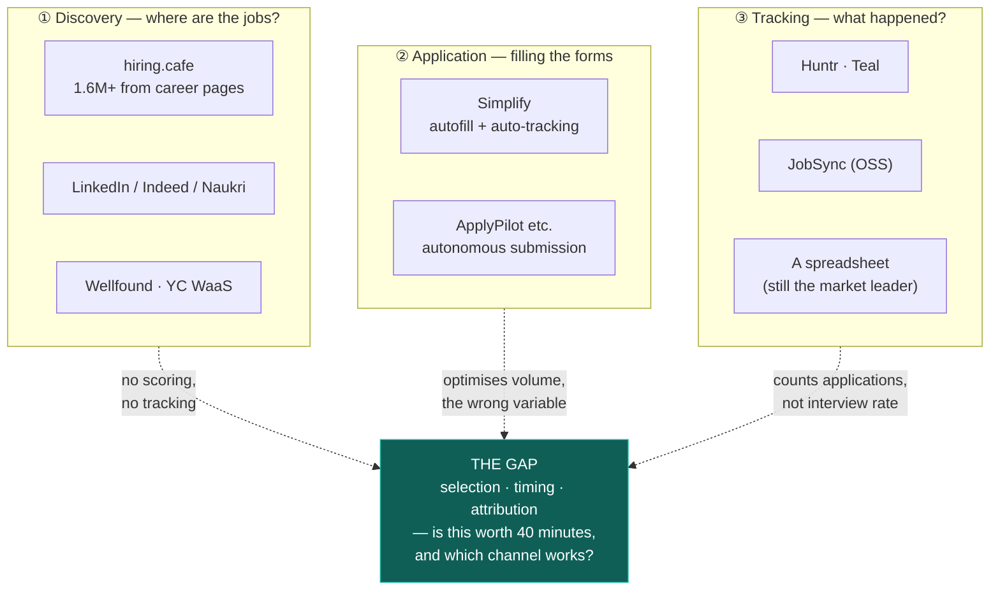

# Competitive landscape

> Status: **LIVING DOCUMENT**. Assessments are as of August 2026.

The purpose of this document is not to disparage competitors. It is to identify **which problem each
one solves well** — so we do not rebuild it — and where the actual gap is.

## The market has three clusters, and nobody spans them

**Discovery tools do not know your resume. Tracking tools do not know the market. Application tools
optimise the variable that stopped working.** The gap is in the middle, and it is the whole product.

---

## ① Discovery

### hiring.cafe — the closest thing to a competitor

**What it gets right, and it is a lot:** 1.6M+ listings scraped **directly from company career
pages**, which means fewer ghost postings, fewer duplicates, and fresher listings than aggregators.
Salary is front and centre. Every listing links straight to the source. It takes no applications.

This is the correct structural insight, and it is the same one this project is built on. Credit where
due — it is the best-designed product in the discovery cluster.

**Where the gap remains:**

| It does not | We do |
|---|---|
| Know your resume | Component-level scoring with named gaps |
| Track what happened | Full pipeline with channel attribution |
| Tell you if a company hires at your level | Entry-level openness from ingestion history |
| Surface knockout criteria | Knockout radar before you invest 40 minutes |

**What we should learn from it:** salary-forward presentation, and linking to source rather than
proxying. Both are already in our spec, and its existence is evidence they are right.

### LinkedIn / Indeed / Naukri

Largest inventory; weakest conversion. Covered in
[personas §4](../product/personas-and-perspectives.md#part-4--the-aggregator--board) — their business
model creates incentives that work against the candidate, most concretely by keeping the application
on their domain, which is where delivery breaks `[A-10]`.

**Naukri deserves a specific note for the India-first market.** It is not an application system; it is
a **resume database** where recruiters search and reach out. The real channel there is *inbound*, which
means profile freshness matters more than application count. Any Indian job-search product that
treats Naukri as an application channel has misunderstood it. We do not integrate; we note in the
product that Naukri is a profile-maintenance task, not an applying task.

### Wellfound, YC Work at a Startup, Levels.fyi, Blind, Grapevine

Vertical discovery with useful adjacent signal — equity data, compensation benchmarks, insider views.
Grapevine is notable for India: several hundred thousand professionals, company groups, referral
threads, and a salary comparison tool with tens of thousands of verified data points.

**Not competitors** — complements. Where we overlap is compensation intelligence (v4), and our
differentiator there is unusual: **every data point traces to a real, dated requisition** rather than
to a self-report.

---

## ② Application

### Simplify — the honest one

Free autofill Copilot across major ATS platforms; the tracker **fills itself in** because the
extension sees what you submit. The paid tier adds tailored resumes and cover letters.

**This is the right level of automation** — it fills the form, you review and submit — and it is the
strongest product in this cluster.

**The cost is the mechanism:** self-filling tracking requires granting a browser extension broad page
access. That is a real trade, made honestly, and some users will decline it.

**Our position:** we do not build an extension in v1. Instead, structured profile export (v2.2) — the
user pastes rather than granting page access. **Strictly more work for the user, and strictly less
access for us.** We think that trade is right for our audience; we may be wrong, and if we are, an
extension is an ADR away.

### ApplyPilot and the autonomous-submission category

Scrape multiple boards plus dozens of Workday portals and direct career sites, AI-score each role,
tailor the resume, write the cover letter, **and submit** — one project claims 1,000 applications in
two days.

**We will not build this**, and the reasoning is [AF1](../product/principles.md#af1--automated-application-submission):

1. It optimises the variable that stopped working. Applications per hire already exceed 300 `[A-05]`;
   adding volume makes the pool worse for everyone including the sender.
2. Recruiters flag burst applications as spam `[C-05]`.
3. **It has a short half-life by construction.** `JobFunnel` — once the leading open-source job
   scraper — was archived by its own author because boards moved to aggressive anti-automation
   `[B-11]`. That is the fate of every tool in this category.

### JobSpy

A scraping *library* pulling from LinkedIn, Indeed, Glassdoor, Google and ZipRecruiter concurrently.
The best building block in the open-source space, and most decent job-hunt repositories are wrappers
around it.

**Incompatible with [ADR-0004](../architecture/adr/0004-source-acquisition-policy.md).** Excellent
engineering; the wrong foundation for something intended to last, for the reason above.

---

## ③ Tracking

### JobSync (OSS) — the closest open-source analogue

Self-hosted: application tracker, dashboard analytics, resume storage with AI review and JD matching,
automated discovery via board APIs, and — notably — an **MCP server** so an AI assistant can add
applications conversationally.

Genuinely the most complete open-source offering, and the MCP integration is a good idea we should
consider for v2.

**Where we differ:**

| | JobSync | JobTrack |
|---|---|---|
| Ingestion | Board APIs | **First-party ATS feeds, adaptive freshness-tiered polling** |
| Scoring | AI review + JD matching | **Explainable weighted components with named gaps and confidence** |
| Analytics | Dashboard | **Channel attribution with sample-size suppression** |
| Stack | Next.js full-stack | Go + Postgres, six scalable units |
| Statistical honesty | — | **Refuses to display rates below n=25** |

### Huntr and Teal

Huntr is the cleanest manual kanban; Teal couples tracking to resume iteration. Both are polished,
both are commercial, both share the category's defining flaw:

> **They count applications.**

Counting applications rewards volume, which is the wrong variable
([problem-statement §7](../product/problem-statement.md#7-what-tracking-is-actually-for)). Neither
makes interview-rate-per-channel the headline metric, and neither treats resume version as a
first-class tracked field — which is the column that answers which positioning converts.

### The spreadsheet — the actual market leader

**A plain sheet beats every fancy tool the user does not update.** This is not a joke and it is the
real benchmark.

The failure mode of every tracker is week three, when maintaining it becomes a chore and the user
quietly stops. Which is why our v1 "done" criterion is: *the founding user runs an entire 30-day job
search without maintaining a parallel spreadsheet* ([roadmap](../product/roadmap.md#v1--the-loop)) —
and why v2's headline feature is **email classification**, so tracking maintains itself.

---

## Resume tooling

| Tool | Strength | Relevance |
|---|---|---|
| **OpenResume** | The **parser** is the useful part — shows you what an ATS extracts | Validates our parse-diagnostic feature. Strong prior art |
| Reactive Resume | Self-hostable, clean PDF export, no watermark | Not competing |
| RenderCV | YAML in git, ATS-readable typeset PDFs | Our audience will like this. Complementary |
| JSON Resume | Schema + themes; one source of truth | **We should export this format** (v2.2) |
| Resume Matcher | Open-source JD-to-resume gap analysis | Closest to our scoring. Ours differs by being config-driven, explainable, and confidence-bearing |

---

## Positioning

**The one-line claim:** *the only tool that tells you whether a role is worth 40 minutes, gets you
there while it is still fresh, and shows you which of your channels actually produces interviews.*

Five defensible differentiators, in order of how hard they are to copy:

| # | Differentiator | Why it is defensible |
|---|---|---|
| 1 | **Channel attribution with statistical honesty** | Requires refusing to show a number, which is a product-culture decision competitors are structurally unwilling to make |
| 2 | **Company entry-level openness** | Requires 90+ days of accumulated ingestion history. Time is the moat |
| 3 | **Explainable scoring with named gaps and confidence** | Requires curated skill taxonomy and adjacency — ongoing manual work most will skip in favour of embeddings |
| 4 | **Adaptive freshness (≤ 90 min on watched companies)** | Requires the conditional-request and tiering architecture; not a feature that can be bolted on |
| 5 | **Knockout radar** | Requires reliable extraction with precision-favouring thresholds |

**Our biggest vulnerability:** hiring.cafe adding resume scoring. They have the discovery layer and
the structural insight already. Our answer has to be that scoring, attribution and posture are not one
feature but a system — and that the system is the product.

---

## Deliberate non-competition

| We will not compete on | Why |
|---|---|
| Inventory size | A board's vanity metric. Selection beats volume ([P2](../product/principles.md#p2--freshness-is-the-product)) |
| Application volume | Optimises the variable that stopped working ([AF1](../product/principles.md#af1--automated-application-submission)) |
| "ATS optimisation" scores | The vendor behaviour our audience has already written off ([AF2](../product/principles.md#af2--keyword-stuffing-hidden-text-or-ats-beating)) |
| Recruiter-side tooling | Inverts whose side we are on. If ever pursued, it has to be a separate company |
| Engagement metrics | The product's job is to *reduce* hours spent job searching ([AF5](../product/principles.md#af5--engagement-mechanics-built-on-anxiety)) |
